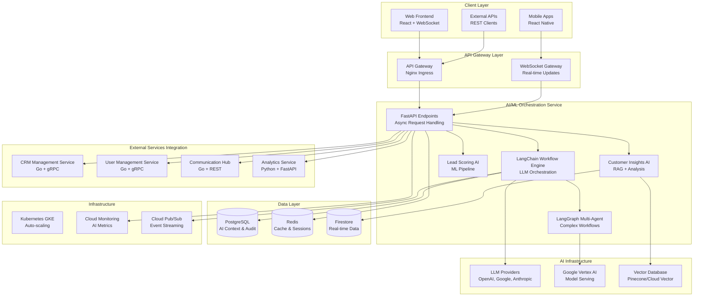
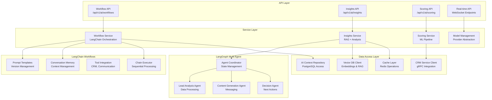

# ai-ml-orchestration - Task 42

Execute task 42 for the ai-ml-orchestration specification.

## Task Description
Create streaming API handler in app/api/streaming.py

## Code Reuse
**Leverage existing code**: Real-time processor, authentication middleware

## Requirements Reference
**Requirements**: 6.2, 6.4

## Usage
```
/Task:42-ai-ml-orchestration
```

## Instructions

Execute with @spec-task-executor agent the following task: "Create streaming API handler in app/api/streaming.py"

```
Use the @spec-task-executor agent to implement task 42: "Create streaming API handler in app/api/streaming.py" for the ai-ml-orchestration specification and include all the below context.

# Steering Context
## Steering Documents Context (Pre-loaded)

### Product Context
# Product Overview

## Product Purpose
Build an intelligent CRM and automated workflows platform specifically designed for the marketing industry, targeting small and medium businesses (SMBs). The platform democratizes enterprise-level AI capabilities, enabling SMBs to compete with larger enterprises through AI-powered customer relationship management, lead scoring, workflow automation, and intelligent insights. This project serves dual objectives: creating a market-ready SaaS solution while providing hands-on learning experience with cutting-edge AI technologies including LangChain, LangGraph, and agentic development workflows.

## Target Users
**Primary Users**: Marketing professionals, sales managers, and business owners at SMBs in the marketing industry

**User Needs and Pain Points**:
- Limited resources to implement complex CRM systems
- Difficulty competing with larger companies using advanced AI tools
- Manual processes for lead qualification and customer communication
- Lack of actionable insights from customer data
- Need for affordable, scalable solutions that grow with their business
- Desire for automation without losing personal touch in customer relationships

## Key Features

1. **Core CRM Management**: Comprehensive contact management with interaction tracking, timeline views, and automated follow-up recommendations
2. **AI-Powered Lead Scoring**: Intelligent prospect qualification using machine learning algorithms with continuous improvement
3. **Intelligent Workflow Automation**: LangGraph-powered visual workflow builder with AI decision points and multi-channel triggers
4. **Agentic RAG Customer Insights**: AI-driven customer analytics providing actionable recommendations and predictive insights
5. **Multi-Channel Communication Hub**: Unified platform for email, SMS, social media, and other communication channels
6. **Advanced Analytics and Reporting**: Real-time dashboards with AI-generated insights, custom reports, and performance tracking
7. **User Management and Security**: Role-based access control with enterprise-grade security and compliance features

## Business Objectives

**Primary Objectives**:
- Create a production-ready SaaS platform serving SMBs in the marketing industry
- Achieve product-market fit with cost-effective pricing suitable for SMB budgets
- Build a scalable, reliable platform capable of handling 10,000+ concurrent users
- Generate sustainable revenue through subscription-based SaaS model

**Learning Objectives**:
- Master advanced AI technologies through practical implementation
- Gain expertise in LLM orchestration, vector databases, and inference infrastructure
- Develop proficiency in agentic workflows and multi-agent systems
- Learn modern cloud-native architecture patterns and microservices design

## Success Metrics

**Performance Metrics**:
- **Response Time**: Sub-2-second response times for 95% of requests
- **Uptime**: 99.9% system availability
- **Concurrent Users**: Support for 10,000+ simultaneous users
- **Scalability**: Auto-scaling to handle traffic spikes without degradation

**Business Metrics**:
- **Customer Acquisition**: Target 100+ SMB customers within first year
- **Customer Retention**: 85%+ monthly retention rate
- **Cost Efficiency**: Maintain operational costs under 30% of revenue
- **Feature Adoption**: 70%+ active usage of core AI features

**Learning Metrics**:
- **Technology Mastery**: Successful implementation of all planned AI technologies
- **Code Quality**: 90%+ test coverage with comprehensive validation
- **Architecture Patterns**: Implement production-ready microservices architecture
- **Performance Optimization**: Meet all specified performance benchmarks

## Product Principles

1. **AI-First Design**: Every feature should leverage AI to provide intelligent automation and insights, not just basic functionality
2. **SMB-Centric Approach**: Design for resource-constrained businesses with simple interfaces, affordable pricing, and quick time-to-value
3. **Scalable Architecture**: Build for growth with cloud-native patterns, microservices, and auto-scaling capabilities from day one
4. **Learning Through Building**: Balance practical business requirements with learning objectives, ensuring both goals are achieved
5. **Security and Compliance**: Implement enterprise-grade security suitable for handling sensitive customer data with full compliance
6. **Cost Efficiency**: Optimize for operational costs to maintain sustainable pricing for SMB market

## Monitoring & Visibility

**Dashboard Type**: Web-based admin dashboard with mobile-responsive design
**Real-time Updates**: WebSocket connections for live updates on workflows, lead scoring, and system performance
**Key Metrics Displayed**:
- System performance (response times, uptime, error rates)
- Business metrics (lead conversion, workflow completion, user engagement)
- AI model performance (scoring accuracy, recommendation effectiveness)
- Resource utilization and cost optimization opportunities

**Sharing Capabilities**:
- Read-only dashboard sharing for stakeholders
- Automated report generation and email delivery
- API access for custom integrations and third-party tools
- Export capabilities for compliance and audit requirements

## Future Vision

The platform will evolve into a comprehensive marketing intelligence suite that serves as the central nervous system for SMB marketing operations.

### Potential Enhancements

**Advanced AI Capabilities**:
- Multi-modal AI supporting voice, image, and video content analysis
- Predictive analytics for market trends and customer behavior
- Advanced personalization engines for hyper-targeted campaigns
- Integration with emerging AI models and technologies

**Platform Expansion**:
- Industry-specific modules beyond marketing (sales, customer success, finance)
- Integration marketplace with hundreds of third-party tools
- Advanced workflow templates and industry-specific best practices
- White-label solutions for agencies and consultants

**Collaboration Features**:
- Team collaboration tools with role-based permissions
- Customer portal for direct interaction and feedback
- Partner ecosystem for integrators and developers
- Community features for knowledge sharing and best practices

**Global Reach**:
- Multi-language support for international markets
- Regional compliance and data residency options
- Localized features for different business cultures
- Currency and tax handling for global operations

---

### Technology Context
# Technology Stack

## Project Type
Cloud-native SaaS platform built as a microservices architecture, comprising a TypeScript/React web application frontend, Python AI/ML services, Go core services, and comprehensive Google Cloud Platform infrastructure. The platform serves as both a production-ready intelligent CRM solution and a learning environment for advanced AI technologies.

## Core Technologies

### Primary Language(s)
- **Frontend**: TypeScript 5.x with React 18.x and modern ES2022+ features
- **AI/ML Services**: Python 3.11+ with async/await patterns and type hints
- **Core Services**: Go 1.21+ for high-performance, low-latency operations
- **Infrastructure**: HCL (Terraform) for Infrastructure as Code
- **Configuration**: YAML for Kubernetes manifests and service configuration

### Key Dependencies/Libraries

**AI/ML Stack**:
- **LangChain**: LLM orchestration, prompt templates, memory management, and tool integration
- **LangGraph**: Complex workflow orchestration, decision trees, and multi-agent coordination
- **LangSmith**: LLM application observability and debugging
- **Pydantic**: Data validation and serialization with automatic API documentation
- **FastAPI**: High-performance async web framework with OpenAPI integration
- **scikit-learn**: Machine learning algorithms for lead scoring and analytics

**Frontend Technologies**:
- **React**: Component-based UI with hooks and suspense for async operations
- **Material-UI (MUI)**: Enterprise-ready component library with theming support
- **Redux Toolkit**: Predictable state management with RTK Query for API integration
- **React Query**: Server state management and caching for optimal performance
- **TypeScript**: Static typing for enhanced developer experience and code quality

**Backend Services (Go)**:
- **Gin**: High-performance HTTP web framework with middleware support
- **GORM**: ORM for database operations with migration support
- **Go-Redis**: Redis client for caching and session management
- **Testify**: Testing framework with assertions and mocking capabilities

**Infrastructure & DevOps**:
- **Kubernetes (GKE)**: Container orchestration with auto-scaling and load balancing
- **Docker**: Containerization with multi-stage builds for optimized images
- **Terraform**: Infrastructure as Code for reproducible deployments
- **Helm**: Kubernetes package manager for templated deployments

### Application Architecture
Microservices architecture following domain-driven design principles with event-driven communication patterns. The system comprises six core services communicating through REST APIs, GraphQL, and asynchronous messaging via Cloud Pub/Sub. Each service is independently deployable, scalable, and maintainable.

**Service Boundaries**:
- CRM Management Service (Go)
- AI/ML Orchestration Service (Python)
- Workflow Engine Service (Python)
- Communication Hub Service (Go)
- Analytics Service (Python)
- User Management Service (Go)

### Data Storage
- **Primary Storage**: Cloud SQL (PostgreSQL 15+) for transactional data with read replicas
- **Document Store**: Firestore for real-time data and user preferences
- **Vector Database**: Pinecone or Google Cloud Vector Search for RAG implementations
- **Data Warehouse**: BigQuery for analytics, reporting, and machine learning workflows
- **Caching**: Redis (Cloud Memorystore) for session management and performance optimization
- **Object Storage**: Cloud Storage for file uploads, backups, and static assets
- **Data Formats**: JSON for API communication, Protocol Buffers for internal service communication

### External Integrations
- **Google Cloud Services**: Vertex AI for ML model serving, Cloud Pub/Sub for messaging, Cloud Monitoring for observability
- **Authentication**: Firebase Auth with OAuth2/OIDC for social login and enterprise SSO
- **Communication APIs**: SendGrid (email), Twilio (SMS), Slack/Teams APIs for notifications
- **CRM Integrations**: Salesforce, HubSpot, Pipedrive APIs for data import/export
- **Payment Processing**: Stripe for subscription management and billing
- **Protocols**: HTTP/REST, GraphQL, WebSocket for real-time updates, gRPC for inter-service communication

### Monitoring & Dashboard Technologies
- **Frontend Framework**: React with TypeScript and Material-UI for responsive design
- **Real-time Communication**: WebSocket connections for live updates, Server-Sent Events for notifications
- **Visualization Libraries**: Chart.js for business metrics, React virtualization for large datasets
- **State Management**: Redux Toolkit with RTK Query for optimistic updates and caching
- **Error Tracking**: Sentry for frontend and backend error monitoring with performance insights

## Development Environment

### Build & Development Tools
- **Build System**: Vite for frontend with HMR, Docker multi-stage builds for services
- **Package Management**: npm/pnpm for frontend, pip with Poetry for Python, Go modules for Go services
- **Development Workflow**: Hot reload for all services, Docker Compose for local development environment
- **API Documentation**: OpenAPI/Swagger with auto-generation from code annotations
- **Database Migrations**: Flyway for SQL migrations, GORM AutoMigrate for development

### Code Quality Tools
- **Static Analysis**: ESLint + Prettier (frontend), Black + Ruff (Python), golangci-lint (Go)
- **Type Checking**: TypeScript strict mode, mypy for Python, native Go type system
- **Testing Framework**: Jest + React Testing Library (frontend), pytest (Python), testify (Go)
- **API Testing**: Postman collections, automated integration tests with testcontainers
- **Security Scanning**: Snyk for dependency vulnerabilities, SonarQube for code quality

### Version Control & Collaboration
- **VCS**: Git with conventional commits for semantic versioning
- **Branching Strategy**: GitHub Flow with feature branches and pull request reviews
- **Code Review Process**: Required PR reviews with automated checks (tests, linting, security)
- **CI/CD**: Google Cloud Build with multi-stage pipelines for testing, building, and deployment

### Dashboard Development
- **Live Reload**: Vite HMR for instant feedback during development
- **Port Management**: Configurable ports for all services with Docker Compose port mapping
- **Multi-Instance Support**: Docker Compose profiles for running selective services during development

## Deployment & Distribution

- **Target Platform**: Google Cloud Platform with multi-region deployment capability
- **Distribution Method**: SaaS platform with web-based access, no client installation required
- **Deployment Strategy**: Blue-green deployments with canary releases for zero-downtime updates
- **Container Registry**: Google Container Registry with vulnerability scanning
- **Environment Management**: Separate GKE clusters for development, staging, and production

## Technical Requirements & Constraints

### Performance Requirements
- **Response Time**: Sub-2-second response times for 95% of user requests
- **Throughput**: Support 10,000+ concurrent users with horizontal auto-scaling
- **AI Processing**: ML inference within 2 seconds for lead scoring and recommendations
- **Database Performance**: Query response times under 100ms for typical operations
- **Frontend Performance**: Core Web Vitals compliance with LCP < 2.5s, FID < 100ms

### Compatibility Requirements
- **Browser Support**: Modern browsers (Chrome 90+, Firefox 88+, Safari 14+, Edge 90+)
- **Mobile Responsiveness**: Full functionality on tablets and smartphones
- **API Versioning**: Semantic versioning with backward compatibility for 2 major versions
- **Database Compatibility**: PostgreSQL 13+ with read replica support

### Security & Compliance
- **Authentication**: Multi-factor authentication with OAuth2/OIDC integration
- **Data Encryption**: TLS 1.3 in transit, AES-256 at rest for all sensitive data
- **Compliance**: GDPR, CCPA, SOC 2 Type II compliance with audit trails
- **Access Control**: Role-based access control (RBAC) with principle of least privilege
- **API Security**: Rate limiting, input validation, SQL injection prevention, CORS configuration

### Scalability & Reliability
- **Expected Load**: Start with 100 SMB customers, scale to 10,000+ users within 2 years
- **Availability**: 99.9% uptime with automated failover and disaster recovery
- **Auto-scaling**: Kubernetes HPA based on CPU, memory, and custom metrics
- **Data Backup**: Automated daily backups with 30-day retention and point-in-time recovery

## Technical Decisions & Rationale

### Decision Log

1. **Microservices over Monolith**: Chosen for independent scaling, technology diversity (Python for AI, Go for performance), and team autonomy. Trade-off: Increased operational complexity managed through Kubernetes and service mesh.

2. **LangChain + LangGraph**: Selected for rapid AI development and workflow orchestration. Provides abstraction over LLM providers and enables complex multi-agent workflows essential for intelligent automation.

3. **TypeScript Frontend**: Ensures type safety and better developer experience. Material-UI chosen for enterprise-ready components and accessibility compliance required for SMB market.

4. **Google Cloud Platform**: Provides integrated AI services (Vertex AI), managed infrastructure, and compliance certifications needed for enterprise sales. Cost optimization through committed use discounts.

5. **PostgreSQL + Firestore Hybrid**: PostgreSQL for transactional consistency, Firestore for real-time features. Avoids vendor lock-in while leveraging Google Cloud's managed services.

6. **Go for Core Services**: Chosen for performance-critical operations like authentication and real-time messaging. Lower resource usage reduces operational costs for SMB-focused pricing model.

## Known Limitations

- **AI Model Dependencies**: Reliance on external LLM providers (OpenAI, Google) creates potential latency and cost concerns. Mitigation: Implement caching and consider on-premise models for future versions.

- **Multi-tenancy Complexity**: Current design uses shared databases with tenant isolation. Future consideration: Move to database-per-tenant for larger customers requiring data residency.

- **Real-time Scaling**: WebSocket connections require sticky sessions, limiting horizontal scaling. Future solution: Implement Redis-based session sharing or move to serverless WebSocket solutions.

- **Development Environment Complexity**: Multiple services require significant local resources. Mitigation: Provide cloud-based development environments and selective service startup options.

- **AI Model Versioning**: No current strategy for AI model versioning and A/B testing. Future implementation: MLOps pipeline with model experiment tracking and gradual rollouts.

---

### Structure Context
# Project Structure

## Directory Organization

```
claude-code-langchain/
├── .claude/                     # Spec framework configuration
│   ├── agents/                  # Validation agents
│   ├── commands/                # Custom commands
│   ├── specs/                   # Feature specifications
│   ├── bugs/                    # Bug tracking
│   ├── steering/                # Project context documents
│   └── templates/               # Document templates
├── services/                    # Microservices
│   ├── crm-management/          # CRM core service (Go)
│   │   ├── cmd/                 # Service entry points
│   │   ├── internal/            # Private application logic
│   │   │   ├── handlers/        # HTTP handlers
│   │   │   ├── services/        # Business logic
│   │   │   ├── models/          # Data models
│   │   │   └── repository/      # Data access layer
│   │   ├── pkg/                 # Public packages
│   │   ├── migrations/          # Database migrations
│   │   └── Dockerfile          # Container configuration
│   ├── ai-orchestration/        # AI/ML service (Python)
│   │   ├── app/                 # Application code
│   │   │   ├── api/             # API endpoints
│   │   │   ├── core/            # Business logic
│   │   │   ├── models/          # Data models
│   │   │   ├── services/        # Service layer
│   │   │   └── utils/           # Utilities
│   │   ├── langchain_workflows/ # LangChain integrations
│   │   ├── requirements.txt     # Python dependencies
│   │   └── Dockerfile          # Container configuration
│   ├── workflow-engine/         # Workflow service (Python)
│   ├── communication-hub/       # Communication service (Go)
│   ├── analytics-service/       # Analytics service (Python)
│   └── user-management/         # Auth service (Go)
├── frontend/                    # React TypeScript application
│   ├── src/                     # Source code
│   │   ├── components/          # Reusable UI components
│   │   │   ├── common/          # Generic components
│   │   │   ├── crm/             # CRM-specific components
│   │   │   ├── workflows/       # Workflow components
│   │   │   └── analytics/       # Analytics components
│   │   ├── pages/               # Page components
│   │   ├── hooks/               # Custom React hooks
│   │   ├── services/            # API client services
│   │   ├── store/               # Redux store configuration
│   │   ├── types/               # TypeScript type definitions
│   │   └── utils/               # Utility functions
│   ├── public/                  # Static assets
│   ├── package.json             # Dependencies
│   └── Dockerfile              # Container configuration
├── infrastructure/              # Infrastructure as Code
│   ├── terraform/               # Terraform configurations
│   │   ├── environments/        # Per-environment configs
│   │   │   ├── dev/
│   │   │   ├── staging/
│   │   │   └── prod/
│   │   ├── modules/             # Reusable Terraform modules
│   │   └── shared/              # Shared resources
│   ├── kubernetes/              # Kubernetes manifests
│   │   ├── base/                # Base configurations
│   │   ├── overlays/            # Environment-specific overlays
│   │   └── helm-charts/         # Helm chart definitions
│   └── scripts/                 # Deployment and utility scripts
├── shared/                      # Shared code and definitions
│   ├── proto/                   # Protocol buffer definitions
│   ├── types/                   # Shared type definitions
│   └── configs/                 # Shared configuration files
├── docs/                        # Project documentation
│   ├── api/                     # API documentation
│   ├── architecture/            # Architecture diagrams and docs
│   ├── deployment/              # Deployment guides
│   └── user-guides/             # End-user documentation
├── tests/                       # Integration and E2E tests
│   ├── e2e/                     # End-to-end tests
│   ├── integration/             # Integration tests
│   └── load/                    # Performance/load tests
├── docker-compose.yml           # Local development environment
├── requirements.md              # Generated requirements document
├── design.md                    # Generated design document
└── spec.md                     # Original project specification
```

## Naming Conventions

### Files and Directories
- **Services**: `kebab-case` for service directories (e.g., `crm-management`, `ai-orchestration`)
- **Go packages**: `lowercase` single words or `snake_case` (e.g., `handlers`, `user_service`)
- **Python modules**: `snake_case` (e.g., `langchain_workflows`, `api_client`)
- **TypeScript components**: `PascalCase` (e.g., `ContactForm.tsx`, `DashboardWidget.tsx`)
- **Configuration files**: `kebab-case` (e.g., `docker-compose.yml`, `api-gateway.yaml`)
- **Tests**: `[filename]_test.go` (Go), `test_[filename].py` (Python), `[filename].test.ts` (TypeScript)

### Code Naming
- **Go**:
  - Types/Structs: `PascalCase` (e.g., `ContactService`, `UserRepository`)
  - Functions/Methods: `PascalCase` for public, `camelCase` for private
  - Constants: `PascalCase` or `UPPER_SNAKE_CASE` for package-level constants
  - Variables: `camelCase`
- **Python**:
  - Classes: `PascalCase` (e.g., `AIOrchestrator`, `WorkflowEngine`)
  - Functions/Methods: `snake_case` (e.g., `process_lead`, `generate_insights`)
  - Constants: `UPPER_SNAKE_CASE` (e.g., `MAX_RETRY_ATTEMPTS`, `DEFAULT_TIMEOUT`)
  - Variables: `snake_case`
- **TypeScript**:
  - Interfaces/Types: `PascalCase` (e.g., `ContactData`, `APIResponse`)
  - Functions/Methods: `camelCase` (e.g., `handleSubmit`, `fetchContacts`)
  - Constants: `UPPER_SNAKE_CASE` (e.g., `API_BASE_URL`, `MAX_FILE_SIZE`)
  - Variables: `camelCase`

## Import Patterns

### Import Order (TypeScript/JavaScript)
1. React and React-related imports
2. External library imports (alphabetical)
3. Internal shared utilities and types
4. Relative imports from same feature
5. CSS/style imports

```typescript
import React, { useState, useEffect } from 'react';
import { useQuery, useMutation } from '@tanstack/react-query';
import { Box, Typography, Button } from '@mui/material';

import { apiClient } from '@/services/api';
import { ContactData, APIResponse } from '@/types/crm';
import { formatDate, validateEmail } from '@/utils/common';

import { ContactFormProps } from './types';
import './ContactForm.css';
```

### Import Order (Python)
1. Standard library imports
2. Third-party library imports
3. Local application imports
4. Relative imports

```python
import asyncio
import json
from datetime import datetime
from typing import Dict, List, Optional

from fastapi import FastAPI, HTTPException
from langchain.llms import OpenAI
from pydantic import BaseModel

from app.core.config import settings
from app.models.contact import Contact
from app.services.crm_service import CRMService

from .schemas import ContactCreate, ContactResponse
```

### Import Order (Go)
1. Standard library imports
2. Third-party imports
3. Local package imports

```go
import (
    "context"
    "fmt"
    "net/http"
    "time"

    "github.com/gin-gonic/gin"
    "github.com/google/uuid"
    "gorm.io/gorm"

    "github.com/your-org/crm-management/internal/models"
    "github.com/your-org/crm-management/internal/services"
    "github.com/your-org/crm-management/pkg/logger"
)
```

## Code Structure Patterns

### Microservice Organization (Go)
```go
// internal/handlers/contact_handler.go
package handlers

// 1. Imports and dependencies
// 2. Handler struct definition
// 3. Constructor function
// 4. HTTP handler methods
// 5. Helper/validation functions
// 6. Error handling utilities
```

### Service Layer Organization (Python)
```python
# app/services/ai_orchestration_service.py

# 1. Imports and type definitions
# 2. Service class definition
# 3. Constructor and dependency injection
# 4. Public interface methods
# 5. Private helper methods
# 6. Error handling and logging
```

### React Component Organization (TypeScript)
```typescript
// src/components/crm/ContactForm.tsx

// 1. Imports (external, internal, types)
// 2. Interface/type definitions
// 3. Component definition with props
// 4. Custom hooks and state management
// 5. Event handlers and business logic
// 6. Render logic and JSX
// 7. Default export and named exports
```

## Code Organization Principles

1. **Domain-Driven Design**: Each microservice represents a clear business domain with well-defined boundaries
2. **Separation of Concerns**: Clear separation between API layer, business logic, and data access
3. **Dependency Injection**: Services receive dependencies through constructors for testability
4. **Single Responsibility**: Each module, class, and function has one clear purpose
5. **Interface Segregation**: Define focused interfaces rather than large, monolithic ones
6. **Error Handling**: Consistent error handling patterns across all services and layers

## Module Boundaries

### Service Communication
- **Public APIs**: Well-defined REST and GraphQL APIs for external communication
- **Internal Communication**: gRPC for high-performance inter-service communication
- **Event-Driven**: Use Cloud Pub/Sub for asynchronous, decoupled communication
- **Shared Types**: Protocol buffer definitions in `/shared/proto/` for type safety

### Dependency Direction
- **Frontend → Services**: Only through public APIs, never direct database access
- **Services → Shared**: Can depend on shared utilities and types
- **Services ↔ Services**: Only through public APIs, no direct dependencies
- **Infrastructure ← Services**: Services depend on infrastructure abstractions, not implementations

### Data Access Patterns
- **Repository Pattern**: Abstract data access behind interfaces for testability
- **Database per Service**: Each microservice owns its data and database schema
- **Event Sourcing**: Consider for audit trails and complex business workflows
- **Read Models**: Separate read and write models for optimal performance

## Code Size Guidelines

### File Size Limits
- **Go files**: Maximum 500 lines per file
- **Python files**: Maximum 400 lines per file
- **TypeScript files**: Maximum 300 lines per file (components), 500 lines (utilities)
- **Configuration files**: Keep focused and under 200 lines

### Function/Method Size
- **Functions**: Maximum 50 lines for complex business logic, 20 lines preferred
- **HTTP handlers**: Maximum 30 lines, delegate to service layer
- **React components**: Maximum 150 lines, extract custom hooks for complex logic
- **Database queries**: Use query builders or ORMs, avoid raw SQL over 10 lines

### Complexity Guidelines
- **Cyclomatic complexity**: Maximum 10 per function
- **Nesting depth**: Maximum 4 levels of nested blocks
- **Parameter count**: Maximum 5 parameters per function, use structs/objects for more

## API Design Structure

### RESTful Endpoint Organization
```
/api/v1/
├── /crm/
│   ├── /contacts/           # Contact management
│   ├── /interactions/       # Customer interactions
│   └── /leads/              # Lead management
├── /ai/
│   ├── /scoring/            # Lead scoring
│   ├── /insights/           # Customer insights
│   └── /workflows/          # AI workflow management
├── /communication/
│   ├── /email/              # Email integration
│   ├── /sms/                # SMS integration
│   └── /notifications/      # Push notifications
└── /analytics/
    ├── /reports/            # Custom reports
    ├── /dashboards/         # Dashboard data
    └── /metrics/            # Performance metrics
```

### GraphQL Schema Organization
- **Modular schemas**: Separate schema files per domain
- **Type composition**: Use interfaces and unions for flexibility
- **Query optimization**: Implement DataLoader pattern for N+1 prevention
- **Real-time subscriptions**: Use subscriptions for live updates

## Testing Structure

### Test Organization
```
tests/
├── unit/                    # Unit tests mirroring source structure
│   ├── services/
│   ├── handlers/
│   └── utils/
├── integration/             # Integration tests by feature
│   ├── crm/
│   ├── ai/
│   └── workflows/
├── e2e/                     # End-to-end user workflows
│   ├── user-journeys/
│   ├── api-workflows/
│   └── ui-scenarios/
└── performance/             # Load and performance tests
    ├── load-tests/
    └── stress-tests/
```

### Test Naming Conventions
- **Unit tests**: `Test[FunctionName]` (Go), `test_[function_name]` (Python), `[functionName].test.ts` (TypeScript)
- **Integration tests**: `Test[FeatureName]Integration`
- **E2E tests**: Descriptive names like `user_can_create_contact_and_send_email`

## Documentation Standards

- **API Documentation**: Auto-generated from OpenAPI specifications and GraphQL schemas
- **Code Documentation**: All public functions/methods must have documentation comments
- **Architecture Documentation**: Keep architectural decisions recorded in `/docs/architecture/`
- **Deployment Documentation**: Step-by-step guides in `/docs/deployment/`
- **README Files**: Each service must have a README with setup, build, and test instructions
- **Inline Comments**: Complex business logic should include explanatory comments

**Note**: Steering documents have been pre-loaded. Do not use get-content to fetch them again.

# Specification Context
## Specification Context (Pre-loaded): ai-ml-orchestration

### Requirements
# Requirements Document - AI/ML Orchestration Service

## Introduction

The AI/ML Orchestration Service specification defines the intelligent automation engine that powers the CRM platform's AI capabilities. This service orchestrates LangChain workflows, manages LLM interactions, provides AI-driven customer insights, and enables intelligent lead scoring and workflow automation. Built using Python with FastAPI, LangChain, and LangGraph, this service serves as the central nervous system for all AI-powered features in the platform.

The service implements production-ready AI orchestration patterns, handles complex multi-agent workflows, and provides the foundation for intelligent automation that helps SMB customers compete with enterprise-level AI capabilities.

## Alignment with Product Vision

This specification directly supports the product vision by:

- **AI-First Design**: Implementing the core AI orchestration engine that makes every feature intelligent and automated
- **SMB Empowerment**: Providing enterprise-level AI capabilities at SMB-friendly complexity and cost levels
- **Learning Platform**: Delivering hands-on experience with cutting-edge AI technologies including LangChain, LangGraph, and agentic workflows
- **Scalable Intelligence**: Creating AI infrastructure that can grow from simple lead scoring to complex multi-agent business automation
- **Cost-Efficient AI**: Optimizing LLM usage and caching to maintain affordable pricing for SMB customers

## Requirements

### Requirement 1: LangChain Workflow Orchestration

**User Story:** As a marketing professional, I want AI-powered workflow automation that can intelligently process customer interactions and trigger appropriate responses, so that I can provide personalized customer experiences at scale without manual intervention.

#### Acceptance Criteria

1. WHEN a workflow is triggered THEN the system SHALL use LangChain to orchestrate the appropriate LLM calls and decision points
2. WHEN processing customer data THEN the system SHALL maintain conversation context and memory across multiple interactions
3. IF an LLM call fails THEN the system SHALL implement retry logic with exponential backoff and fallback responses
4. WHEN workflow completes THEN the system SHALL log all steps, tokens used, and execution time for monitoring and optimization
5. WHEN multiple workflows run concurrently THEN the system SHALL handle parallel execution without context bleeding

### Requirement 2: Intelligent Lead Scoring

**User Story:** As a sales manager, I want AI-driven lead qualification that analyzes customer behavior, interaction history, and profile data to provide accurate lead scores, so that my team can focus on the highest-value prospects.

#### Acceptance Criteria

1. WHEN a new lead enters the system THEN the AI SHALL analyze all available data points and generate a lead score between 0-100
2. WHEN lead behavior changes THEN the system SHALL recalculate the lead score in near real-time (within 30 seconds)
3. IF lead scoring model needs updates THEN the system SHALL support A/B testing of different scoring algorithms
4. WHEN lead score is calculated THEN the system SHALL provide explainable AI reasoning for the score components
5. WHEN lead scores are generated THEN the system SHALL maintain audit trail for compliance and model improvement

### Requirement 3: Multi-Agent Workflow Management

**User Story:** As a business owner, I want complex business processes automated through intelligent agents that can collaborate to handle customer inquiries, data analysis, and decision making, so that I can scale my operations without proportionally increasing staff.

#### Acceptance Criteria

1. WHEN complex workflow is initiated THEN the system SHALL use LangGraph to orchestrate multiple specialized agents
2. WHEN agents need to collaborate THEN the system SHALL manage state sharing and communication between agents
3. IF agent execution fails THEN the system SHALL implement graceful degradation and human handoff capabilities
4. WHEN workflow requires external data THEN agents SHALL integrate with CRM, communication, and analytics services
5. WHEN workflow completes THEN the system SHALL provide comprehensive execution summary with agent contributions

### Requirement 4: Conversational AI and Customer Insights

**User Story:** As a marketing professional, I want AI-powered customer insights that can analyze conversation history, behavior patterns, and interaction data to provide actionable recommendations, so that I can improve customer engagement and conversion rates.

#### Acceptance Criteria

1. WHEN customer interaction data is available THEN the AI SHALL generate insights about preferences, pain points, and next best actions
2. WHEN generating insights THEN the system SHALL use RAG (Retrieval-Augmented Generation) with customer knowledge base
3. IF customer asks questions THEN the system SHALL provide contextually relevant responses using conversation history
4. WHEN insights are generated THEN the system SHALL rank recommendations by confidence level and potential impact
5. WHEN customer sentiment changes THEN the system SHALL detect and alert relevant team members within 5 minutes

### Requirement 5: AI Model Management and Optimization

**User Story:** As a platform administrator, I want centralized AI model management with performance monitoring, cost optimization, and quality control, so that I can ensure reliable AI services while controlling operational costs.

#### Acceptance Criteria

1. WHEN AI models are deployed THEN the system SHALL support multiple LLM providers (OpenAI, Google, Anthropic) with failover
2. WHEN LLM calls are made THEN the system SHALL implement intelligent caching to reduce costs and improve response times
3. IF AI model performance degrades THEN the system SHALL automatically switch to backup models and alert administrators
4. WHEN tokens are consumed THEN the system SHALL track usage by tenant, feature, and model for cost allocation
5. WHEN model responses are generated THEN the system SHALL implement quality checks and filter inappropriate content

### Requirement 6: Real-time AI Processing Pipeline

**User Story:** As a sales representative, I want real-time AI processing of customer interactions that can provide instant recommendations, sentiment analysis, and next steps during conversations, so that I can respond more effectively and close more deals.

#### Acceptance Criteria

1. WHEN customer interaction occurs THEN the system SHALL process it through AI pipeline within 2 seconds
2. WHEN processing real-time data THEN the system SHALL use streaming APIs for immediate response capability
3. IF processing queue builds up THEN the system SHALL prioritize high-value customers and time-sensitive interactions
4. WHEN real-time insights are generated THEN the system SHALL deliver them via WebSocket to active user sessions
5. WHEN system is under high load THEN the system SHALL gracefully degrade to cached responses rather than failing

### Requirement 7: Multi-tenant AI Isolation and Security

**User Story:** As a platform operator, I want strict tenant isolation for AI processing that ensures customer data privacy, prevents cross-tenant contamination, and maintains compliance with data protection regulations, so that I can safely serve multiple SMB customers on the same infrastructure.

#### Acceptance Criteria

1. WHEN AI processes customer data THEN the system SHALL enforce strict tenant boundaries in all LLM interactions
2. WHEN storing AI context and memory THEN the system SHALL encrypt and isolate data by tenant ID
3. IF cross-tenant data access is attempted THEN the system SHALL block the request and log security violation
4. WHEN LLM prompts are constructed THEN the system SHALL sanitize inputs and prevent prompt injection attacks
5. WHEN AI audit trails are maintained THEN the system SHALL ensure compliance with GDPR, CCPA, and SOC 2 requirements

## Non-Functional Requirements

### Performance
- **Response Time**: 95% of AI requests complete within 2 seconds, 99% within 5 seconds
- **Throughput**: Support minimum 1,000 concurrent AI workflows with horizontal scaling
- **LLM Latency**: Optimize LLM calls to complete within 1.5 seconds average response time
- **Memory Usage**: Each service instance uses maximum 2GB RAM under normal load
- **Cache Hit Rate**: Achieve 60%+ cache hit rate for LLM responses to optimize costs

### Security
- **Data Encryption**: All AI processing data encrypted in transit and at rest using AES-256
- **Prompt Security**: Implement prompt injection protection and input sanitization
- **API Security**: Rate limiting, authentication, and authorization for all AI endpoints
- **Audit Logging**: Complete audit trail for all AI decisions and data processing
- **Compliance**: GDPR, CCPA, and SOC 2 compliance for AI data processing

### Reliability
- **Availability**: 99.9% uptime with automated health checks and LLM provider failover
- **Error Recovery**: Graceful handling of LLM failures with fallback responses
- **Data Consistency**: Maintain AI context and memory consistency across service restarts
- **Backup Strategy**: Automated backup of AI models, prompts, and configuration data
- **Monitoring**: Real-time monitoring of AI performance, costs, and quality metrics

### Usability
- **API Design**: RESTful APIs with comprehensive OpenAPI documentation for AI endpoints
- **Error Messages**: Clear error messages for AI failures with actionable guidance
- **Response Format**: Consistent JSON structure for all AI-generated content and insights
- **Configuration**: Simple configuration management for AI models, prompts, and workflows
- **Observability**: Detailed logging and tracing for AI workflow debugging and optimization

### Scalability
- **Horizontal Scaling**: Kubernetes-based auto-scaling based on AI processing queue depth
- **LLM Load Balancing**: Distribute requests across multiple LLM providers and endpoints
- **Caching Strategy**: Multi-layer caching for LLM responses, embeddings, and computed insights
- **Queue Management**: Asynchronous processing queues for non-real-time AI workflows
- **Resource Optimization**: Dynamic resource allocation based on AI workload patterns

### Compliance
- **AI Ethics**: Implement bias detection and fairness monitoring for AI decisions
- **Data Privacy**: Customer data processing controls with consent management integration
- **Model Governance**: Version control and approval processes for AI model updates
- **Regulatory Compliance**: Support for industry-specific AI regulations and standards
- **Transparency**: Explainable AI capabilities for regulatory reporting and customer trust

---

### Design
# Design Document - AI/ML Orchestration Service

## Overview

The AI/ML Orchestration Service design implements the intelligent automation engine that powers all AI capabilities in the CRM platform. Built with Python, FastAPI, LangChain, and LangGraph, this service orchestrates complex AI workflows, manages LLM interactions, provides real-time customer insights, and enables intelligent lead scoring. The service integrates seamlessly with the existing Go-based CRM Core Services while providing enterprise-grade AI capabilities optimized for SMB customers.

The design follows cloud-native patterns with Kubernetes deployment, implements multi-tenant AI isolation, and provides production-ready AI orchestration with comprehensive monitoring, caching, and cost optimization. The architecture emphasizes real-time processing (sub-2-second AI responses), scalability (1000+ concurrent workflows), and intelligent cost management while serving as a comprehensive learning platform for modern AI/ML development.

## Steering Document Alignment

### Technical Standards (tech.md)
The design strictly follows documented technical patterns:
- **Python AI/ML Stack**: Using FastAPI for high-performance async APIs and Pydantic for data validation
- **LangChain Integration**: LLM orchestration with prompt templates, memory management, and tool integration
- **LangGraph Workflows**: Complex multi-agent workflow orchestration with decision trees
- **Database Strategy**: PostgreSQL for persistent data, Redis for caching, Firestore for real-time data
- **Infrastructure**: Kubernetes deployment on Google Cloud Platform with Vertex AI integration
- **Communication**: REST APIs for external clients, gRPC for inter-service communication
- **Monitoring**: Cloud Monitoring with AI-specific metrics, token usage tracking, and performance analysis

### Project Structure (structure.md)
Implementation follows established project organization:
- **Service Organization**: Domain-driven design with clear AI service boundaries
- **Python Package Structure**: Standard layout with `app/`, `langchain_workflows/`, and service layers
- **Naming Conventions**: PascalCase for classes, snake_case for functions and variables
- **Import Patterns**: Standard library → Third-party → Internal → Relative imports ordering
- **Testing Structure**: Comprehensive unit, integration, and AI workflow testing

## Code Reuse Analysis

The AI/ML Orchestration Service builds upon existing CRM Core Services patterns while introducing new AI-specific components and integrating with established cloud infrastructure.

### Existing Components to Leverage
- **CRM Core Services Integration**: REST and gRPC clients for user management, contact data, and interaction history
- **Multi-tenant Architecture**: Reuse existing tenant isolation patterns and database connection strategies
- **Authentication & Authorization**: JWT token validation and RBAC integration with User Management Service
- **Monitoring Infrastructure**: Existing Cloud Monitoring setup extended with AI-specific metrics
- **Kubernetes Deployment**: Leverage existing GKE cluster, Helm charts, and deployment patterns
- **Database Connections**: Reuse PostgreSQL and Redis connection pools with AI-optimized configurations

### Integration Points
- **CRM Management Service**: Real-time access to contact data, interaction history, and lead information
- **User Management Service**: Authentication, RBAC validation, and tenant context for AI operations
- **Communication Hub Service**: Integration for AI-generated messages and notifications
- **Analytics Service**: AI insights feeding into broader analytics and reporting pipelines
- **Cloud Vertex AI**: Native Google Cloud AI services for model serving and MLOps
- **Vector Databases**: Integration with Pinecone or Cloud Vector Search for RAG capabilities

## Architecture

The system implements a modern AI-first microservices architecture with LangChain orchestration, multi-agent workflows, and real-time processing capabilities.



## Service Architecture Details



## Components and Interfaces

### AI Workflow Engine
- **Purpose:** Orchestrates LangChain workflows for automated customer interaction processing
- **Interfaces:** REST API for workflow triggering, WebSocket for real-time updates
- **Dependencies:** LLM providers, CRM Service, Redis cache, PostgreSQL context storage
- **Reuses:** Existing authentication middleware, multi-tenant isolation, monitoring patterns

### Lead Scoring Intelligence
- **Purpose:** AI-driven lead qualification with real-time scoring and explainable results
- **Interfaces:** REST API for score requests, gRPC for internal service communication
- **Dependencies:** ML models, customer data from CRM Service, historical interaction data
- **Reuses:** Existing database connection pools, tenant-scoped data access, audit logging

### Multi-Agent Workflow Manager
- **Purpose:** Coordinates complex business processes using LangGraph agent orchestration
- **Interfaces:** Async workflow API, agent status monitoring, human handoff integration
- **Dependencies:** LangGraph framework, multiple LLM providers, external service integrations
- **Reuses:** Existing error handling patterns, resource management, Kubernetes scaling

### Customer Insights RAG Engine
- **Purpose:** Provides AI-powered customer analysis using retrieval-augmented generation
- **Interfaces:** REST API for insight requests, streaming API for real-time analysis
- **Dependencies:** Vector database, conversation history, customer knowledge base
- **Reuses:** Existing data validation, caching strategies, monitoring infrastructure

### LLM Provider Management
- **Purpose:** Abstracts multiple LLM providers with intelligent routing and failover
- **Interfaces:** Internal provider API, cost tracking, performance monitoring
- **Dependencies:** OpenAI, Google, Anthropic APIs, token usage tracking
- **Reuses:** Existing configuration management, health checks, alert systems

### Real-time AI Pipeline
- **Purpose:** Processes customer interactions with sub-2-second AI response times
- **Interfaces:** WebSocket connections, streaming APIs, priority queue management
- **Dependencies:** Redis queues, WebSocket gateway, real-time data streams
- **Reuses:** Existing WebSocket infrastructure, load balancing, auto-scaling

## Data Models

### AI Workflow Context
```python
class WorkflowContext(BaseModel):
    id: UUID
    tenant_id: UUID  # Multi-tenant isolation
    workflow_type: WorkflowType
    customer_id: Optional[UUID]
    status: WorkflowStatus
    input_data: Dict[str, Any]
    conversation_memory: List[ConversationTurn]
    execution_steps: List[ExecutionStep]
    tokens_used: int
    cost: Decimal
    created_at: datetime
    completed_at: Optional[datetime]

class ConversationTurn(BaseModel):
    role: Literal["human", "ai", "system"]
    content: str
    timestamp: datetime
    metadata: Dict[str, Any]
```

### Lead Score Result
```python
class LeadScoreResult(BaseModel):
    id: UUID
    lead_id: UUID
    tenant_id: UUID
    score: int  # 0-100
    confidence: float  # 0.0-1.0
    reasoning: List[ScoreComponent]
    model_version: str
    calculated_at: datetime
    expires_at: datetime

class ScoreComponent(BaseModel):
    factor: str
    weight: float
    value: float
    explanation: str
```

### AI Agent State
```python
class AgentState(BaseModel):
    id: UUID
    workflow_id: UUID
    agent_type: AgentType
    current_step: str
    state_data: Dict[str, Any]
    shared_memory: Dict[str, Any]
    execution_history: List[AgentAction]
    status: AgentStatus

class AgentAction(BaseModel):
    action_type: str
    input_data: Dict[str, Any]
    output_data: Dict[str, Any]
    duration: float
    timestamp: datetime
    success: bool
    error_message: Optional[str]
```

### Customer Insight
```python
class CustomerInsight(BaseModel):
    id: UUID
    customer_id: UUID
    tenant_id: UUID
    insight_type: InsightType
    title: str
    description: str
    confidence: float
    impact_score: int  # 1-10
    recommendations: List[Recommendation]
    supporting_data: Dict[str, Any]
    generated_at: datetime
    expires_at: datetime

class Recommendation(BaseModel):
    action: str
    description: str
    priority: Priority
    estimated_impact: str
    next_steps: List[str]
```

## Error Handling

### Error Scenarios
1. **LLM Provider Failures**
   - **Handling:** Automatic failover to backup providers, retry with exponential backoff
   - **User Impact:** Transparent failover with minimal latency increase, fallback responses for critical failures

2. **Token Limit Exceeded**
   - **Handling:** Intelligent context trimming, conversation summarization, provider switching
   - **User Impact:** Continued service with context preservation, cost optimization notifications

3. **Multi-Agent Coordination Failures**
   - **Handling:** Graceful degradation to single-agent mode, human handoff triggers
   - **User Impact:** Workflow continues with reduced complexity, manual intervention alerts

4. **Real-time Processing Overload**
   - **Handling:** Priority queuing, cache-first responses, auto-scaling triggers
   - **User Impact:** High-priority requests processed first, cached insights for lower priority

5. **Tenant Data Isolation Breach**
   - **Handling:** Immediate request termination, security logging, alert generation
   - **User Impact:** Request blocked with security notice, incident response initiated

## Testing Strategy

### Unit Testing
- **LangChain Components:** Mock LLM providers, test prompt templates and memory management
- **AI Services:** Test scoring algorithms, insight generation, and data processing logic
- **Multi-Agent Workflows:** Test agent coordination, state management, and error handling
- **Integration Clients:** Mock external services, test authentication and data retrieval

### Integration Testing
- **Workflow Orchestration:** End-to-end workflow execution with real LLM providers (test accounts)
- **Multi-Service Integration:** Test AI service communication with CRM, User, and Communication services
- **Database Operations:** Test AI context storage, caching, and multi-tenant data isolation
- **Performance Testing:** Load testing with concurrent workflows, response time validation

### End-to-End Testing
- **Customer Journey Testing:** Complete AI-powered customer interaction scenarios
- **Lead Scoring Accuracy:** Validate scoring results against known customer outcomes
- **Real-time Processing:** Test WebSocket connections and streaming AI responses
- **Failure Scenarios:** Test provider failovers, error recovery, and graceful degradation

## API Design

### Workflow Orchestration Endpoints
```
POST   /api/v1/ai/workflows                    # Trigger new workflow
GET    /api/v1/ai/workflows/{id}              # Get workflow status
PUT    /api/v1/ai/workflows/{id}/continue     # Continue paused workflow
DELETE /api/v1/ai/workflows/{id}              # Cancel workflow
GET    /api/v1/ai/workflows                   # List workflows (tenant-scoped)
```

### Lead Scoring Endpoints
```
POST   /api/v1/ai/scoring/leads               # Score single lead
POST   /api/v1/ai/scoring/leads/batch         # Batch score multiple leads
GET    /api/v1/ai/scoring/leads/{id}          # Get lead score
GET    /api/v1/ai/scoring/models              # List available scoring models
POST   /api/v1/ai/scoring/models/test         # A/B test scoring models
```

### Customer Insights Endpoints
```
POST   /api/v1/ai/insights/generate           # Generate customer insights
GET    /api/v1/ai/insights/customer/{id}      # Get customer insights
GET    /api/v1/ai/insights                    # List insights (tenant-scoped)
POST   /api/v1/ai/insights/chat               # Conversational insight queries
```

### Real-time WebSocket Endpoints
```
WS     /ws/ai/workflows/{workflow_id}         # Real-time workflow updates
WS     /ws/ai/insights/{customer_id}          # Real-time customer insights
WS     /ws/ai/scoring                         # Real-time lead score updates
```

## Deployment Architecture

### Container Configuration
```yaml
apiVersion: apps/v1
kind: Deployment
metadata:
  name: ai-ml-orchestration-service
spec:
  replicas: 3
  selector:
    matchLabels:
      app: ai-ml-orchestration
  template:
    spec:
      containers:
      - name: ai-orchestration
        image: gcr.io/project/ai-ml-orchestration:latest
        ports:
        - containerPort: 8000
        env:
        - name: DATABASE_URL
          valueFrom:
            secretKeyRef:
              name: ai-secrets
              key: database-url
        - name: REDIS_URL
          valueFrom:
            configMapKeyRef:
              name: ai-config
              key: redis-url
        resources:
          requests:
            cpu: 500m
            memory: 1Gi
          limits:
            cpu: 2
            memory: 2Gi
        livenessProbe:
          httpGet:
            path: /health
            port: 8000
          initialDelaySeconds: 30
          periodSeconds: 10
        readinessProbe:
          httpGet:
            path: /ready
            port: 8000
          initialDelaySeconds: 5
          periodSeconds: 5
```

### Service Configuration
```yaml
apiVersion: v1
kind: Service
metadata:
  name: ai-ml-orchestration-service
spec:
  selector:
    app: ai-ml-orchestration
  ports:
  - name: http
    port: 80
    targetPort: 8000
  - name: grpc
    port: 9000
    targetPort: 9000
  type: ClusterIP
```

### Auto-scaling Configuration
```yaml
apiVersion: autoscaling/v2
kind: HorizontalPodAutoscaler
metadata:
  name: ai-ml-orchestration-hpa
spec:
  scaleTargetRef:
    apiVersion: apps/v1
    kind: Deployment
    name: ai-ml-orchestration-service
  minReplicas: 3
  maxReplicas: 20
  metrics:
  - type: Resource
    resource:
      name: cpu
      target:
        type: Utilization
        averageUtilization: 70
  - type: Resource
    resource:
      name: memory
      target:
        type: Utilization
        averageUtilization: 80
  - type: Pods
    pods:
      metric:
        name: ai_workflow_queue_depth
      target:
        type: AverageValue
        averageValue: "10"
```

## Performance Optimization

### Caching Strategy
- **LLM Response Caching:** Multi-level Redis caching with semantic similarity matching
- **Customer Data Caching:** Frequently accessed customer profiles and interaction history
- **Embedding Caching:** Vector embeddings for RAG operations with TTL management
- **Model Result Caching:** Lead scores and insights with intelligent invalidation

### Cost Optimization
- **Token Usage Tracking:** Per-tenant, per-feature token consumption monitoring
- **Provider Cost Optimization:** Intelligent routing based on cost per token and performance
- **Prompt Optimization:** Template refinement to minimize token usage while maintaining quality
- **Batch Processing:** Group similar requests to optimize LLM API calls

### Resource Management
- **Connection Pooling:** Optimized database and Redis connection pools
- **Memory Management:** Efficient conversation memory and context management
- **Async Processing:** FastAPI async capabilities for concurrent request handling
- **Queue Management:** Priority-based processing queues for real-time vs batch operations

## Monitoring and Observability

### AI-Specific Metrics
- **Workflow Execution Times:** Track AI workflow performance and bottlenecks
- **LLM Provider Performance:** Response times, success rates, cost per provider
- **Lead Scoring Accuracy:** Model performance metrics and drift detection
- **Token Usage and Costs:** Detailed breakdown by tenant, feature, and model
- **Cache Hit Rates:** AI response caching effectiveness and optimization opportunities

### Business Metrics
- **Customer Insight Generation:** Rate and quality of AI-generated insights
- **Lead Score Distribution:** Score distribution and conversion correlation
- **Workflow Success Rates:** Business process automation effectiveness
- **Real-time Processing:** WebSocket connection health and response times
- **Multi-Agent Coordination:** Agent collaboration success and failure patterns

### Alerting Rules
- **High LLM Costs:** Alert when token usage exceeds budget thresholds
- **Model Performance Degradation:** Alert when AI model accuracy drops
- **Provider Failures:** Alert when LLM providers experience outages
- **Queue Depth:** Alert when AI processing queues exceed capacity
- **Security Violations:** Alert for prompt injection attempts or tenant isolation breaches

**Note**: Specification documents have been pre-loaded. Do not use get-content to fetch them again.

## Task Details
- Task ID: 42
- Description: Create streaming API handler in app/api/streaming.py
- Leverage: Real-time processor, authentication middleware
- Requirements: 6.2, 6.4

## Instructions
- Implement ONLY task 42: "Create streaming API handler in app/api/streaming.py"
- Follow all project conventions and leverage existing code
- Mark the task as complete using: claude-code-spec-workflow get-tasks ai-ml-orchestration 42 --mode complete
- Provide a completion summary
```

## Task Completion
When the task is complete, mark it as done:
```bash
claude-code-spec-workflow get-tasks ai-ml-orchestration 42 --mode complete
```

## Next Steps
After task completion, you can:
- Execute the next task using /ai-ml-orchestration-task-[next-id]
- Check overall progress with /spec-status ai-ml-orchestration
