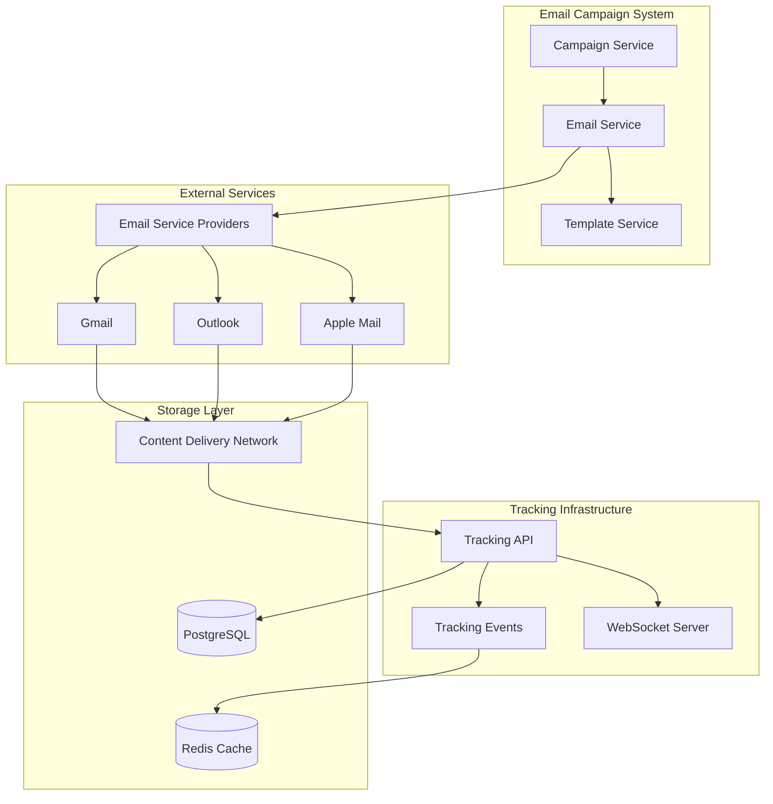
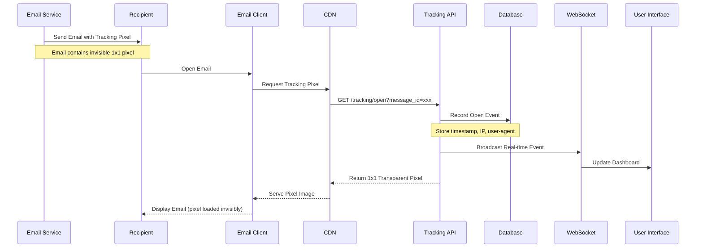
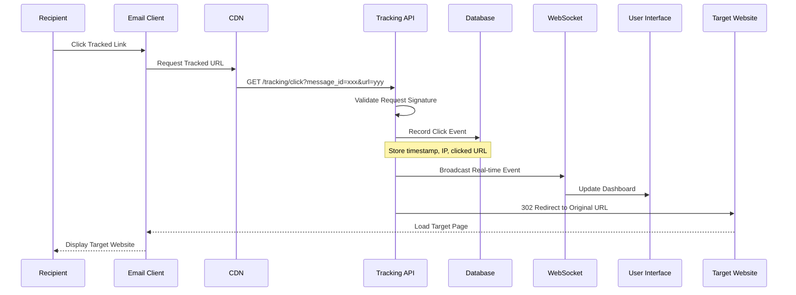

# Email Tracking System Documentation

## Table of Contents
1. [Overview](#overview)
2. [Architecture](#architecture)
3. [Email Open Tracking](#email-open-tracking)
4. [Link Click Tracking](#link-click-tracking)
5. [Email Provider Compatibility](#email-provider-compatibility)
6. [Implementation Details](#implementation-details)
7. [Privacy and Compliance](#privacy-and-compliance)
8. [Analytics and Reporting](#analytics-and-reporting)
9. [Troubleshooting](#troubleshooting)

## Overview

The Email Tracking System provides comprehensive analytics for email campaigns by tracking user engagement through two primary mechanisms:

- **Open Tracking**: Uses invisible 1x1 pixel images to detect when emails are opened
- **Click Tracking**: Rewrites all links to go through our tracking server before redirecting to the original destination

### Key Features
- ✅ Real-time open and click tracking
- ✅ Cross-platform compatibility (Gmail, Outlook, Apple Mail, etc.)
- ✅ Bot detection and filtering
- ✅ GDPR/Privacy compliance
- ✅ Advanced analytics and reporting
- ✅ WebSocket-based real-time updates

## Architecture

### High-Level System Design



### Component Responsibilities

| Component | Purpose | Technology |
|-----------|---------|------------|
| **Campaign Service** | Campaign lifecycle management | Python/FastAPI |
| **Email Service** | Email composition and sending | Python/FastAPI |
| **Tracking API** | Handle open/click events | Python/FastAPI |
| **WebSocket Server** | Real-time event broadcasting | Socket.IO |
| **CDN** | Global pixel and redirect serving | CloudFlare/AWS |
| **Database** | Event persistence and analytics | PostgreSQL |
| **Cache** | Performance optimization | Redis |

## Email Open Tracking

### How Open Tracking Works

Email open tracking uses an invisible tracking pixel embedded in HTML emails. When a recipient opens the email, their email client automatically requests this image from our server, allowing us to record the open event.

#### Tracking Pixel Implementation

```html
<!-- Invisible tracking pixel embedded in email HTML -->

```

#### Technical Flow



### Backend Implementation

```python
from fastapi import APIRouter, Request, Response, Depends
from sqlalchemy.orm import Session
import base64
from datetime import datetime

router = APIRouter()

@router.get("/tracking/open")
async def track_email_open(
    message_id: str,
    request: Request,
    db: Session = Depends(get_db)
):
    """
    Track email open event via invisible pixel
    Returns: 1x1 transparent PNG image
    """
    
    # Get message details
    message = db.query(CampaignMessage).filter(
        CampaignMessage.id == message_id
    ).first()
    
    if not message:
        return Response(status_code=404)
    
    # Check if tracking is enabled for this campaign
    campaign = db.query(Campaign).filter(
        Campaign.id == message.campaign_id
    ).first()
    
    if not campaign or not campaign.open_tracking_enabled:
        return _return_transparent_pixel()
    
    # Bot detection
    if _is_bot_request(request):
        return _return_transparent_pixel()
    
    # Check for duplicate opens (within 1 minute)
    recent_open = db.query(EmailTrackingEvent).filter(
        EmailTrackingEvent.message_id == message_id,
        EmailTrackingEvent.event_type == "OPEN",
        EmailTrackingEvent.created_at > datetime.utcnow() - timedelta(minutes=1)
    ).first()
    
    if not recent_open:
        # Record the open event
        tracking_event = EmailTrackingEvent(
            id=str(uuid.uuid4()),
            campaign_id=message.campaign_id,
            message_id=message_id,
            recipient_email=message.recipient_email,
            event_type="OPEN",
            ip_address=request.client.host,
            user_agent=request.headers.get("user-agent"),
            metadata={
                "referer": request.headers.get("referer"),
                "accept_language": request.headers.get("accept-language"),
                "x_forwarded_for": request.headers.get("x-forwarded-for")
            },
            created_at=datetime.utcnow()
        )
        
        db.add(tracking_event)
        db.commit()
        
        # Broadcast real-time event
        await broadcast_tracking_event(tracking_event)
    
    return _return_transparent_pixel()

def _return_transparent_pixel():
    """Return 1x1 transparent PNG pixel"""
    # Base64 encoded 1x1 transparent PNG
    pixel_data = base64.b64decode(
        "iVBORw0KGgoAAAANSUhEUgAAAAEAAAABCAYAAAAfFcSJAAAADUlEQVR42mNkYPhfDwAChwGA60e6kgAAAABJRU5ErkJggg=="
    )
    
    return Response(
        content=pixel_data,
        media_type="image/png",
        headers={
            "Cache-Control": "no-cache, no-store, must-revalidate",
            "Pragma": "no-cache",
            "Expires": "0"
        }
    )

def _is_bot_request(request: Request) -> bool:
    """Detect email scanners and bots"""
    user_agent = request.headers.get("user-agent", "").lower()
    
    bot_patterns = [
        "bot", "crawler", "scanner", "preview", "proxy",
        "proofpoint", "mimecast", "barracuda", "symantec",
        "mcafee", "trend micro", "forcepoint",
        "outlookemailwebaccess", "gmail-image-proxy"
    ]
    
    return any(pattern in user_agent for pattern in bot_patterns)
```

### Enhanced Tracking Methods

For better reliability across different email clients, we implement multiple tracking fallbacks:

```python
def generate_enhanced_tracking_pixel(message_id: str, recipient_hash: str) -> str:
    """Generate tracking pixel with multiple fallback methods"""
    
    base_url = "https://track.yourdomain.com/api/v1/tracking/open"
    params = f"?message_id={message_id}&r={recipient_hash}&t={int(time.time())}"
    
    tracking_html = f"""
    <!-- Primary tracking pixel -->
    
    
    <!-- CSS background fallback -->
    <div style="background-image: url('{base_url}{params}&method=css'); 
                width: 1px; height: 1px; 
                display: none;"></div>
    
    <!-- JavaScript beacon fallback -->
    <script type="text/javascript">
        (function() {{
            try {{
                if (navigator.sendBeacon) {{
                    navigator.sendBeacon('{base_url}{params}&method=beacon');
                }} else if (fetch) {{
                    fetch('{base_url}{params}&method=fetch').catch(function() {{}});
                }}
            }} catch (e) {{
                // Fallback: create image element
                var img = new Image();
                img.src = '{base_url}{params}&method=js';
            }}
        }})();
    </script>
    """
    
    return tracking_html
```

## Link Click Tracking

### How Click Tracking Works

All links in email content are rewritten to go through our tracking server first. When a recipient clicks a link, we record the click event and then redirect them to the original destination.

#### Link Rewriting Process

**Original Link:**
```html
<a href="https://example.com/product?utm_source=email">Visit Our Store</a>
```

**Tracked Link:**
```html
<a href="https://track.yourdomain.com/api/v1/tracking/click?message_id=abc123&url=https%3A%2F%2Fexample.com%2Fproduct%3Futm_source%3Demail&sig=a1b2c3">
  Visit Our Store
</a>
```

#### Technical Flow



### Backend Implementation

```python
@router.get("/tracking/click")
async def track_link_click(
    message_id: str,
    url: str,
    sig: str,
    request: Request,
    db: Session = Depends(get_db)
):
    """
    Track link click and redirect to original URL
    """
    
    # Validate signature to prevent tampering
    if not _validate_signature(message_id, url, sig):
        return Response(status_code=403)
    
    # Get message and campaign details
    message = db.query(CampaignMessage).filter(
        CampaignMessage.id == message_id
    ).first()
    
    if not message:
        return RedirectResponse(url=url, status_code=302)
    
    campaign = db.query(Campaign).filter(
        Campaign.id == message.campaign_id
    ).first()
    
    # Only track if click tracking is enabled
    if campaign and campaign.click_tracking_enabled:
        # Bot detection
        if not _is_bot_request(request):
            # Record click event
            tracking_event = EmailTrackingEvent(
                id=str(uuid.uuid4()),
                campaign_id=message.campaign_id,
                message_id=message_id,
                recipient_email=message.recipient_email,
                event_type="CLICK",
                url=url,
                ip_address=request.client.host,
                user_agent=request.headers.get("user-agent"),
                metadata={
                    "referer": request.headers.get("referer"),
                    "click_timestamp": datetime.utcnow().isoformat()
                },
                created_at=datetime.utcnow()
            )
            
            db.add(tracking_event)
            db.commit()
            
            # Broadcast real-time event
            await broadcast_tracking_event(tracking_event)
    
    # Redirect to original URL
    return RedirectResponse(url=url, status_code=302)

def _validate_signature(message_id: str, url: str, signature: str) -> bool:
    """Validate HMAC signature to prevent URL tampering"""
    import hmac
    import hashlib
    
    expected_sig = hmac.new(
        TRACKING_SECRET_KEY.encode(),
        f"{message_id}:{url}".encode(),
        hashlib.sha256
    ).hexdigest()[:16]
    
    return signature == expected_sig
```

### Link Rewriting Service

```python
from bs4 import BeautifulSoup
import urllib.parse
import hmac
import hashlib

class LinkTrackingService:
    def __init__(self, base_tracking_url: str, secret_key: str):
        self.base_url = base_tracking_url
        self.secret_key = secret_key
    
    def rewrite_email_links(self, html_content: str, message_id: str) -> str:
        """Rewrite all links in email HTML to include tracking"""
        
        soup = BeautifulSoup(html_content, 'html.parser')
        
        # Find all anchor tags with href attributes
        for link in soup.find_all('a', href=True):
            original_url = link['href']
            
            # Skip non-HTTP links (mailto, tel, etc.)
            if not original_url.startswith(('http://', 'https://')):
                continue
            
            # Skip unsubscribe links (handle separately)
            if 'unsubscribe' in original_url.lower():
                continue
            
            # Create tracked URL
            tracked_url = self._create_tracked_url(original_url, message_id)
            link['href'] = tracked_url
        
        return str(soup)
    
    def _create_tracked_url(self, original_url: str, message_id: str) -> str:
        """Create a tracked version of the URL"""
        
        # Generate signature for security
        signature = self._generate_signature(message_id, original_url)
        
        # URL encode the original URL
        encoded_url = urllib.parse.quote(original_url, safe='')
        
        # Build tracking URL
        params = {
            'message_id': message_id,
            'url': encoded_url,
            'sig': signature
        }
        
        query_string = urllib.parse.urlencode(params)
        return f"{self.base_url}/api/v1/tracking/click?{query_string}"
    
    def _generate_signature(self, message_id: str, url: str) -> str:
        """Generate HMAC signature for URL integrity"""
        return hmac.new(
            self.secret_key.encode(),
            f"{message_id}:{url}".encode(),
            hashlib.sha256
        ).hexdigest()[:16]

# Usage example
link_service = LinkTrackingService(
    base_tracking_url="https://track.yourdomain.com",
    secret_key=os.getenv("TRACKING_SECRET_KEY")
)

tracked_html = link_service.rewrite_email_links(email_html, message_id)
```

## Email Provider Compatibility

### Gmail

Gmail presents unique challenges and considerations for email tracking:

#### Open Tracking in Gmail
- **Image Proxy**: Gmail serves images through their proxy servers (`ci3.googleusercontent.com`)
- **Caching**: Images may be cached, affecting open tracking accuracy
- **Mobile Apps**: Different behavior between Gmail web and mobile apps
- **Privacy**: Users can disable image loading

#### Implementation Considerations
```python
def handle_gmail_open_tracking(request: Request, user_agent: str):
    """Special handling for Gmail image proxy requests"""
    
    # Detect Gmail image proxy
    if "googleimageproxy" in user_agent.lower():
        return {
            "source": "gmail_proxy",
            "cached": True,  # Likely cached request
            "real_ip": request.headers.get("x-forwarded-for", "").split(',')[0].strip()
        }
    
    # Detect Gmail web interface
    if "gmail" in user_agent.lower():
        return {
            "source": "gmail_web",
            "cached": False
        }
    
    return {"source": "unknown"}
```

#### Click Tracking in Gmail
- **Safe Links**: Gmail may process links through their safe browsing
- **Link Warnings**: May show warnings for external domains
- **AMP Emails**: Special handling needed for AMP email format

### Outlook

Microsoft Outlook (including Outlook.com, Office 365) has its own tracking challenges:

#### Open Tracking in Outlook
- **Image Blocking**: Desktop Outlook blocks images by default
- **Safe Lists**: Images load automatically for trusted senders
- **Web vs Desktop**: Different behavior between Outlook web and desktop clients

#### Implementation Considerations
```python
def handle_outlook_open_tracking(request: Request, user_agent: str):
    """Special handling for Outlook clients"""
    
    # Detect Outlook Web Access
    if "outlookwebaccess" in user_agent.lower():
        return {
            "source": "outlook_web",
            "version": "web"
        }
    
    # Detect Outlook desktop client
    if "microsoft outlook" in user_agent.lower():
        return {
            "source": "outlook_desktop",
            "version": "desktop"
        }
    
    return {"source": "unknown"}
```

#### Click Tracking in Outlook
- **Safe Links Protection**: Office 365 ATP rewrites URLs for security scanning
- **Link Analysis**: Microsoft analyzes clicked links before redirecting
- **Delayed Redirects**: May experience delays due to security scanning

### Apple Mail

Apple Mail (macOS and iOS) introduces privacy-focused challenges:

#### Mail Privacy Protection (iOS 15+)
Apple's Mail Privacy Protection significantly impacts email tracking:

```python
def handle_apple_mail_privacy(request: Request, user_agent: str):
    """Handle Apple Mail Privacy Protection"""
    
    # Detect Apple Mail Privacy Protection
    if "mail privacy protection" in user_agent.lower():
        return {
            "source": "apple_mail_privacy",
            "privacy_protected": True,
            "real_user_interaction": False,  # Likely pre-fetched
            "note": "Apple MPP pre-loads images for privacy"
        }
    
    # Regular Apple Mail
    if "mail/" in user_agent.lower() and "apple" in user_agent.lower():
        return {
            "source": "apple_mail",
            "privacy_protected": False
        }
    
    return {"source": "unknown"}
```

#### Key Challenges:
1. **Pre-loading**: Apple pre-loads images regardless of user interaction
2. **Proxy IPs**: Real user IP addresses are hidden
3. **False Opens**: Generate artificial open events for privacy
4. **Statistical Impact**: Affects open rate accuracy significantly

## Implementation Details

### Database Schema

```sql
-- Campaign tracking events table
CREATE TABLE email_tracking_events (
    id UUID PRIMARY KEY DEFAULT gen_random_uuid(),
    campaign_id UUID NOT NULL REFERENCES campaigns(id),
    message_id UUID NOT NULL REFERENCES campaign_messages(id),
    recipient_email VARCHAR(255) NOT NULL,
    event_type VARCHAR(50) NOT NULL CHECK (event_type IN ('OPEN', 'CLICK', 'BOUNCE', 'UNSUBSCRIBE', 'COMPLAINT')),
    
    -- Event details
    ip_address INET,
    user_agent TEXT,
    url TEXT,  -- For click events
    
    -- Detection and filtering
    is_bot_detected BOOLEAN DEFAULT FALSE,
    email_client_info JSONB,
    
    -- Metadata and context
    metadata JSONB DEFAULT '{}',
    created_at TIMESTAMP WITH TIME ZONE DEFAULT NOW(),
    
    -- Indexes for performance
    INDEX idx_tracking_campaign_id (campaign_id),
    INDEX idx_tracking_message_id (message_id),
    INDEX idx_tracking_recipient (recipient_email),
    INDEX idx_tracking_event_type (event_type),
    INDEX idx_tracking_created_at (created_at),
    
    -- Composite indexes for analytics
    INDEX idx_tracking_campaign_event_time (campaign_id, event_type, created_at),
    INDEX idx_tracking_recipient_event_time (recipient_email, event_type, created_at)
);

-- Campaign statistics materialized view for performance
CREATE MATERIALIZED VIEW campaign_stats AS
SELECT 
    c.id as campaign_id,
    c.name as campaign_name,
    COUNT(DISTINCT cm.id) as messages_sent,
    COUNT(DISTINCT CASE WHEN ete.event_type = 'OPEN' THEN ete.recipient_email END) as unique_opens,
    COUNT(CASE WHEN ete.event_type = 'OPEN' THEN 1 END) as total_opens,
    COUNT(DISTINCT CASE WHEN ete.event_type = 'CLICK' THEN ete.recipient_email END) as unique_clicks,
    COUNT(CASE WHEN ete.event_type = 'CLICK' THEN 1 END) as total_clicks,
    COUNT(CASE WHEN cm.status = 'BOUNCED' THEN 1 END) as bounces,
    COUNT(CASE WHEN ete.event_type = 'UNSUBSCRIBE' THEN 1 END) as unsubscribes,
    COUNT(CASE WHEN ete.event_type = 'COMPLAINT' THEN 1 END) as complaints,
    
    -- Calculated rates
    CASE 
        WHEN COUNT(DISTINCT cm.id) > 0 
        THEN ROUND((COUNT(DISTINCT CASE WHEN ete.event_type = 'OPEN' THEN ete.recipient_email END) * 100.0) / COUNT(DISTINCT cm.id), 2)
        ELSE 0 
    END as open_rate,
    
    CASE 
        WHEN COUNT(DISTINCT cm.id) > 0 
        THEN ROUND((COUNT(DISTINCT CASE WHEN ete.event_type = 'CLICK' THEN ete.recipient_email END) * 100.0) / COUNT(DISTINCT cm.id), 2)
        ELSE 0 
    END as click_rate
    
FROM campaigns c
LEFT JOIN campaign_messages cm ON c.id = cm.campaign_id
LEFT JOIN email_tracking_events ete ON cm.id = ete.message_id AND ete.is_bot_detected = FALSE
GROUP BY c.id, c.name;

-- Refresh stats periodically
CREATE INDEX ON campaign_stats (campaign_id);
```

### Real-time Event Broadcasting

```python
import asyncio
from socketio import AsyncServer
from typing import Dict, List

class TrackingEventBroadcaster:
    def __init__(self):
        self.sio = AsyncServer(cors_allowed_origins="*")
        self.connected_clients: Dict[str, List[str]] = {}  # user_id -> [session_ids]
    
    async def broadcast_tracking_event(self, event: EmailTrackingEvent):
        """Broadcast tracking event to connected dashboards"""
        
        # Get campaign owner/team members
        campaign = await self._get_campaign(event.campaign_id)
        authorized_users = await self._get_authorized_users(campaign.tenant_id)
        
        # Prepare event data for frontend
        event_data = {
            "id": event.id,
            "campaignId": event.campaign_id,
            "messageId": event.message_id,
            "recipientEmail": self._hash_email(event.recipient_email),  # Privacy
            "eventType": event.event_type,
            "url": event.url,
            "timestamp": event.created_at.isoformat(),
            "location": await self._get_location_from_ip(event.ip_address),
            "device": self._parse_user_agent(event.user_agent)
        }
        
        # Broadcast to authorized users
        for user_id in authorized_users:
            if user_id in self.connected_clients:
                for session_id in self.connected_clients[user_id]:
                    await self.sio.emit(
                        'tracking_event',
                        event_data,
                        room=session_id
                    )
    
    async def connect_client(self, session_id: str, user_id: str):
        """Handle client connection"""
        if user_id not in self.connected_clients:
            self.connected_clients[user_id] = []
        
        self.connected_clients[user_id].append(session_id)
    
    async def disconnect_client(self, session_id: str, user_id: str):
        """Handle client disconnection"""
        if user_id in self.connected_clients:
            if session_id in self.connected_clients[user_id]:
                self.connected_clients[user_id].remove(session_id)
            
            if not self.connected_clients[user_id]:
                del self.connected_clients[user_id]
    
    def _hash_email(self, email: str) -> str:
        """Hash email for privacy in frontend"""
        import hashlib
        return hashlib.sha256(email.encode()).hexdigest()[:8]
    
    def _parse_user_agent(self, user_agent: str) -> Dict:
        """Parse user agent for device/browser info"""
        # Simplified user agent parsing
        # In production, use a library like user-agents
        return {
            "browser": "Unknown",
            "device": "Unknown",
            "os": "Unknown"
        }

# Usage
broadcaster = TrackingEventBroadcaster()

async def broadcast_tracking_event(event: EmailTrackingEvent):
    """Helper function to broadcast events"""
    await broadcaster.broadcast_tracking_event(event)
```

### Frontend Real-time Updates

```typescript
// Frontend WebSocket integration
import { io, Socket } from 'socket.io-client';

interface TrackingEvent {
  id: string;
  campaignId: string;
  messageId: string;
  recipientEmail: string;  // Hashed for privacy
  eventType: 'OPEN' | 'CLICK' | 'BOUNCE' | 'UNSUBSCRIBE' | 'COMPLAINT';
  url?: string;
  timestamp: string;
  location?: {
    country: string;
    city: string;
  };
  device?: {
    browser: string;
    device: string;
    os: string;
  };
}

class TrackingEventListener {
  private socket: Socket;
  private eventHandlers: Map<string, (event: TrackingEvent) => void> = new Map();
  
  constructor(serverUrl: string, authToken: string) {
    this.socket = io(serverUrl, {
      auth: {
        token: authToken
      }
    });
    
    this.setupEventListeners();
  }
  
  private setupEventListeners() {
    this.socket.on('connect', () => {
      console.log('Connected to tracking server');
    });
    
    this.socket.on('tracking_event', (event: TrackingEvent) => {
      this.handleTrackingEvent(event);
    });
    
    this.socket.on('disconnect', () => {
      console.log('Disconnected from tracking server');
    });
  }
  
  private handleTrackingEvent(event: TrackingEvent) {
    // Update campaign statistics in real-time
    this.updateCampaignStats(event);
    
    // Add to event timeline
    this.addToEventTimeline(event);
    
    // Trigger custom handlers
    const handler = this.eventHandlers.get(event.campaignId);
    if (handler) {
      handler(event);
    }
  }
  
  public subscribeToCampaign(campaignId: string, handler: (event: TrackingEvent) => void) {
    this.eventHandlers.set(campaignId, handler);
    
    // Join campaign room
    this.socket.emit('join_campaign', { campaignId });
  }
  
  public unsubscribeFromCampaign(campaignId: string) {
    this.eventHandlers.delete(campaignId);
    
    // Leave campaign room
    this.socket.emit('leave_campaign', { campaignId });
  }
  
  private updateCampaignStats(event: TrackingEvent) {
    // Update React Query cache or state management
    // This would integrate with your existing state management solution
  }
  
  private addToEventTimeline(event: TrackingEvent) {
    // Add event to timeline component
    // Update UI to show new activity
  }
}

// Usage in React component
const CampaignAnalytics: React.FC<{ campaignId: string }> = ({ campaignId }) => {
  const [events, setEvents] = useState<TrackingEvent[]>([]);
  const [stats, setStats] = useState<CampaignStats | null>(null);
  
  useEffect(() => {
    const listener = new TrackingEventListener(
      process.env.NEXT_PUBLIC_TRACKING_WS_URL!,
      getAuthToken()
    );
    
    listener.subscribeToCampaign(campaignId, (event) => {
      setEvents(prev => [event, ...prev].slice(0, 100)); // Keep last 100 events
      
      // Update stats based on event type
      setStats(prev => {
        if (!prev) return prev;
        
        const updated = { ...prev };
        
        if (event.eventType === 'OPEN') {
          updated.totalOpens += 1;
          // Check if this is a unique open
        } else if (event.eventType === 'CLICK') {
          updated.totalClicks += 1;
          // Check if this is a unique click
        }
        
        return updated;
      });
    });
    
    return () => {
      listener.unsubscribeFromCampaign(campaignId);
    };
  }, [campaignId]);
  
  return (
    <div className="campaign-analytics">
      <div className="stats-grid">
        {stats && (
          <>
            <StatCard title="Open Rate" value={`${stats.openRate.toFixed(1)}%`} />
            <StatCard title="Click Rate" value={`${stats.clickRate.toFixed(1)}%`} />
          </>
        )}
      </div>
      
      <div className="event-timeline">
        <h3>Recent Activity</h3>
        {events.map(event => (
          <EventItem key={event.id} event={event} />
        ))}
      </div>
    </div>
  );
};
```

## Privacy and Compliance

### GDPR Compliance

Implementing email tracking while respecting privacy regulations requires careful consideration:

```python
class PrivacyCompliantTracker:
    """Email tracking with privacy compliance features"""
    
    def __init__(self, db: Session):
        self.db = db
    
    def should_track_recipient(self, recipient_email: str, tracking_type: str) -> bool:
        """Check if tracking is allowed for this recipient"""
        
        # Check global opt-out list
        if self._is_globally_opted_out(recipient_email):
            return False
        
        # Check specific tracking preferences
        preferences = self._get_tracking_preferences(recipient_email)
        
        if tracking_type == "open" and not preferences.allow_open_tracking:
            return False
        
        if tracking_type == "click" and not preferences.allow_click_tracking:
            return False
        
        return True
    
    def anonymize_tracking_data(self, event: EmailTrackingEvent) -> EmailTrackingEvent:
        """Anonymize tracking data for privacy"""
        
        # Hash email address
        event.recipient_email = self._hash_email(event.recipient_email)
        
        # Truncate IP address (remove last octet)
        if event.ip_address:
            ip_parts = event.ip_address.split('.')
            if len(ip_parts) == 4:
                event.ip_address = f"{'.'.join(ip_parts[:3])}.0"
        
        # Remove detailed user agent info
        if event.user_agent:
            event.user_agent = self._sanitize_user_agent(event.user_agent)
        
        return event
    
    def create_privacy_notice_email(self, html_content: str, recipient_email: str) -> str:
        """Add privacy notice and opt-out links to email"""
        
        opt_out_url = self._generate_opt_out_url(recipient_email)
        privacy_policy_url = "https://yourdomain.com/privacy-policy"
        
        privacy_notice = f"""
        <div style="font-size: 11px; color: #666; border-top: 1px solid #eee; 
                    margin-top: 30px; padding-top: 15px;">
            <p>This email contains tracking elements for analytics purposes.</p>
            <p>
                <a href="{opt_out_url}" style="color: #666;">Opt out of tracking</a> | 
                <a href="{privacy_policy_url}" style="color: #666;">Privacy Policy</a>
            </p>
        </div>
        """
        
        return html_content + privacy_notice
    
    def handle_opt_out_request(self, recipient_email: str, tracking_types: List[str]):
        """Process tracking opt-out request"""
        
        opt_out_record = TrackingOptOut(
            email=recipient_email,
            opted_out_types=tracking_types,
            opted_out_at=datetime.utcnow(),
            ip_address=request.client.host if request else None
        )
        
        self.db.add(opt_out_record)
        self.db.commit()
        
        # Send confirmation email
        self._send_opt_out_confirmation(recipient_email)
    
    def _hash_email(self, email: str) -> str:
        """Create consistent hash for email"""
        return hashlib.sha256(f"{email}:{HASH_SALT}".encode()).hexdigest()[:16]
    
    def _generate_opt_out_url(self, email: str) -> str:
        """Generate secure opt-out URL"""
        token = self._create_opt_out_token(email)
        return f"https://yourdomain.com/unsubscribe?token={token}"
```

### Data Retention Policy

```python
class TrackingDataRetentionManager:
    """Manage tracking data lifecycle and retention"""
    
    def __init__(self, db: Session):
        self.db = db
        self.retention_periods = {
            "raw_events": timedelta(days=365),      # 1 year
            "aggregated_stats": timedelta(days=2555), # 7 years
            "opt_out_records": None                  # Permanent
        }
    
    async def cleanup_expired_data(self):
        """Remove tracking data past retention period"""
        
        cutoff_date = datetime.utcnow() - self.retention_periods["raw_events"]
        
        # Archive old events before deletion
        await self._archive_old_events(cutoff_date)
        
        # Delete raw tracking events
        deleted_count = self.db.query(EmailTrackingEvent).filter(
            EmailTrackingEvent.created_at < cutoff_date
        ).delete(synchronize_session=False)
        
        self.db.commit()
        
        logger.info(f"Cleaned up {deleted_count} expired tracking events")
    
    async def _archive_old_events(self, cutoff_date: datetime):
        """Archive events to cold storage before deletion"""
        
        # Export to data warehouse or cold storage
        old_events = self.db.query(EmailTrackingEvent).filter(
            EmailTrackingEvent.created_at < cutoff_date
        ).all()
        
        # Process in batches for large datasets
        batch_size = 1000
        for i in range(0, len(old_events), batch_size):
            batch = old_events[i:i + batch_size]
            await self._export_events_to_archive(batch)
```

## Analytics and Reporting

### Campaign Performance Metrics

```python
class CampaignAnalytics:
    """Advanced analytics for email campaigns"""
    
    def __init__(self, db: Session):
        self.db = db
    
    def get_campaign_performance(self, campaign_id: str) -> Dict:
        """Get comprehensive campaign performance metrics"""
        
        # Base query for campaign events
        events_query = self.db.query(EmailTrackingEvent).filter(
            EmailTrackingEvent.campaign_id == campaign_id,
            EmailTrackingEvent.is_bot_detected == False
        )
        
        # Get message count
        message_count = self.db.query(CampaignMessage).filter(
            CampaignMessage.campaign_id == campaign_id
        ).count()
        
        # Calculate metrics
        metrics = {
            "sent_count": message_count,
            "delivered_count": self._get_delivered_count(campaign_id),
            "unique_opens": self._get_unique_opens(events_query),
            "total_opens": self._get_total_opens(events_query),
            "unique_clicks": self._get_unique_clicks(events_query),
            "total_clicks": self._get_total_clicks(events_query),
            "bounce_count": self._get_bounce_count(campaign_id),
            "unsubscribe_count": self._get_unsubscribe_count(events_query),
            "complaint_count": self._get_complaint_count(events_query)
        }
        
        # Calculate rates
        if metrics["sent_count"] > 0:
            metrics["open_rate"] = (metrics["unique_opens"] / metrics["sent_count"]) * 100
            metrics["click_rate"] = (metrics["unique_clicks"] / metrics["sent_count"]) * 100
            metrics["bounce_rate"] = (metrics["bounce_count"] / metrics["sent_count"]) * 100
        else:
            metrics["open_rate"] = 0
            metrics["click_rate"] = 0
            metrics["bounce_rate"] = 0
        
        # Click-through rate (clicks per opens)
        if metrics["unique_opens"] > 0:
            metrics["ctr"] = (metrics["unique_clicks"] / metrics["unique_opens"]) * 100
        else:
            metrics["ctr"] = 0
        
        return metrics
    
    def get_engagement_timeline(self, campaign_id: str, interval: str = "hour") -> List[Dict]:
        """Get engagement timeline for visualization"""
        
        # Time-series aggregation based on interval
        if interval == "hour":
            time_format = "YYYY-MM-DD HH24:00:00"
        elif interval == "day":
            time_format = "YYYY-MM-DD"
        else:
            time_format = "YYYY-MM-DD HH24:00:00"
        
        timeline_query = """
        SELECT 
            TO_CHAR(created_at, %s) as time_period,
            event_type,
            COUNT(*) as event_count,
            COUNT(DISTINCT recipient_email) as unique_recipients
        FROM email_tracking_events 
        WHERE campaign_id = %s 
          AND is_bot_detected = FALSE
        GROUP BY time_period, event_type
        ORDER BY time_period
        """
        
        results = self.db.execute(timeline_query, (time_format, campaign_id))
        
        # Transform results for frontend consumption
        timeline = {}
        for row in results:
            period = row.time_period
            if period not in timeline:
                timeline[period] = {
                    "timestamp": period,
                    "opens": 0,
                    "clicks": 0,
                    "unique_opens": 0,
                    "unique_clicks": 0
                }
            
            if row.event_type == "OPEN":
                timeline[period]["opens"] = row.event_count
                timeline[period]["unique_opens"] = row.unique_recipients
            elif row.event_type == "CLICK":
                timeline[period]["clicks"] = row.event_count
                timeline[period]["unique_clicks"] = row.unique_recipients
        
        return list(timeline.values())
    
    def get_top_clicked_links(self, campaign_id: str, limit: int = 10) -> List[Dict]:
        """Get most clicked links in campaign"""
        
        click_query = """
        SELECT 
            url,
            COUNT(*) as total_clicks,
            COUNT(DISTINCT recipient_email) as unique_clicks
        FROM email_tracking_events 
        WHERE campaign_id = %s 
          AND event_type = 'CLICK' 
          AND is_bot_detected = FALSE
          AND url IS NOT NULL
        GROUP BY url
        ORDER BY total_clicks DESC
        LIMIT %s
        """
        
        results = self.db.execute(click_query, (campaign_id, limit))
        
        return [
            {
                "url": row.url,
                "total_clicks": row.total_clicks,
                "unique_clicks": row.unique_clicks,
                "click_rate": (row.unique_clicks / self._get_unique_opens_count(campaign_id)) * 100
            }
            for row in results
        ]
    
    def get_geographic_distribution(self, campaign_id: str) -> Dict:
        """Get geographic distribution of opens/clicks"""
        
        # This would require IP geolocation service integration
        geo_query = """
        SELECT 
            COALESCE(geo_data->>'country', 'Unknown') as country,
            COALESCE(geo_data->>'city', 'Unknown') as city,
            COUNT(CASE WHEN event_type = 'OPEN' THEN 1 END) as opens,
            COUNT(CASE WHEN event_type = 'CLICK' THEN 1 END) as clicks
        FROM email_tracking_events 
        WHERE campaign_id = %s 
          AND is_bot_detected = FALSE
        GROUP BY country, city
        ORDER BY opens DESC, clicks DESC
        """
        
        results = self.db.execute(geo_query, (campaign_id,))
        
        return {
            "countries": [
                {
                    "country": row.country,
                    "city": row.city,
                    "opens": row.opens,
                    "clicks": row.clicks
                }
                for row in results
            ]
        }
```

## Troubleshooting

### Common Issues and Solutions

#### 1. Low Open Rates

**Symptoms:**
- Open rates significantly below industry average (< 15%)
- Tracking pixels not loading properly

**Potential Causes & Solutions:**

| Issue | Solution |
|-------|----------|
| **Images Blocked** | Implement multiple tracking methods (CSS, JS fallbacks) |
| **Email in Spam** | Check sender reputation, authentication (SPF, DKIM, DMARC) |
| **Apple Mail Privacy Protection** | Account for inflated rates, focus on click metrics |
| **Corporate Firewalls** | Use CDN with good reputation, proper SSL certificates |

```python
# Diagnostic query for low open rates
def diagnose_low_open_rates(campaign_id: str) -> Dict:
    results = db.execute("""
    SELECT 
        COUNT(DISTINCT cm.recipient_email) as total_recipients,
        COUNT(DISTINCT CASE WHEN ete.event_type = 'OPEN' THEN ete.recipient_email END) as unique_opens,
        COUNT(CASE WHEN ete.event_type = 'OPEN' AND ete.user_agent LIKE '%Mail Privacy Protection%' THEN 1 END) as apple_privacy_opens,
        COUNT(CASE WHEN ete.event_type = 'OPEN' AND ete.is_bot_detected = TRUE THEN 1 END) as bot_opens
    FROM campaign_messages cm
    LEFT JOIN email_tracking_events ete ON cm.id = ete.message_id
    WHERE cm.campaign_id = %s
    """, (campaign_id,))
    
    return dict(results.first())
```

#### 2. Inflated Open Rates

**Symptoms:**
- Open rates unusually high (> 40-50%)
- Many opens immediately after sending

**Potential Causes & Solutions:**

| Issue | Solution |
|-------|----------|
| **Email Scanners** | Implement bot detection algorithms |
| **Apple MPP** | Statistical modeling to estimate real opens |
| **Pre-fetching** | Time-based filtering (ignore opens < 5 seconds) |
| **Image Caching** | Implement cache-busting parameters |

```python
# Bot detection enhancement
def enhanced_bot_detection(request: Request, event: EmailTrackingEvent) -> bool:
    """Advanced bot detection logic"""
    
    user_agent = request.headers.get("user-agent", "").lower()
    
    # Known bot patterns
    bot_patterns = [
        "bot", "crawler", "scanner", "preview", "prefetch",
        "proofpoint", "mimecast", "barracuda", "symantec",
        "mcafee", "trend micro", "forcepoint", "spam",
        "outlookemailwebaccess", "gmail-image-proxy"
    ]
    
    # User agent analysis
    if any(pattern in user_agent for pattern in bot_patterns):
        return True
    
    # Timing analysis (too fast)
    if event.created_at - event.message.sent_at < timedelta(seconds=5):
        return True
    
    # IP reputation check
    if is_known_scanner_ip(request.client.host):
        return True
    
    # Behavioral patterns (multiple rapid requests)
    recent_events = db.query(EmailTrackingEvent).filter(
        EmailTrackingEvent.ip_address == request.client.host,
        EmailTrackingEvent.created_at > datetime.utcnow() - timedelta(minutes=5)
    ).count()
    
    if recent_events > 10:  # More than 10 events in 5 minutes
        return True
    
    return False
```

#### 3. Click Tracking Not Working

**Symptoms:**
- Very low or zero click rates
- Links not redirecting properly
- Error 404 on tracking URLs

**Potential Causes & Solutions:**

| Issue | Solution |
|-------|----------|
| **Invalid Signatures** | Check HMAC signature generation and validation |
| **URL Encoding** | Properly encode URLs with special characters |
| **CDN Issues** | Check CDN configuration and SSL certificates |
| **Link Rewriting Errors** | Validate HTML parsing and link modification |

```python
# Diagnostic function for click tracking
def diagnose_click_tracking(campaign_id: str) -> Dict:
    """Diagnose click tracking issues"""
    
    # Check for tracking errors
    error_query = """
    SELECT 
        url,
        COUNT(*) as error_count,
        array_agg(DISTINCT metadata->>'error') as error_types
    FROM email_tracking_events 
    WHERE campaign_id = %s 
      AND event_type = 'CLICK_ERROR'
    GROUP BY url
    ORDER BY error_count DESC
    """
    
    results = db.execute(error_query, (campaign_id,))
    
    return {
        "errors": [dict(row) for row in results],
        "total_links": get_total_links_count(campaign_id),
        "tracked_links": get_tracked_links_count(campaign_id)
    }
```

### Performance Optimization

#### Database Optimization

```sql
-- Partition large tracking events table by time
CREATE TABLE email_tracking_events_2024_q1 PARTITION OF email_tracking_events
FOR VALUES FROM ('2024-01-01') TO ('2024-04-01');

CREATE TABLE email_tracking_events_2024_q2 PARTITION OF email_tracking_events
FOR VALUES FROM ('2024-04-01') TO ('2024-07-01');

-- Optimize queries with proper indexes
CREATE INDEX CONCURRENTLY idx_tracking_events_campaign_time 
ON email_tracking_events (campaign_id, created_at DESC);

CREATE INDEX CONCURRENTLY idx_tracking_events_recipient_hash 
ON email_tracking_events USING hash (recipient_email);

-- Materialized view for campaign statistics
CREATE MATERIALIZED VIEW campaign_stats_hourly AS
SELECT 
    campaign_id,
    date_trunc('hour', created_at) as hour,
    event_type,
    COUNT(*) as event_count,
    COUNT(DISTINCT recipient_email) as unique_count
FROM email_tracking_events
WHERE is_bot_detected = FALSE
GROUP BY campaign_id, hour, event_type;

-- Refresh hourly stats view
CREATE OR REPLACE FUNCTION refresh_campaign_stats()
RETURNS void AS $$
BEGIN
    REFRESH MATERIALIZED VIEW CONCURRENTLY campaign_stats_hourly;
END;
$$ LANGUAGE plpgsql;

-- Schedule periodic refresh
SELECT cron.schedule('refresh-campaign-stats', '0 * * * *', 'SELECT refresh_campaign_stats();');
```

#### Caching Strategy

```python
import redis
from typing import Optional, Dict
import json

class TrackingCache:
    """Redis-based caching for tracking data"""
    
    def __init__(self, redis_client: redis.Redis):
        self.redis = redis_client
        self.default_ttl = 3600  # 1 hour
    
    def get_campaign_stats(self, campaign_id: str) -> Optional[Dict]:
        """Get cached campaign statistics"""
        cache_key = f"campaign_stats:{campaign_id}"
        cached_data = self.redis.get(cache_key)
        
        if cached_data:
            return json.loads(cached_data)
        return None
    
    def set_campaign_stats(self, campaign_id: str, stats: Dict, ttl: int = None):
        """Cache campaign statistics"""
        cache_key = f"campaign_stats:{campaign_id}"
        self.redis.setex(
            cache_key,
            ttl or self.default_ttl,
            json.dumps(stats, default=str)
        )
    
    def invalidate_campaign_cache(self, campaign_id: str):
        """Invalidate all cache entries for a campaign"""
        pattern = f"campaign_*:{campaign_id}"
        keys = self.redis.keys(pattern)
        if keys:
            self.redis.delete(*keys)
    
    def get_rate_limit_status(self, ip_address: str) -> int:
        """Check rate limiting status"""
        rate_key = f"rate_limit:{ip_address}"
        current = self.redis.get(rate_key)
        return int(current) if current else 0
    
    def increment_rate_limit(self, ip_address: str, window: int = 300) -> int:
        """Increment rate limit counter"""
        rate_key = f"rate_limit:{ip_address}"
        pipe = self.redis.pipeline()
        pipe.incr(rate_key)
        pipe.expire(rate_key, window)
        results = pipe.execute()
        return results[0]

# Usage in tracking endpoints
cache = TrackingCache(redis.Redis(host="localhost", port=6379, db=0))

@router.get("/tracking/open")
async def track_email_open_cached(message_id: str, request: Request):
    # Rate limiting
    ip = request.client.host
    if cache.increment_rate_limit(ip) > 100:  # Max 100 requests per 5 minutes
        return Response(status_code=429)
    
    # Check for cached campaign stats
    campaign_stats = cache.get_campaign_stats(campaign_id)
    if not campaign_stats:
        # Compute and cache stats
        campaign_stats = compute_campaign_stats(campaign_id)
        cache.set_campaign_stats(campaign_id, campaign_stats)
    
    # Record tracking event
    # ... existing logic ...
    
    # Invalidate cache after update
    cache.invalidate_campaign_cache(campaign_id)
    
    return _return_transparent_pixel()
```

This comprehensive documentation covers all aspects of the email tracking system, from basic concepts to advanced implementation details, privacy compliance, and troubleshooting. The system provides reliable, privacy-compliant email analytics across all major email providers while maintaining high performance and real-time capabilities.
