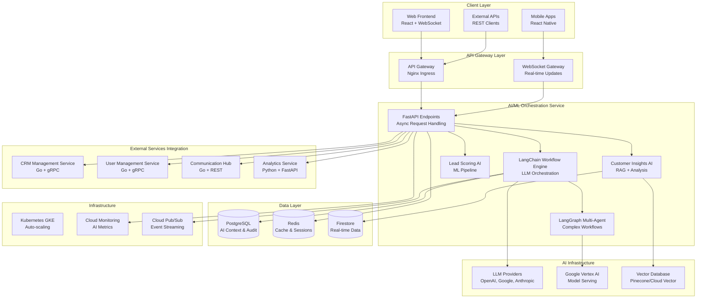
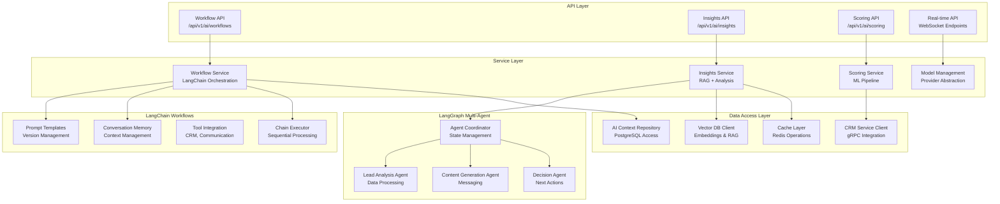

# Design Document - AI/ML Orchestration Service

## Overview

The AI/ML Orchestration Service design implements the intelligent automation engine that powers all AI capabilities in the CRM platform. Built with Python, FastAPI, LangChain, and LangGraph, this service orchestrates complex AI workflows, manages LLM interactions, provides real-time customer insights, and enables intelligent lead scoring. The service integrates seamlessly with the existing Go-based CRM Core Services while providing enterprise-grade AI capabilities optimized for SMB customers.

The design follows cloud-native patterns with Kubernetes deployment, implements multi-tenant AI isolation, and provides production-ready AI orchestration with comprehensive monitoring, caching, and cost optimization. The architecture emphasizes real-time processing (sub-2-second AI responses), scalability (1000+ concurrent workflows), and intelligent cost management while serving as a comprehensive learning platform for modern AI/ML development.

## Steering Document Alignment

### Technical Standards (tech.md)
The design strictly follows documented technical patterns:
- **Python AI/ML Stack**: Using FastAPI for high-performance async APIs and Pydantic for data validation
- **LangChain Integration**: LLM orchestration with prompt templates, memory management, and tool integration
- **LangGraph Workflows**: Complex multi-agent workflow orchestration with decision trees
- **Database Strategy**: PostgreSQL for persistent data, Redis for caching, Firestore for real-time data
- **Infrastructure**: Kubernetes deployment on Google Cloud Platform with Vertex AI integration
- **Communication**: REST APIs for external clients, gRPC for inter-service communication
- **Monitoring**: Cloud Monitoring with AI-specific metrics, token usage tracking, and performance analysis

### Project Structure (structure.md)
Implementation follows established project organization:
- **Service Organization**: Domain-driven design with clear AI service boundaries
- **Python Package Structure**: Standard layout with `app/`, `langchain_workflows/`, and service layers
- **Naming Conventions**: PascalCase for classes, snake_case for functions and variables
- **Import Patterns**: Standard library → Third-party → Internal → Relative imports ordering
- **Testing Structure**: Comprehensive unit, integration, and AI workflow testing

## Code Reuse Analysis

The AI/ML Orchestration Service builds upon existing CRM Core Services patterns while introducing new AI-specific components and integrating with established cloud infrastructure.

### Existing Components to Leverage
- **CRM Core Services Integration**: REST and gRPC clients for user management, contact data, and interaction history
- **Multi-tenant Architecture**: Reuse existing tenant isolation patterns and database connection strategies
- **Authentication & Authorization**: JWT token validation and RBAC integration with User Management Service
- **Monitoring Infrastructure**: Existing Cloud Monitoring setup extended with AI-specific metrics
- **Kubernetes Deployment**: Leverage existing GKE cluster, Helm charts, and deployment patterns
- **Database Connections**: Reuse PostgreSQL and Redis connection pools with AI-optimized configurations

### Integration Points
- **CRM Management Service**: Real-time access to contact data, interaction history, and lead information
- **User Management Service**: Authentication, RBAC validation, and tenant context for AI operations
- **Communication Hub Service**: Integration for AI-generated messages and notifications
- **Analytics Service**: AI insights feeding into broader analytics and reporting pipelines
- **Cloud Vertex AI**: Native Google Cloud AI services for model serving and MLOps
- **Vector Databases**: Integration with Pinecone or Cloud Vector Search for RAG capabilities

## Architecture

The system implements a modern AI-first microservices architecture with LangChain orchestration, multi-agent workflows, and real-time processing capabilities.



## Service Architecture Details



## Components and Interfaces

### AI Workflow Engine
- **Purpose:** Orchestrates LangChain workflows for automated customer interaction processing
- **Interfaces:** REST API for workflow triggering, WebSocket for real-time updates
- **Dependencies:** LLM providers, CRM Service, Redis cache, PostgreSQL context storage
- **Reuses:** Existing authentication middleware, multi-tenant isolation, monitoring patterns

### Lead Scoring Intelligence
- **Purpose:** AI-driven lead qualification with real-time scoring and explainable results
- **Interfaces:** REST API for score requests, gRPC for internal service communication
- **Dependencies:** ML models, customer data from CRM Service, historical interaction data
- **Reuses:** Existing database connection pools, tenant-scoped data access, audit logging

### Multi-Agent Workflow Manager
- **Purpose:** Coordinates complex business processes using LangGraph agent orchestration
- **Interfaces:** Async workflow API, agent status monitoring, human handoff integration
- **Dependencies:** LangGraph framework, multiple LLM providers, external service integrations
- **Reuses:** Existing error handling patterns, resource management, Kubernetes scaling

### Customer Insights RAG Engine
- **Purpose:** Provides AI-powered customer analysis using retrieval-augmented generation
- **Interfaces:** REST API for insight requests, streaming API for real-time analysis
- **Dependencies:** Vector database, conversation history, customer knowledge base
- **Reuses:** Existing data validation, caching strategies, monitoring infrastructure

### LLM Provider Management
- **Purpose:** Abstracts multiple LLM providers with intelligent routing and failover
- **Interfaces:** Internal provider API, cost tracking, performance monitoring
- **Dependencies:** OpenAI, Google, Anthropic APIs, token usage tracking
- **Reuses:** Existing configuration management, health checks, alert systems

### Real-time AI Pipeline
- **Purpose:** Processes customer interactions with sub-2-second AI response times
- **Interfaces:** WebSocket connections, streaming APIs, priority queue management
- **Dependencies:** Redis queues, WebSocket gateway, real-time data streams
- **Reuses:** Existing WebSocket infrastructure, load balancing, auto-scaling

## Data Models

### AI Workflow Context
```python
class WorkflowContext(BaseModel):
    id: UUID
    tenant_id: UUID  # Multi-tenant isolation
    workflow_type: WorkflowType
    customer_id: Optional[UUID]
    status: WorkflowStatus
    input_data: Dict[str, Any]
    conversation_memory: List[ConversationTurn]
    execution_steps: List[ExecutionStep]
    tokens_used: int
    cost: Decimal
    created_at: datetime
    completed_at: Optional[datetime]

class ConversationTurn(BaseModel):
    role: Literal["human", "ai", "system"]
    content: str
    timestamp: datetime
    metadata: Dict[str, Any]
```

### Lead Score Result
```python
class LeadScoreResult(BaseModel):
    id: UUID
    lead_id: UUID
    tenant_id: UUID
    score: int  # 0-100
    confidence: float  # 0.0-1.0
    reasoning: List[ScoreComponent]
    model_version: str
    calculated_at: datetime
    expires_at: datetime

class ScoreComponent(BaseModel):
    factor: str
    weight: float
    value: float
    explanation: str
```

### AI Agent State
```python
class AgentState(BaseModel):
    id: UUID
    workflow_id: UUID
    agent_type: AgentType
    current_step: str
    state_data: Dict[str, Any]
    shared_memory: Dict[str, Any]
    execution_history: List[AgentAction]
    status: AgentStatus

class AgentAction(BaseModel):
    action_type: str
    input_data: Dict[str, Any]
    output_data: Dict[str, Any]
    duration: float
    timestamp: datetime
    success: bool
    error_message: Optional[str]
```

### Customer Insight
```python
class CustomerInsight(BaseModel):
    id: UUID
    customer_id: UUID
    tenant_id: UUID
    insight_type: InsightType
    title: str
    description: str
    confidence: float
    impact_score: int  # 1-10
    recommendations: List[Recommendation]
    supporting_data: Dict[str, Any]
    generated_at: datetime
    expires_at: datetime

class Recommendation(BaseModel):
    action: str
    description: str
    priority: Priority
    estimated_impact: str
    next_steps: List[str]
```

## Error Handling

### Error Scenarios
1. **LLM Provider Failures**
   - **Handling:** Automatic failover to backup providers, retry with exponential backoff
   - **User Impact:** Transparent failover with minimal latency increase, fallback responses for critical failures

2. **Token Limit Exceeded**
   - **Handling:** Intelligent context trimming, conversation summarization, provider switching
   - **User Impact:** Continued service with context preservation, cost optimization notifications

3. **Multi-Agent Coordination Failures**
   - **Handling:** Graceful degradation to single-agent mode, human handoff triggers
   - **User Impact:** Workflow continues with reduced complexity, manual intervention alerts

4. **Real-time Processing Overload**
   - **Handling:** Priority queuing, cache-first responses, auto-scaling triggers
   - **User Impact:** High-priority requests processed first, cached insights for lower priority

5. **Tenant Data Isolation Breach**
   - **Handling:** Immediate request termination, security logging, alert generation
   - **User Impact:** Request blocked with security notice, incident response initiated

## Testing Strategy

### Unit Testing
- **LangChain Components:** Mock LLM providers, test prompt templates and memory management
- **AI Services:** Test scoring algorithms, insight generation, and data processing logic
- **Multi-Agent Workflows:** Test agent coordination, state management, and error handling
- **Integration Clients:** Mock external services, test authentication and data retrieval

### Integration Testing
- **Workflow Orchestration:** End-to-end workflow execution with real LLM providers (test accounts)
- **Multi-Service Integration:** Test AI service communication with CRM, User, and Communication services
- **Database Operations:** Test AI context storage, caching, and multi-tenant data isolation
- **Performance Testing:** Load testing with concurrent workflows, response time validation

### End-to-End Testing
- **Customer Journey Testing:** Complete AI-powered customer interaction scenarios
- **Lead Scoring Accuracy:** Validate scoring results against known customer outcomes
- **Real-time Processing:** Test WebSocket connections and streaming AI responses
- **Failure Scenarios:** Test provider failovers, error recovery, and graceful degradation

## API Design

### Workflow Orchestration Endpoints
```
POST   /api/v1/ai/workflows                    # Trigger new workflow
GET    /api/v1/ai/workflows/{id}              # Get workflow status
PUT    /api/v1/ai/workflows/{id}/continue     # Continue paused workflow
DELETE /api/v1/ai/workflows/{id}              # Cancel workflow
GET    /api/v1/ai/workflows                   # List workflows (tenant-scoped)
```

### Lead Scoring Endpoints
```
POST   /api/v1/ai/scoring/leads               # Score single lead
POST   /api/v1/ai/scoring/leads/batch         # Batch score multiple leads
GET    /api/v1/ai/scoring/leads/{id}          # Get lead score
GET    /api/v1/ai/scoring/models              # List available scoring models
POST   /api/v1/ai/scoring/models/test         # A/B test scoring models
```

### Customer Insights Endpoints
```
POST   /api/v1/ai/insights/generate           # Generate customer insights
GET    /api/v1/ai/insights/customer/{id}      # Get customer insights
GET    /api/v1/ai/insights                    # List insights (tenant-scoped)
POST   /api/v1/ai/insights/chat               # Conversational insight queries
```

### Real-time WebSocket Endpoints
```
WS     /ws/ai/workflows/{workflow_id}         # Real-time workflow updates
WS     /ws/ai/insights/{customer_id}          # Real-time customer insights
WS     /ws/ai/scoring                         # Real-time lead score updates
```

## Deployment Architecture

### Container Configuration
```yaml
apiVersion: apps/v1
kind: Deployment
metadata:
  name: ai-ml-orchestration-service
spec:
  replicas: 3
  selector:
    matchLabels:
      app: ai-ml-orchestration
  template:
    spec:
      containers:
      - name: ai-orchestration
        image: gcr.io/project/ai-ml-orchestration:latest
        ports:
        - containerPort: 8000
        env:
        - name: DATABASE_URL
          valueFrom:
            secretKeyRef:
              name: ai-secrets
              key: database-url
        - name: REDIS_URL
          valueFrom:
            configMapKeyRef:
              name: ai-config
              key: redis-url
        resources:
          requests:
            cpu: 500m
            memory: 1Gi
          limits:
            cpu: 2
            memory: 2Gi
        livenessProbe:
          httpGet:
            path: /health
            port: 8000
          initialDelaySeconds: 30
          periodSeconds: 10
        readinessProbe:
          httpGet:
            path: /ready
            port: 8000
          initialDelaySeconds: 5
          periodSeconds: 5
```

### Service Configuration
```yaml
apiVersion: v1
kind: Service
metadata:
  name: ai-ml-orchestration-service
spec:
  selector:
    app: ai-ml-orchestration
  ports:
  - name: http
    port: 80
    targetPort: 8000
  - name: grpc
    port: 9000
    targetPort: 9000
  type: ClusterIP
```

### Auto-scaling Configuration
```yaml
apiVersion: autoscaling/v2
kind: HorizontalPodAutoscaler
metadata:
  name: ai-ml-orchestration-hpa
spec:
  scaleTargetRef:
    apiVersion: apps/v1
    kind: Deployment
    name: ai-ml-orchestration-service
  minReplicas: 3
  maxReplicas: 20
  metrics:
  - type: Resource
    resource:
      name: cpu
      target:
        type: Utilization
        averageUtilization: 70
  - type: Resource
    resource:
      name: memory
      target:
        type: Utilization
        averageUtilization: 80
  - type: Pods
    pods:
      metric:
        name: ai_workflow_queue_depth
      target:
        type: AverageValue
        averageValue: "10"
```

## Performance Optimization

### Caching Strategy
- **LLM Response Caching:** Multi-level Redis caching with semantic similarity matching
- **Customer Data Caching:** Frequently accessed customer profiles and interaction history
- **Embedding Caching:** Vector embeddings for RAG operations with TTL management
- **Model Result Caching:** Lead scores and insights with intelligent invalidation

### Cost Optimization
- **Token Usage Tracking:** Per-tenant, per-feature token consumption monitoring
- **Provider Cost Optimization:** Intelligent routing based on cost per token and performance
- **Prompt Optimization:** Template refinement to minimize token usage while maintaining quality
- **Batch Processing:** Group similar requests to optimize LLM API calls

### Resource Management
- **Connection Pooling:** Optimized database and Redis connection pools
- **Memory Management:** Efficient conversation memory and context management
- **Async Processing:** FastAPI async capabilities for concurrent request handling
- **Queue Management:** Priority-based processing queues for real-time vs batch operations

## Monitoring and Observability

### AI-Specific Metrics
- **Workflow Execution Times:** Track AI workflow performance and bottlenecks
- **LLM Provider Performance:** Response times, success rates, cost per provider
- **Lead Scoring Accuracy:** Model performance metrics and drift detection
- **Token Usage and Costs:** Detailed breakdown by tenant, feature, and model
- **Cache Hit Rates:** AI response caching effectiveness and optimization opportunities

### Business Metrics
- **Customer Insight Generation:** Rate and quality of AI-generated insights
- **Lead Score Distribution:** Score distribution and conversion correlation
- **Workflow Success Rates:** Business process automation effectiveness
- **Real-time Processing:** WebSocket connection health and response times
- **Multi-Agent Coordination:** Agent collaboration success and failure patterns

### Alerting Rules
- **High LLM Costs:** Alert when token usage exceeds budget thresholds
- **Model Performance Degradation:** Alert when AI model accuracy drops
- **Provider Failures:** Alert when LLM providers experience outages
- **Queue Depth:** Alert when AI processing queues exceed capacity
- **Security Violations:** Alert for prompt injection attempts or tenant isolation breaches