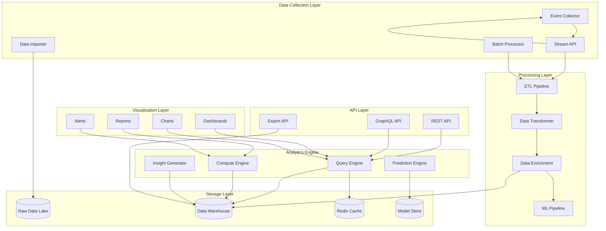
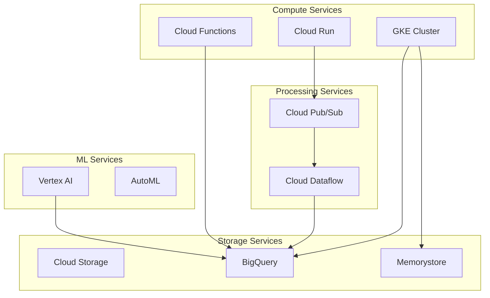
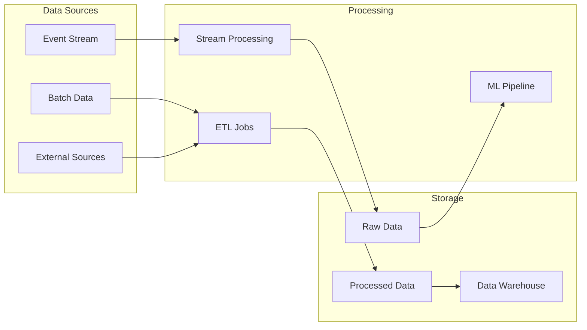

# Analytics Service Design

## Architecture Overview

The Analytics Service is designed as a scalable, real-time analytics platform that processes, analyzes, and visualizes data from various sources while providing AI-powered insights.

### High-Level Architecture



## Component Details

### 1. Data Collection Layer
- **Event Collector**
  - Real-time event ingestion
  - Data validation
  - Schema enforcement
  - Rate limiting
- **Stream Processor**
  - Event streaming
  - Message queuing
  - Flow control
  - Error handling
- **Batch Processor**
  - Scheduled imports
  - Large data processing
  - Data validation
  - Error recovery
- **Data Importer**
  - External data integration
  - Format conversion
  - Schema mapping
  - Validation rules

### 2. Processing Layer
- **ETL Pipeline**
  - Data extraction
  - Transformation rules
  - Loading strategies
  - Pipeline monitoring
- **Data Transformer**
  - Schema transformation
  - Data cleansing
  - Format conversion
  - Validation rules
- **Data Enrichment**
  - Feature computation
  - Data augmentation
  - Metadata addition
  - Quality checks
- **ML Pipeline**
  - Model training
  - Feature engineering
  - Prediction generation
  - Model monitoring

### 3. Storage Layer
- **Raw Data Lake**
  - Original data storage
  - Data versioning
  - Access controls
  - Lifecycle management
- **Data Warehouse**
  - Structured storage
  - Query optimization
  - Data partitioning
  - Access patterns
- **Redis Cache**
  - Query caching
  - Session storage
  - Rate limiting
  - Real-time counters
- **Model Store**
  - ML model storage
  - Version control
  - Model metadata
  - Performance metrics

## Data Models

### Event Model
```typescript
interface Event {
    id: string;                 // UUID
    type: EventType;           // Event classification
    source: string;            // Event origin
    timestamp: Date;           // Event time
    data: {
        attributes: Record<string, any>; // Event data
        metadata: EventMetadata;    // Additional context
    };
    version: string;           // Schema version
    processingStatus: Status;  // Processing state
}

interface EventMetadata {
    sourceIp: string;          // Origin IP
    userAgent?: string;        // Client info
    sessionId?: string;        // Session context
    batchId?: string;         // Batch identifier
}

enum EventType {
    USER_ACTION = 'USER_ACTION',
    SYSTEM_METRIC = 'SYSTEM_METRIC',
    BUSINESS_EVENT = 'BUSINESS_EVENT',
    CUSTOM_EVENT = 'CUSTOM_EVENT'
}
```

### Metric Model
```typescript
interface Metric {
    id: string;               // Metric identifier
    name: string;            // Display name
    type: MetricType;        // Metric classification
    value: number;           // Current value
    timestamp: Date;         // Measurement time
    dimensions: {
        [key: string]: string; // Grouping dimensions
    };
    metadata: MetricMetadata; // Additional context
}

interface MetricMetadata {
    unit: string;            // Measurement unit
    aggregation: string;     // Aggregation method
    interval: string;        // Collection interval
    retention: string;       // Retention period
}

enum MetricType {
    COUNTER = 'COUNTER',
    GAUGE = 'GAUGE',
    HISTOGRAM = 'HISTOGRAM',
    SUMMARY = 'SUMMARY'
}
```

### Report Model
```typescript
interface Report {
    id: string;              // Report identifier
    name: string;           // Report name
    type: ReportType;       // Report classification
    config: {
        metrics: string[];   // Included metrics
        dimensions: string[]; // Grouping dimensions
        filters: Filter[];   // Data filters
        timeRange: TimeRange; // Time period
    };
    schedule?: Schedule;    // Generation schedule
    format: FormatType;     // Output format
    delivery: Delivery[];   // Distribution method
    createdAt: Date;       // Creation time
    updatedAt: Date;       // Last update
}

interface Filter {
    field: string;         // Filter field
    operator: string;      // Comparison operator
    value: any;           // Filter value
}

interface TimeRange {
    start: Date;          // Start time
    end: Date;           // End time
    interval: string;     // Time bucket size
}

enum ReportType {
    DASHBOARD = 'DASHBOARD',
    SCHEDULED = 'SCHEDULED',
    ADHOC = 'ADHOC',
    SYSTEM = 'SYSTEM'
}
```

## API Specifications

### REST API

```yaml
/api/v1/metrics:
  get:
    summary: Get metrics
    parameters:
      - name: names
        in: query
        schema:
          type: array
          items:
            type: string
      - name: timeRange
        in: query
        schema:
          $ref: '#/components/schemas/TimeRange'
      - name: dimensions
        in: query
        schema:
          type: array
          items:
            type: string
    responses:
      200:
        description: Metric values
        content:
          application/json:
            schema:
              type: array
              items:
                $ref: '#/components/schemas/Metric'

/api/v1/events:
  post:
    summary: Send events
    requestBody:
      required: true
      content:
        application/json:
          schema:
            type: array
            items:
              $ref: '#/components/schemas/Event'
    responses:
      201:
        description: Events accepted

/api/v1/reports:
  post:
    summary: Generate report
    requestBody:
      required: true
      content:
        application/json:
          schema:
            $ref: '#/components/schemas/ReportRequest'
    responses:
      202:
        description: Report generation started
```

### GraphQL Schema

```graphql
type Query {
  metrics(
    names: [String!]!
    timeRange: TimeRangeInput!
    dimensions: [String!]
  ): [Metric!]!

  reports(
    type: ReportType
    status: ReportStatus
  ): [Report!]!

  insights(
    context: String!
    limit: Int = 10
  ): [Insight!]!
}

type Mutation {
  createReport(input: CreateReportInput!): Report!
  updateReport(id: ID!, input: UpdateReportInput!): Report!
  generateReport(id: ID!): ReportGeneration!
}

type Subscription {
  metricUpdates(names: [String!]!): Metric!
  reportProgress(id: ID!): ReportProgress!
  newInsights(context: String!): Insight!
}

type Metric {
  id: ID!
  name: String!
  type: MetricType!
  value: Float!
  timestamp: DateTime!
  dimensions: JSON
  metadata: MetricMetadata!
}

type Report {
  id: ID!
  name: String!
  type: ReportType!
  config: ReportConfig!
  schedule: Schedule
  format: FormatType!
  delivery: [Delivery!]!
  createdAt: DateTime!
  updatedAt: DateTime!
}
```

## Infrastructure Design

### Google Cloud Platform Architecture



### Scaling Strategy

```yaml
# Kubernetes HPA Configuration
apiVersion: autoscaling/v2
kind: HorizontalPodAutoscaler
metadata:
  name: analytics-api
spec:
  scaleTargetRef:
    apiVersion: apps/v1
    kind: Deployment
    name: analytics-api
  minReplicas: 3
  maxReplicas: 20
  metrics:
  - type: Resource
    resource:
      name: cpu
      target:
        type: Utilization
        averageUtilization: 70
  - type: Resource
    resource:
      name: memory
      target:
        type: Utilization
        averageUtilization: 80
```

### Data Pipeline Architecture



## Security Considerations

### 1. Data Security
- End-to-end encryption
- Data masking for sensitive information
- Access control policies
- Audit logging
- Data retention policies

### 2. API Security
- OAuth2/JWT authentication
- Rate limiting
- IP whitelisting
- Request validation
- Error handling

### 3. Infrastructure Security
- Network isolation
- Service mesh
- Secret management
- Container security
- Compliance monitoring

## Monitoring & Observability

### 1. Metrics
- Request rates
- Error rates
- Processing latency
- Resource utilization
- Cache hit rates
- Query performance

### 2. Logging
- Application logs
- Access logs
- Error logs
- Audit logs
- Pipeline logs

### 3. Alerting
- Performance degradation
- Error thresholds
- Resource constraints
- Security incidents
- Pipeline failures
