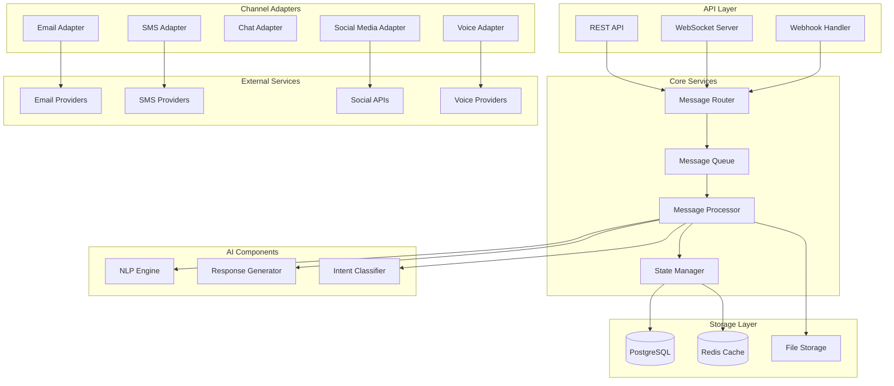
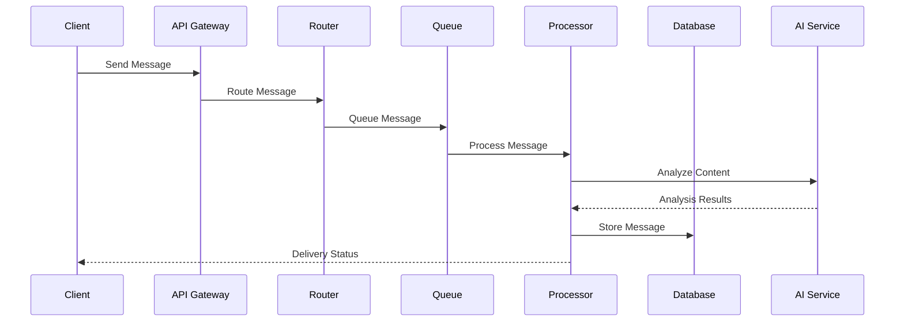
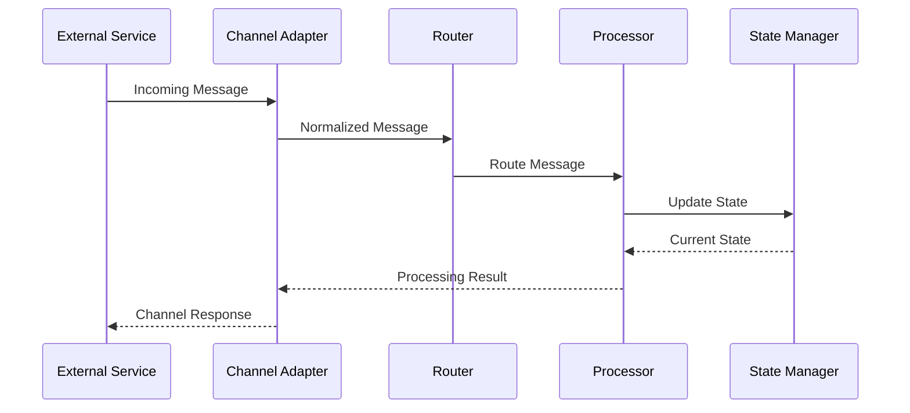

# Communication Hub Service Design

## Architecture Overview

The Communication Hub Service is designed as a scalable, real-time communication platform that integrates multiple channels and provides AI-powered features for message handling and routing.

### High-Level Architecture



## Component Details

### 1. API Layer
- **REST API**
  - Message CRUD operations
  - Channel management
  - Configuration endpoints
  - Analytics queries
- **WebSocket Server**
  - Real-time message delivery
  - Presence management
  - Typing indicators
  - Status updates
- **Webhook Handler**
  - Incoming webhooks
  - Event notifications
  - Integration callbacks

### 2. Channel Adapters
- **Email Adapter**
  - SMTP/IMAP handling
  - Email parsing
  - Attachment processing
  - Threading management
- **SMS Adapter**
  - Provider integration
  - Number pooling
  - Status tracking
  - Rate limiting
- **Chat Adapter**
  - WebSocket management
  - Session handling
  - Presence tracking
  - Typing indicators
- **Social Media Adapter**
  - Platform-specific APIs
  - Rate limit management
  - Media handling
  - Account management
- **Voice Adapter**
  - Call handling
  - Transcription
  - Recording management
  - Quality monitoring

### 3. Core Services
- **Message Router**
  - Channel selection
  - Load balancing
  - Priority routing
  - Rule evaluation
- **Message Queue**
  - Priority queues
  - Dead letter handling
  - Retry mechanisms
  - Rate limiting
- **Message Processor**
  - Content processing
  - Format conversion
  - Attachment handling
  - Metadata enrichment
- **State Manager**
  - Session management
  - Conversation tracking
  - User state
  - Channel state

### 4. AI Components
- **NLP Engine**
  - Language detection
  - Sentiment analysis
  - Entity extraction
  - Topic modeling
- **Response Generator**
  - Template matching
  - Context-aware responses
  - Personalization
  - Multi-language support
- **Intent Classifier**
  - Intent detection
  - Priority assessment
  - Category assignment
  - Routing suggestions

## Data Models

### Message Model
```typescript
interface Message {
    id: string;                 // UUID
    conversationId: string;     // Thread/conversation ID
    channelId: string;          // Channel identifier
    type: MessageType;          // Message classification
    direction: Direction;       // INBOUND | OUTBOUND
    content: {
        text: string;           // Message text
        html?: string;          // HTML content
        attachments: Attachment[]; // Files/media
        metadata: any;          // Channel-specific data
    };
    sender: {
        id: string;            // Sender identifier
        type: SenderType;      // USER | SYSTEM | BOT
        metadata: any;         // Sender information
    };
    recipient: {
        id: string;           // Recipient identifier
        type: RecipientType;  // USER | GROUP | CHANNEL
        metadata: any;        // Recipient information
    };
    status: MessageStatus;    // Delivery status
    priority: Priority;       // Message priority
    tags: string[];          // Classification tags
    sentiment?: {
        score: number;       // -1 to 1
        confidence: number;  // 0 to 1
        labels: string[];   // Emotion labels
    };
    intent?: {
        name: string;       // Classified intent
        confidence: number; // Confidence score
        entities: Entity[]; // Extracted entities
    };
    createdAt: Date;       // Creation timestamp
    updatedAt: Date;       // Last update
    metadata: any;         // Additional data
}

interface Conversation {
    id: string;           // Conversation ID
    channelId: string;    // Primary channel
    participants: string[]; // Participant IDs
    status: ConversationStatus; // Active/Closed
    lastMessage: Message;  // Latest message
    metadata: {
        subject?: string;  // Topic/subject
        category?: string; // Classification
        priority: Priority; // Conversation priority
        tags: string[];    // Organization tags
        customFields: any; // Additional fields
    };
    metrics: {
        messageCount: number; // Total messages
        responseTime: number; // Avg response time
        resolution?: {
            status: ResolutionStatus;
            time: number;    // Time to resolve
        };
    };
    createdAt: Date;
    updatedAt: Date;
}
```

### Channel Model
```typescript
interface Channel {
    id: string;           // Channel identifier
    type: ChannelType;    // Channel type
    provider: string;     // Service provider
    config: {
        credentials: {    // Auth credentials
            encrypted: string;
        };
        settings: {      // Channel settings
            rateLimit: number;
            features: string[];
            templates: Template[];
        };
        routing: {       // Routing rules
            rules: Rule[];
            default: string;
        };
    };
    status: {
        isActive: boolean;
        health: HealthStatus;
        lastCheck: Date;
        metrics: {
            messageCount: number;
            errorRate: number;
            responseTime: number;
        };
    };
    metadata: any;
}
```

## API Specifications

### REST Endpoints
```yaml
/api/v1/messages:
  post:
    summary: Send message
    request:
      content:
        application/json:
          schema:
            $ref: '#/components/schemas/SendMessageRequest'
    response:
      201:
        $ref: '#/components/schemas/Message'

  get:
    summary: List messages
    parameters:
      - name: conversationId
        in: query
        type: string
      - name: channelId
        in: query
        type: string
    response:
      200:
        type: array
        items:
          $ref: '#/components/schemas/Message'

/api/v1/conversations:
  post:
    summary: Create conversation
    request:
      content:
        application/json:
          schema:
            $ref: '#/components/schemas/CreateConversationRequest'
    response:
      201:
        $ref: '#/components/schemas/Conversation'

/api/v1/channels:
  get:
    summary: List channels
    response:
      200:
        type: array
        items:
          $ref: '#/components/schemas/Channel'
```

### WebSocket Events
```typescript
interface WebSocketEvents {
    // Client -> Server
    'message.send': {
        content: string;
        conversationId: string;
    };
    'typing.start': {
        conversationId: string;
    };
    'typing.stop': {
        conversationId: string;
    };
    'presence.update': {
        status: PresenceStatus;
    };

    // Server -> Client
    'message.received': Message;
    'message.updated': Message;
    'conversation.updated': Conversation;
    'typing.indicator': {
        conversationId: string;
        userId: string;
        isTyping: boolean;
    };
    'presence.changed': {
        userId: string;
        status: PresenceStatus;
    };
}
```

## Integration Patterns

### 1. Message Flow


### 2. Channel Integration


## Security Considerations

### 1. Authentication & Authorization
- OAuth2/OIDC integration
- JWT token validation
- Role-based access control
- API key management
- Channel credentials encryption

### 2. Data Protection
- End-to-end encryption
- Data encryption at rest
- PII handling
- Data retention policies
- Secure file storage

### 3. Network Security
- TLS/SSL enforcement
- Rate limiting
- DDoS protection
- IP whitelisting
- WebSocket security

## Monitoring & Observability

### 1. Metrics
- Message volume
- Response times
- Error rates
- Channel health
- Queue depth
- Cache hit rates
- AI performance

### 2. Logging
- Request logging
- Error logging
- Audit logging
- Performance logging
- Security events
- Integration status

### 3. Alerts
- Service health
- Error thresholds
- Performance degradation
- Security incidents
- Integration failures
- Resource utilization

## Deployment Strategy

### 1. Infrastructure
- Kubernetes deployment
- Auto-scaling configuration
- Load balancer setup
- Database clustering
- Cache distribution
- Storage configuration

### 2. High Availability
- Multi-zone deployment
- Service redundancy
- Database replication
- Queue mirroring
- Failover handling
- Disaster recovery

### 3. Performance
- CDN integration
- Cache strategies
- Connection pooling
- Query optimization
- Resource allocation
- Batch processing
