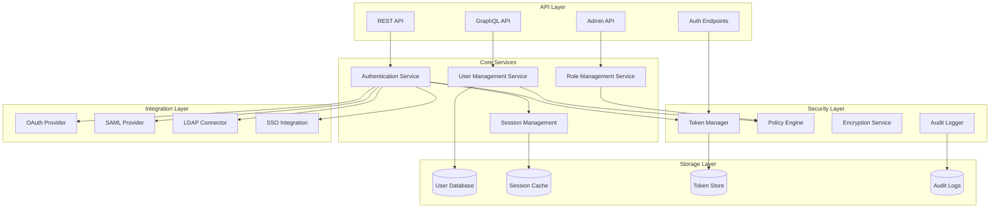
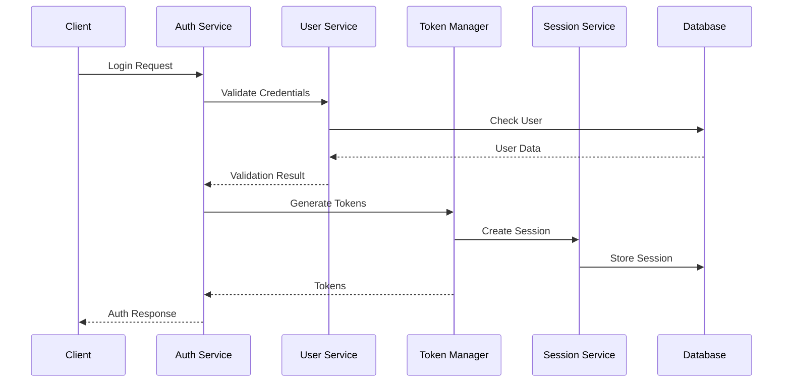
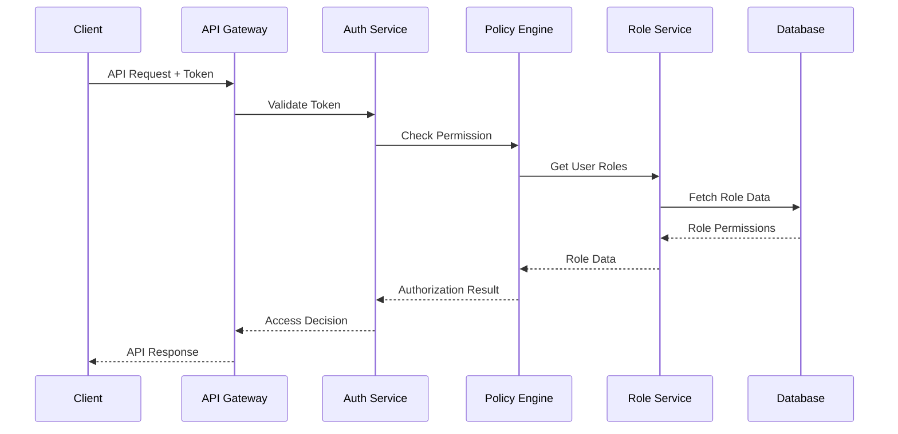
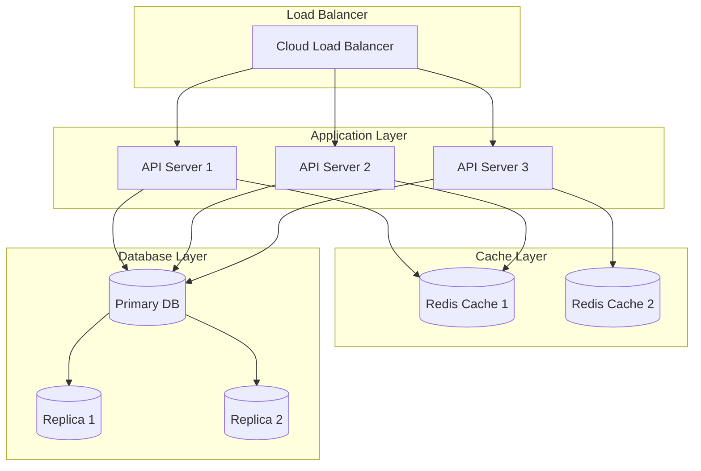

# User Management Service Design

## Architecture Overview

The User Management Service is designed as a secure, scalable system that handles authentication, authorization, and user data management while integrating with various identity providers and security systems.

### High-Level Architecture



## Component Details

### 1. API Layer
- **REST API**
  - User CRUD operations
  - Authentication endpoints
  - Role management
  - Profile updates
- **GraphQL API**
  - Complex user queries
  - Batch operations
  - Real-time subscriptions
  - Nested relationships
- **Auth Endpoints**
  - Login/logout
  - Token refresh
  - Password reset
  - MFA validation
- **Admin API**
  - User management
  - Role configuration
  - System settings
  - Audit logs

### 2. Core Services
- **Authentication Service**
  - Credential validation
  - Token management
  - MFA handling
  - Session control
- **User Management Service**
  - Profile management
  - Organization handling
  - Preference storage
  - Data validation
- **Role Management Service**
  - Role definitions
  - Permission management
  - Access control
  - Role hierarchy
- **Session Management**
  - Session tracking
  - Token validation
  - Device management
  - Timeout handling

### 3. Security Layer
- **Token Manager**
  - JWT generation
  - Token validation
  - Refresh handling
  - Revocation
- **Policy Engine**
  - Permission evaluation
  - Role resolution
  - Access decisions
  - Policy enforcement
- **Encryption Service**
  - Data encryption
  - Key management
  - Secure storage
  - Hash generation
- **Audit Logger**
  - Activity tracking
  - Security events
  - Access logs
  - Change history

## Data Models

### User Model
```typescript
interface User {
    id: string;                // UUID primary key
    email: string;            // Primary email (unique)
    username?: string;        // Optional username
    password?: string;        // Hashed password
    status: UserStatus;       // Account status
    type: UserType;          // User classification
    profile: UserProfile;     // Profile information
    security: SecuritySettings; // Security configuration
    organizations: Organization[]; // Associated organizations
    roles: Role[];           // Assigned roles
    preferences: UserPreferences; // User preferences
    metadata: Record<string, any>; // Custom metadata
    createdAt: Date;         // Creation timestamp
    updatedAt: Date;         // Last update timestamp
    lastLoginAt?: Date;      // Last login time
    lastActivityAt?: Date;   // Last activity time
}

interface UserProfile {
    firstName: string;        // First name
    lastName: string;         // Last name
    displayName?: string;     // Display name
    avatar?: string;         // Avatar URL
    phoneNumber?: string;    // Contact number
    timezone: string;        // User timezone
    language: string;        // Preferred language
    company?: string;        // Company name
    position?: string;       // Job title
    department?: string;     // Department
    location?: string;       // Location
    bio?: string;           // User biography
}

interface SecuritySettings {
    mfaEnabled: boolean;     // MFA status
    mfaMethod?: MFAMethod;   // MFA method
    passwordLastChanged: Date; // Last password change
    securityQuestions: SecurityQuestion[]; // Security questions
    allowedIPs?: string[];   // IP whitelist
    failedAttempts: number;  // Failed login count
    lockoutUntil?: Date;     // Account lockout time
}

enum UserStatus {
    ACTIVE = 'ACTIVE',
    INACTIVE = 'INACTIVE',
    SUSPENDED = 'SUSPENDED',
    PENDING = 'PENDING',
    LOCKED = 'LOCKED'
}

enum UserType {
    ADMIN = 'ADMIN',
    USER = 'USER',
    SYSTEM = 'SYSTEM',
    SERVICE = 'SERVICE'
}
```

### Role Model
```typescript
interface Role {
    id: string;              // Role identifier
    name: string;           // Display name
    description: string;    // Role description
    type: RoleType;        // Role classification
    permissions: Permission[]; // Granted permissions
    scope: RoleScope;      // Application scope
    hierarchy: {
        parentId?: string;  // Parent role
        level: number;     // Hierarchy level
    };
    metadata: {
        isSystem: boolean;  // System-defined role
        isCustom: boolean;  // Custom role
        template?: string;  // Role template
    };
    createdAt: Date;
    updatedAt: Date;
}

interface Permission {
    id: string;             // Permission identifier
    name: string;          // Permission name
    description: string;   // Description
    resource: string;      // Target resource
    actions: string[];     // Allowed actions
    conditions?: Record<string, any>; // Additional conditions
}

enum RoleType {
    SYSTEM = 'SYSTEM',
    ORGANIZATION = 'ORGANIZATION',
    CUSTOM = 'CUSTOM'
}

enum RoleScope {
    GLOBAL = 'GLOBAL',
    ORGANIZATION = 'ORGANIZATION',
    PROJECT = 'PROJECT'
}
```

### Session Model
```typescript
interface Session {
    id: string;              // Session identifier
    userId: string;         // Associated user
    token: string;          // Session token
    refreshToken: string;   // Refresh token
    deviceInfo: {
        id: string;         // Device identifier
        type: string;       // Device type
        name: string;       // Device name
        ip: string;         // IP address
        userAgent: string;  // Browser/app info
        location?: string;  // Geographic location
    };
    status: SessionStatus;  // Session status
    expiresAt: Date;       // Expiration time
    lastActivityAt: Date;   // Last activity
    metadata: Record<string, any>; // Additional data
}

enum SessionStatus {
    ACTIVE = 'ACTIVE',
    EXPIRED = 'EXPIRED',
    REVOKED = 'REVOKED'
}
```

## API Specifications

### REST API

```yaml
openapi: 3.0.0
info:
  title: User Management API
  version: 1.0.0
paths:
  /api/v1/auth/login:
    post:
      summary: User login
      requestBody:
        required: true
        content:
          application/json:
            schema:
              type: object
              properties:
                email:
                  type: string
                password:
                  type: string
                mfaCode:
                  type: string
      responses:
        '200':
          description: Login successful
          content:
            application/json:
              schema:
                type: object
                properties:
                  token:
                    type: string
                  refreshToken:
                    type: string
                  user:
                    $ref: '#/components/schemas/User'

  /api/v1/users:
    get:
      summary: List users
      parameters:
        - name: page
          in: query
          schema:
            type: integer
        - name: limit
          in: query
          schema:
            type: integer
        - name: status
          in: query
          schema:
            type: string
      responses:
        '200':
          description: User list
          content:
            application/json:
              schema:
                type: array
                items:
                  $ref: '#/components/schemas/User'

  /api/v1/roles:
    post:
      summary: Create role
      requestBody:
        required: true
        content:
          application/json:
            schema:
              $ref: '#/components/schemas/CreateRoleRequest'
      responses:
        '201':
          description: Role created
          content:
            application/json:
              schema:
                $ref: '#/components/schemas/Role'
```

### GraphQL Schema

```graphql
type Query {
  user(id: ID!): User
  users(
    filter: UserFilter
    pagination: PaginationInput
    sort: [UserSortInput!]
  ): UserConnection!

  role(id: ID!): Role
  roles(
    filter: RoleFilter
    pagination: PaginationInput
  ): RoleConnection!

  permissions(
    userId: ID
    roleId: ID
    resource: String
  ): [Permission!]!

  sessions(
    userId: ID!
    status: SessionStatus
  ): [Session!]!
}

type Mutation {
  createUser(input: CreateUserInput!): CreateUserResult!
  updateUser(id: ID!, input: UpdateUserInput!): UpdateUserResult!
  deleteUser(id: ID!): DeleteUserResult!

  assignRole(
    userId: ID!
    roleId: ID!
  ): AssignRoleResult!

  createRole(input: CreateRoleInput!): CreateRoleResult!
  updateRole(id: ID!, input: UpdateRoleInput!): UpdateRoleResult!

  revokeSession(sessionId: ID!): RevokeSessionResult!
}

type Subscription {
  userStatusChanged(userId: ID!): UserStatus!
  sessionCreated(userId: ID!): Session!
  roleUpdated(roleId: ID!): Role!
}
```

## Security Design

### Authentication Flow



### Authorization Flow



## Deployment Architecture



## Monitoring & Observability

### 1. Key Metrics
- Authentication success/failure rates
- Token validation performance
- Session counts and durations
- API endpoint response times
- Database query performance
- Cache hit/miss rates
- Error rates and types

### 2. Logging Strategy
- Authentication attempts
- Authorization decisions
- User activities
- Role changes
- Security events
- System operations
- Performance data

### 3. Alerting Rules
- Authentication failures
- Suspicious activities
- Performance degradation
- Error thresholds
- Resource utilization
- Security breaches
- System health
