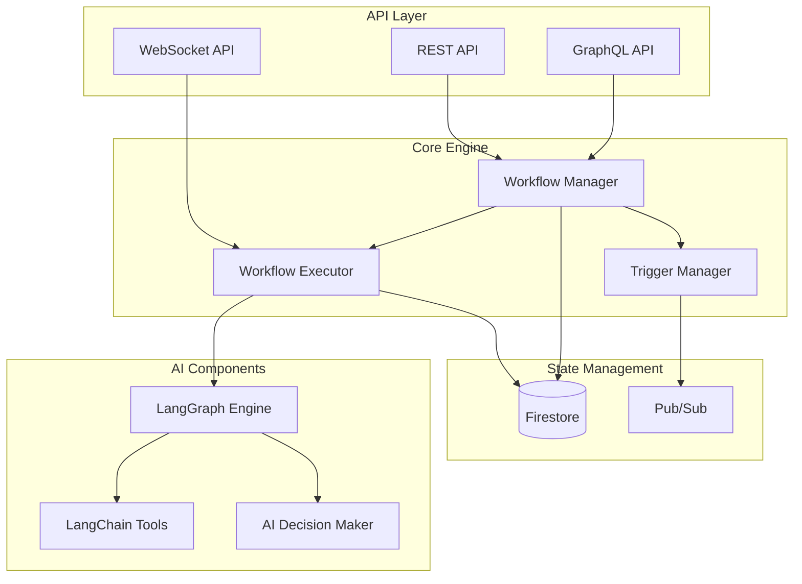

# Workflow Engine Service Design

## Overview
The Workflow Engine Service is a critical component that provides intelligent automation capabilities using LangGraph for complex decision trees and workflow orchestration. It enables dynamic, AI-driven workflow execution while maintaining scalability and reliability.

## Core Capabilities
- Complex decision tree management using LangGraph
- Multi-step workflow orchestration
- Event-driven trigger system
- Real-time execution monitoring
- State persistence and recovery
- AI-powered decision making

## Architecture

### Component Diagram


## Component Details

### 1. API Layer
- **REST API**
  - Workflow CRUD operations
  - Execution management
  - Status monitoring
- **GraphQL API**
  - Complex workflow queries
  - Real-time execution tracking
  - Batch operations
- **WebSocket API**
  - Live execution updates
  - Event streaming
  - Status notifications

### 2. Core Engine
- **Workflow Manager**
  - Workflow definition validation
  - Version management
  - Access control
  - Resource allocation
- **Workflow Executor**
  - Step execution orchestration
  - Error handling
  - State management
  - Recovery mechanisms
- **Trigger Manager**
  - Event processing
  - Condition evaluation
  - Schedule management
  - Trigger registration

### 3. State Management
- **Firestore Integration**
  - Workflow state persistence
  - Execution history
  - Configuration storage
  - Audit logging
- **Pub/Sub Integration**
  - Event distribution
  - Cross-service communication
  - Asynchronous processing
  - Event sourcing

### 4. AI Components
- **LangGraph Engine**
  - Decision tree processing
  - State graph management
  - Transition logic
  - Context management
- **LangChain Integration**
  - Tool integration
  - Chain composition
  - Memory management
  - Model interaction
- **AI Decision Maker**
  - Smart routing
  - Dynamic optimization
  - Adaptive execution
  - Learning from history

## Data Models

### Workflow Definition
```typescript
interface WorkflowDefinition {
    id: string;                    // UUID
    name: string;                  // Human-readable name
    description?: string;          // Optional description
    version: number;               // Version number
    isActive: boolean;             // Active/inactive flag
    trigger: WorkflowTrigger;      // Trigger configuration
    steps: WorkflowStep[];         // Ordered execution steps
    variables: Record<string, any>; // Workflow variables
    owner: string;                 // Owner ID
    tags: string[];                // Organization tags
    createdAt: Date;              // Creation timestamp
    updatedAt: Date;              // Last update timestamp
    lastExecuted?: Date;          // Last execution time
    executionStats: ExecutionStats; // Execution statistics
}

interface WorkflowStep {
    id: string;                    // Step identifier
    name: string;                  // Step name
    type: StepType;               // Step type
    config: StepConfiguration;     // Step configuration
    conditions?: StepCondition[];  // Execution conditions
    nextSteps: string[];          // Next possible steps
    onError: ErrorHandling;       // Error handling config
}

interface WorkflowExecution {
    id: string;                    // Execution ID
    workflowId: string;           // Associated workflow
    status: ExecutionStatus;      // Current status
    currentStep?: string;         // Current step ID
    variables: Record<string, any>; // Execution variables
    result?: any;                 // Execution result
    error?: string;              // Error information
    startedAt: Date;             // Start timestamp
    completedAt?: Date;          // Completion timestamp
    duration?: number;           // Execution duration
}
```

## API Specifications

### REST API Endpoints
```yaml
/api/v1/workflows:
  post:
    summary: Create workflow
    request: WorkflowDefinition
    response: WorkflowDefinition
  get:
    summary: List workflows
    params:
      - active_only: boolean
      - tags: string[]
    response: WorkflowDefinition[]

/api/v1/workflows/{id}:
  get:
    summary: Get workflow
    response: WorkflowDefinition
  put:
    summary: Update workflow
    request: WorkflowDefinition
    response: WorkflowDefinition
  delete:
    summary: Delete workflow

/api/v1/workflows/{id}/execute:
  post:
    summary: Execute workflow
    request: ExecutionInput
    response: WorkflowExecution

/api/v1/executions:
  get:
    summary: List executions
    params:
      - workflow_id: string
      - status: ExecutionStatus
    response: WorkflowExecution[]
```

### GraphQL Schema
```graphql
type Query {
  workflow(id: ID!): Workflow
  workflows(filter: WorkflowFilter): [Workflow!]!
  execution(id: ID!): WorkflowExecution
  executions(filter: ExecutionFilter): [WorkflowExecution!]!
}

type Mutation {
  createWorkflow(input: WorkflowInput!): Workflow!
  updateWorkflow(id: ID!, input: WorkflowInput!): Workflow!
  executeWorkflow(id: ID!, input: ExecutionInput!): WorkflowExecution!
}

type Subscription {
  workflowStatus(executionId: ID!): ExecutionStatus!
}
```

## Implementation Tasks

1. Core Infrastructure Setup
   - [ ] Project structure and dependency setup
   - [ ] Configuration management
   - [ ] Logging and monitoring setup
   - [ ] Error handling utilities

2. Data Layer Implementation
   - [ ] Firestore schema setup
   - [ ] Data access layer implementation
   - [ ] Pub/Sub topic and subscription setup
   - [ ] State persistence mechanisms

3. Core Engine Development
   - [ ] Workflow Manager implementation
   - [ ] Executor service development
   - [ ] Trigger system implementation
   - [ ] State management logic

4. AI Integration
   - [ ] LangGraph integration
   - [ ] LangChain tool setup
   - [ ] AI decision maker implementation
   - [ ] Model integration and testing

5. API Layer Development
   - [ ] REST API implementation
   - [ ] GraphQL schema and resolvers
   - [ ] WebSocket endpoints
   - [ ] API documentation

6. Testing and Validation
   - [ ] Unit test suite
   - [ ] Integration tests
   - [ ] Performance testing
   - [ ] Security testing

7. Deployment and Operations
   - [ ] Docker containerization
   - [ ] Kubernetes configuration
   - [ ] CI/CD pipeline setup
   - [ ] Monitoring and alerting

## Technology Stack
- **Language**: Python 3.11+
- **Web Framework**: FastAPI
- **GraphQL**: Strawberry
- **Database**: Google Cloud Firestore
- **Message Queue**: Google Cloud Pub/Sub
- **AI Framework**: LangChain, LangGraph
- **Testing**: pytest, pytest-asyncio
- **Container**: Docker
- **Orchestration**: Kubernetes

## Security Considerations
1. Authentication and Authorization
2. Data encryption at rest and in transit
3. Audit logging
4. Rate limiting
5. Input validation
6. Secret management
7. Access control

## Monitoring and Observability
1. Execution metrics
2. Performance monitoring
3. Error tracking
4. Resource utilization
5. Audit trails
6. Health checks

## Future Enhancements
1. Custom step type framework
2. Visual workflow designer
3. Advanced analytics dashboard
4. Multi-tenant support
5. Workflow templates
6. Import/export capabilities