# Intelligence CRM - Architecture Diagrams

## 🏗️ System Architecture Overview

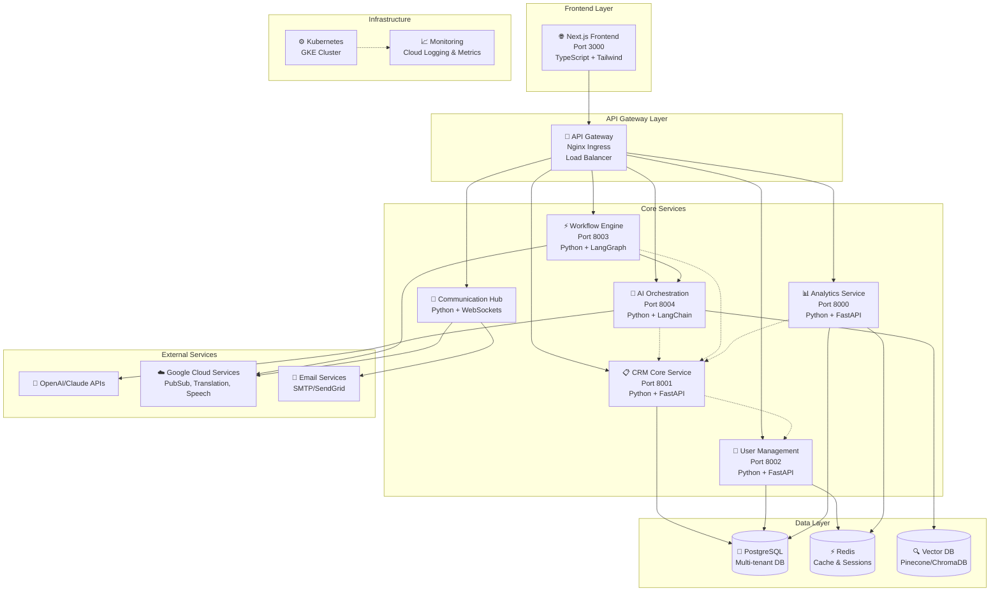

## 🔄 Service Interaction Patterns

### 1. User Authentication Flow
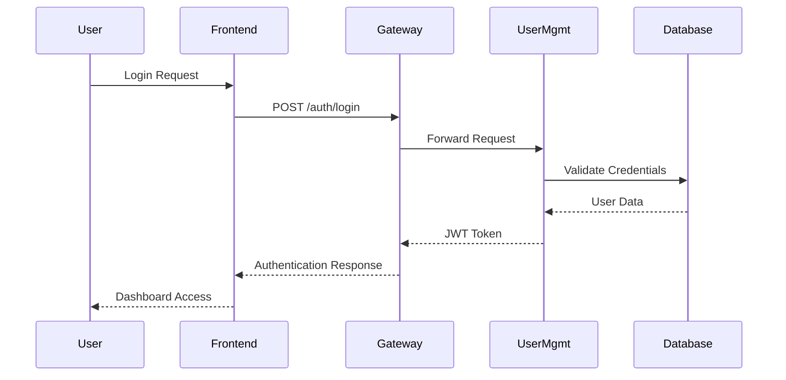

### 2. Contact Management Flow
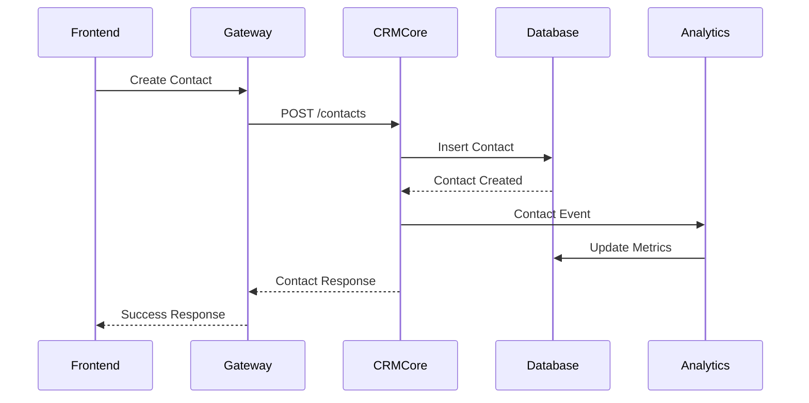

### 3. AI-Powered Lead Scoring Flow
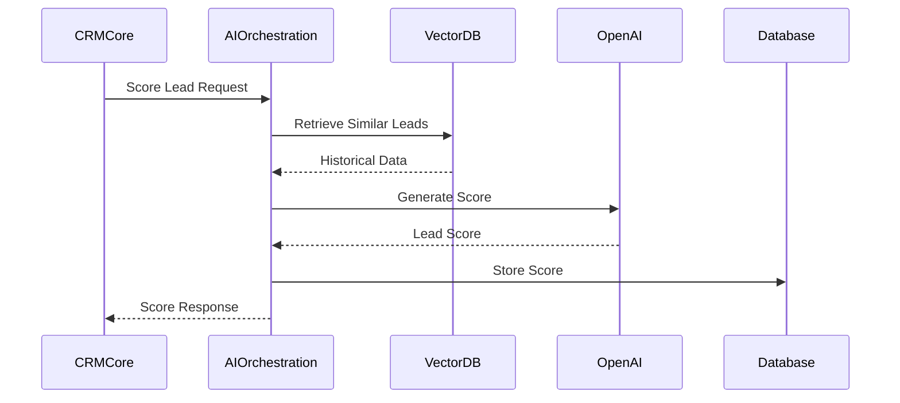

### 4. Workflow Automation Flow
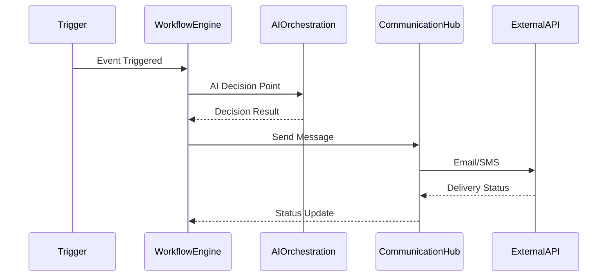

## 🏛️ Database Architecture

### Multi-Tenant Data Model
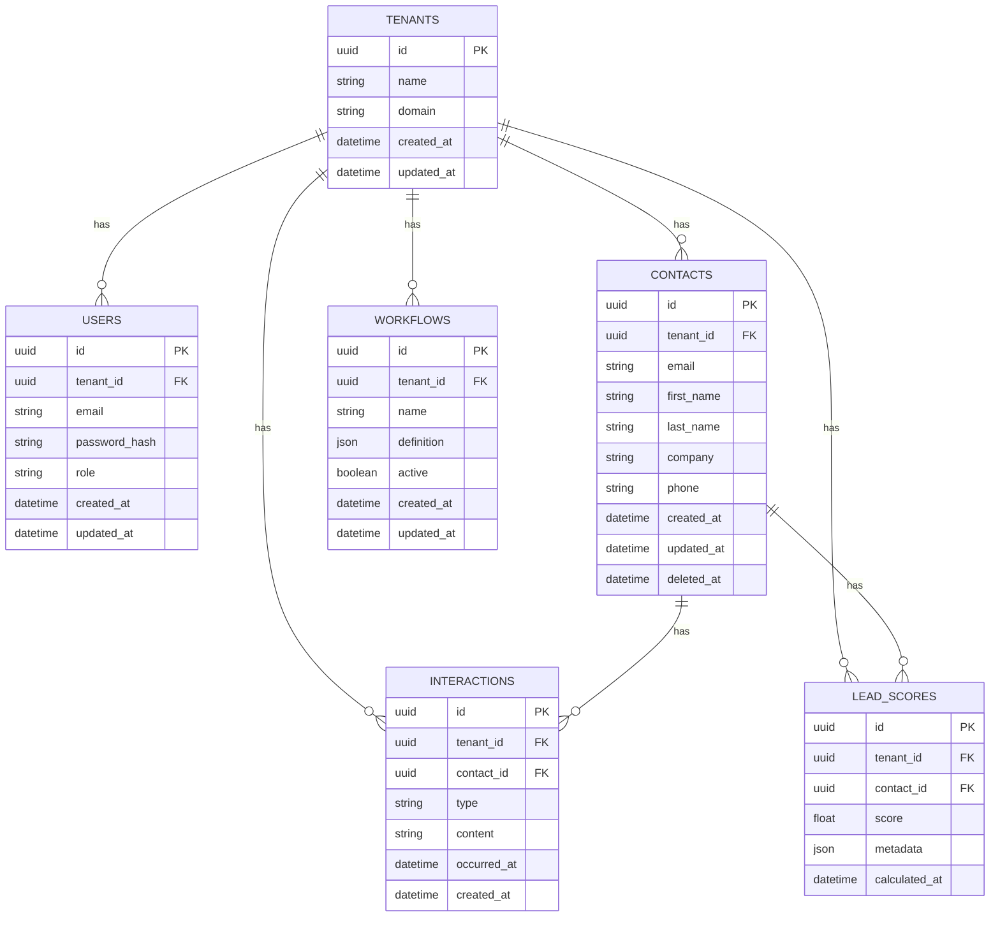

## 🔧 Service-Specific Architectures

### CRM Core Service Architecture
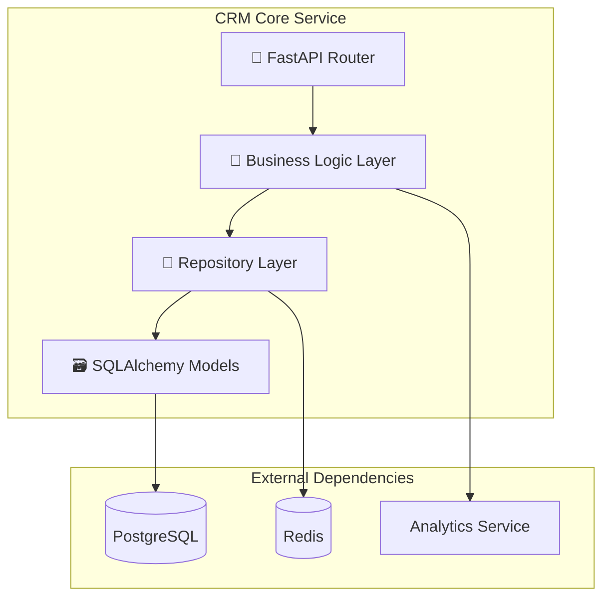

### AI Orchestration Service Architecture
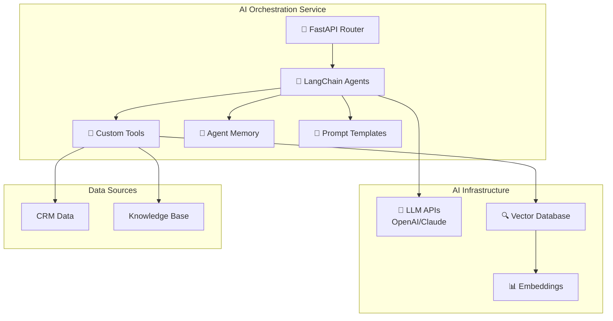

### Frontend Architecture
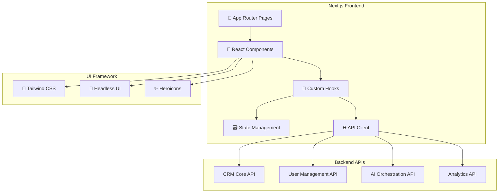

## 🚀 Deployment Architecture

### Development Environment
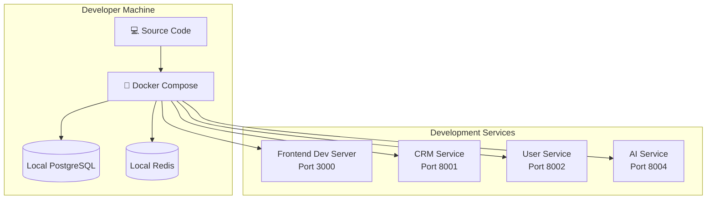

### Production Environment (Kubernetes)
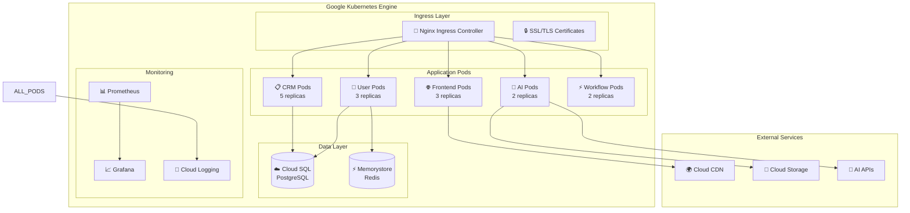

## 🔄 Data Flow Patterns

### Real-time Analytics Flow
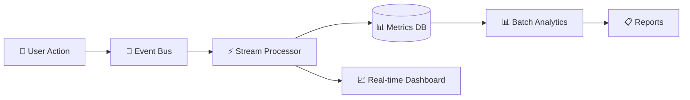

### Multi-tenant Data Isolation
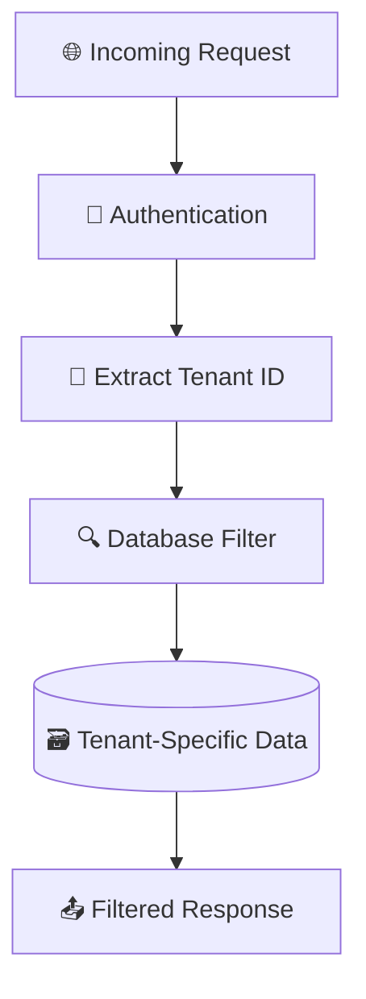

## 🛡️ Security Architecture

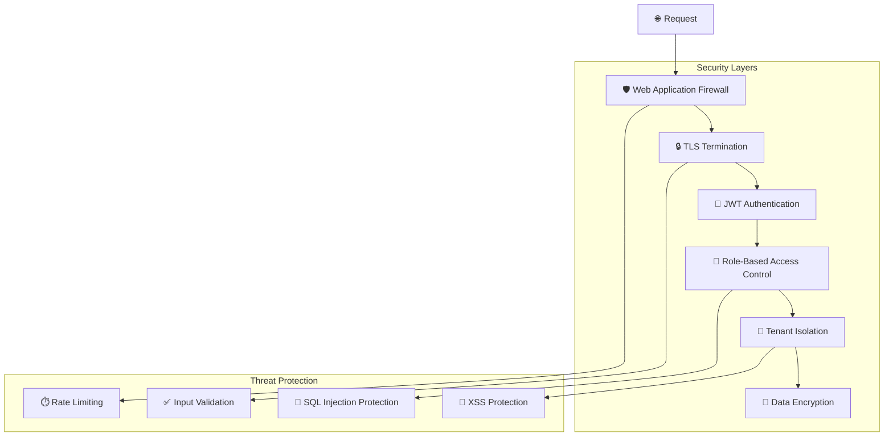

This architecture demonstrates a modern, scalable, AI-powered CRM platform built with microservices principles, cloud-native patterns, and enterprise-grade security. The system is designed for high availability, horizontal scaling, and multi-tenancy while providing rich AI capabilities through LangChain integration.