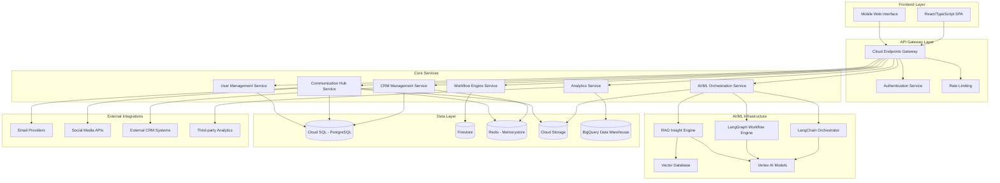
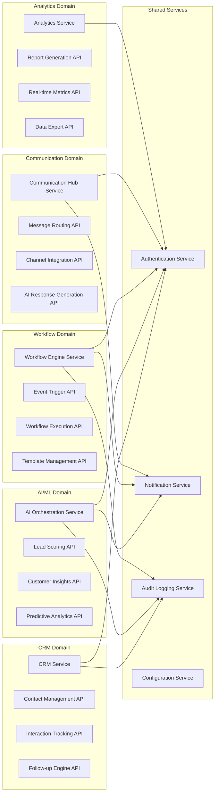
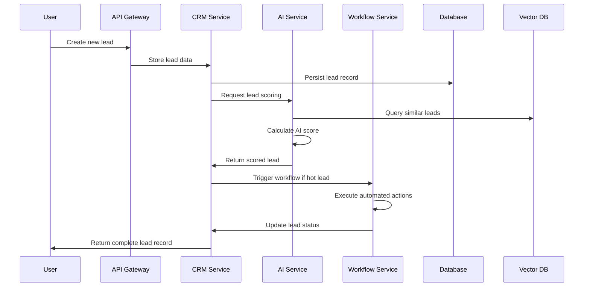
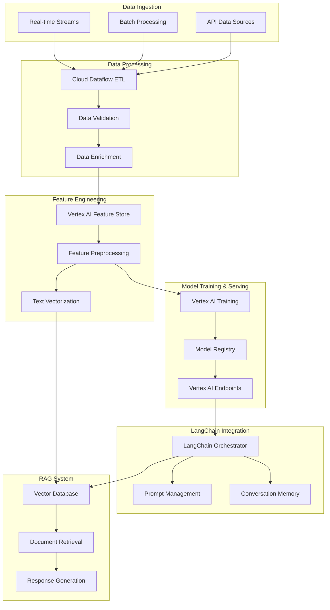
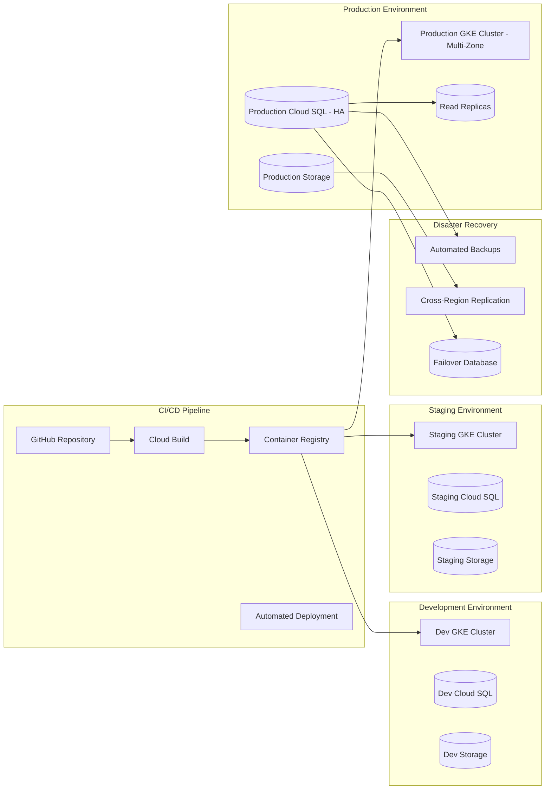
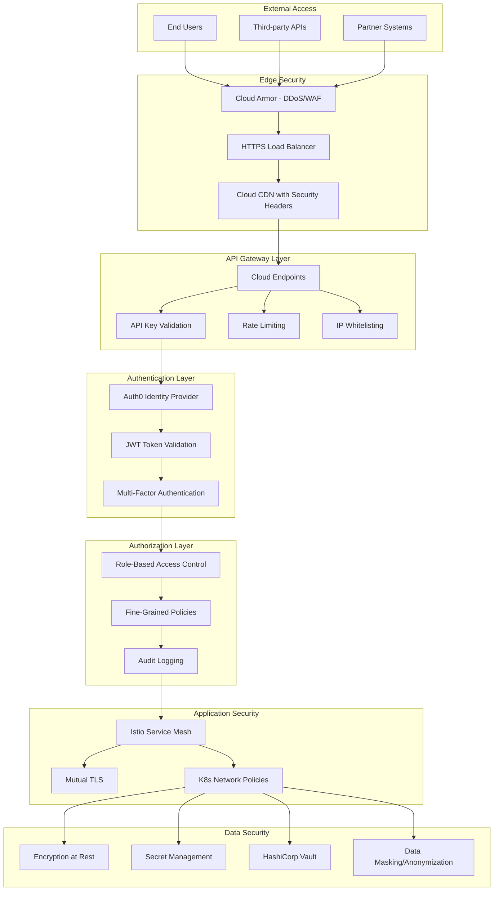

# Technical Design Document: Intelligent CRM and Automated Workflows Platform

## Overview

This document presents the comprehensive technical design for an intelligent CRM and automated workflows platform targeting SMBs in the marketing industry. The platform leverages cutting-edge AI technologies including LangChain, LangGraph, and agentic RAG to deliver enterprise-level capabilities at SMB-friendly scale and cost. The system is architected as a cloud-native, microservices-based solution on Google Cloud Platform, designed to handle 10,000 concurrent users with sub-2-second response times and 99.9% uptime.

The platform serves dual objectives: providing a production-ready SaaS solution for marketing SMBs while serving as a comprehensive learning vehicle for advanced AI technologies including LLM orchestration, vector databases, inference infrastructure, and agentic workflows.

## Steering Document Alignment

### Technical Standards (tech.md)
The design follows cloud-native architectural patterns with:
- Microservices architecture using containerized services on Google Kubernetes Engine
- API-first design with REST and GraphQL endpoints
- Event-driven architecture using Cloud Pub/Sub for loose coupling
- Infrastructure as Code using Terraform for reproducible deployments
- CI/CD pipelines with automated testing and security scanning

### Project Structure (structure.md)
Implementation follows modular organization:
- Services organized by domain (CRM, AI/ML, Communication, Analytics)
- Shared utilities and common interfaces for cross-service consistency
- Clear separation between business logic, data access, and presentation layers
- Standardized configuration management and service discovery patterns

## Code Reuse Analysis

### Existing Components to Leverage
- **LangChain Framework**: Core LLM orchestration, prompt templates, memory management, and tool integration
- **LangGraph**: Complex workflow orchestration, decision trees, and multi-agent coordination
- **Google Cloud SDK**: Infrastructure services, authentication, monitoring, and data management
- **FastAPI & Pydantic**: Python service foundations with automatic API documentation and type validation
- **Gin Framework**: High-performance Go services for latency-critical operations
- **React/TypeScript Ecosystem**: Frontend component libraries (Material-UI), state management (Redux Toolkit)
- **Kubernetes Helm Charts**: Standardized deployment patterns for microservices

### Integration Points
- **Google Cloud Services**: Native integration with GKE, Cloud SQL, BigQuery, Vertex AI, and Cloud Storage
- **Vector Database Solutions**: Pinecone or Google Cloud Vector Search for RAG implementations
- **Authentication Providers**: Firebase Auth or Auth0 for OAuth2/OIDC compliance
- **Third-party APIs**: CRM platforms (Salesforce, HubSpot), communication channels (Slack, Teams), social media APIs
- **Monitoring Stack**: Cloud Monitoring, Logging, Error Reporting for observability

## Architecture

The system employs a modern microservices architecture with domain-driven design principles, enabling independent development, deployment, and scaling of core business capabilities.



## Microservices Architecture



## Data Flow Architecture



## AI/ML Pipeline Architecture



## Components and Interfaces

### CRM Management Service
- **Purpose:** Core customer relationship management with contact lifecycle management, interaction tracking, and automated follow-up recommendations
- **Interfaces:**
  - REST API: `/api/v1/contacts`, `/api/v1/interactions`, `/api/v1/follow-ups`
  - GraphQL: Complex relationship queries and batch operations
  - Events: `contact.created`, `interaction.logged`, `follow-up.due`
- **Dependencies:** Cloud SQL (PostgreSQL), Redis cache, Authentication service
- **Reuses:** Pydantic models for data validation, SQLAlchemy ORM patterns, FastAPI dependency injection

### AI/ML Orchestration Service
- **Purpose:** Centralized AI capabilities including lead scoring, customer insights, and predictive analytics using LangChain and custom models
- **Interfaces:**
  - REST API: `/api/v1/scoring`, `/api/v1/insights`, `/api/v1/predictions`
  - Async Processing: Message queue integration for batch operations
  - WebSocket: Real-time AI assistance and notifications
- **Dependencies:** Vertex AI, Vector database, LangChain framework, feature store
- **Reuses:** LangChain prompt templates, model abstractions, memory management, tool integration patterns

### Workflow Engine Service
- **Purpose:** Intelligent automation using LangGraph for complex decision trees, trigger management, and multi-step workflow orchestration
- **Interfaces:**
  - REST API: `/api/v1/workflows`, `/api/v1/triggers`, `/api/v1/executions`
  - GraphQL: Workflow definition and execution monitoring
  - Events: `workflow.triggered`, `workflow.completed`, `workflow.failed`
- **Dependencies:** Firestore for workflow state, LangGraph engine, Cloud Pub/Sub for event handling
- **Reuses:** LangGraph workflow patterns, state management abstractions, event-driven architecture components

### Communication Hub Service
- **Purpose:** Unified multi-channel communication management with AI-powered response suggestions and conversation routing
- **Interfaces:**
  - REST API: `/api/v1/conversations`, `/api/v1/channels`, `/api/v1/messages`
  - WebSocket: Real-time message delivery and presence
  - Webhook: Third-party channel integrations
- **Dependencies:** Cloud SQL, Redis for real-time data, external communication APIs
- **Reuses:** Message queuing patterns, WebSocket connection management, OAuth2 integration libraries

### Analytics Service
- **Purpose:** Comprehensive analytics with AI-generated insights, real-time dashboards, and automated reporting
- **Interfaces:**
  - REST API: `/api/v1/analytics`, `/api/v1/reports`, `/api/v1/metrics`
  - GraphQL: Complex analytical queries and data aggregation
  - Streaming API: Real-time metrics and alerts
- **Dependencies:** BigQuery data warehouse, Cloud Monitoring, ML models for insights
- **Reuses:** BigQuery client libraries, time-series analysis patterns, dashboard component libraries

### User Management Service
- **Purpose:** Authentication, authorization, role-based access control, and audit logging with enterprise security features
- **Interfaces:**
  - REST API: `/api/v1/users`, `/api/v1/roles`, `/api/v1/permissions`
  - OAuth2/OIDC: External identity provider integration
  - Events: `user.created`, `role.changed`, `access.granted`
- **Dependencies:** Firebase Auth or Auth0, Cloud SQL for role management
- **Reuses:** OAuth2 libraries, JWT handling, RBAC middleware patterns

## Data Models

### Contact Model
```typescript
interface Contact {
  id: string;              // UUID primary key
  firstName: string;       // Required contact first name
  lastName: string;        // Required contact last name
  email: string;           // Primary email address (unique)
  phone?: string;          // Primary phone number
  company?: string;        // Associated company name
  position?: string;       // Job title/position
  leadScore: number;       // AI-calculated score (0-100)
  status: ContactStatus;   // LEAD | PROSPECT | CUSTOMER | INACTIVE
  source: string;          // Lead acquisition source
  assignedTo?: string;     // User ID of assigned sales rep
  customFields: Record<string, any>; // Flexible additional data
  lastContactDate?: Date;  // Most recent interaction date
  createdAt: Date;         // Record creation timestamp
  updatedAt: Date;         // Last modification timestamp
  metadata: ContactMetadata; // Additional tracking information
}

interface ContactMetadata {
  ipAddress?: string;      // Initial IP for geolocation
  userAgent?: string;      // Browser/device information
  referrer?: string;       // Traffic source URL
  campaignId?: string;     // Marketing campaign identifier
  leadMagnet?: string;     // Content that generated lead
}

enum ContactStatus {
  LEAD = 'LEAD',           // Initial unqualified contact
  PROSPECT = 'PROSPECT',   // Qualified potential customer
  CUSTOMER = 'CUSTOMER',   // Active paying customer
  INACTIVE = 'INACTIVE'    // Churned or inactive contact
}
```

### Interaction Model
```typescript
interface Interaction {
  id: string;              // UUID primary key
  contactId: string;       // Foreign key to Contact
  userId: string;          // User who logged interaction
  type: InteractionType;   // Classification of interaction
  channel: Channel;        // Communication channel used
  subject?: string;        // Brief interaction summary
  content: string;         // Detailed interaction notes
  direction: Direction;    // INBOUND | OUTBOUND
  duration?: number;       // Interaction duration in minutes
  outcome?: string;        // Result or next steps
  scheduledFollowUp?: Date; // Planned follow-up date
  attachments: string[];   // File references
  sentiment?: SentimentScore; // AI-analyzed sentiment
  tags: string[];          // Categorization tags
  createdAt: Date;         // Interaction timestamp
  metadata: InteractionMetadata;
}

enum InteractionType {
  EMAIL = 'EMAIL',
  PHONE_CALL = 'PHONE_CALL',
  MEETING = 'MEETING',
  CHAT = 'CHAT',
  SOCIAL_MEDIA = 'SOCIAL_MEDIA',
  FORM_SUBMISSION = 'FORM_SUBMISSION',
  WEBSITE_VISIT = 'WEBSITE_VISIT'
}

enum Channel {
  EMAIL = 'EMAIL',
  PHONE = 'PHONE',
  LINKEDIN = 'LINKEDIN',
  TWITTER = 'TWITTER',
  FACEBOOK = 'FACEBOOK',
  WEBSITE = 'WEBSITE',
  CHAT = 'CHAT',
  IN_PERSON = 'IN_PERSON'
}

interface SentimentScore {
  score: number;           // -1 to 1 sentiment score
  confidence: number;      // 0 to 1 confidence level
  emotions: string[];      // Detected emotional indicators
}
```

### Workflow Model
```typescript
interface Workflow {
  id: string;              // UUID primary key
  name: string;            // Human-readable workflow name
  description?: string;    // Workflow purpose description
  version: number;         // Version for workflow evolution
  isActive: boolean;       // Enable/disable workflow execution
  trigger: WorkflowTrigger; // Conditions that start workflow
  steps: WorkflowStep[];   // Ordered execution steps
  variables: Record<string, any>; // Workflow-scoped variables
  owner: string;           // User ID of workflow owner
  tags: string[];          // Organization and filtering tags
  createdAt: Date;
  updatedAt: Date;
  lastExecuted?: Date;
  executionStats: ExecutionStats;
}

interface WorkflowTrigger {
  type: TriggerType;       // Event type that starts workflow
  conditions: TriggerCondition[]; // Filter conditions
  schedule?: CronSchedule;  // Time-based trigger schedule
}

enum TriggerType {
  CONTACT_CREATED = 'CONTACT_CREATED',
  INTERACTION_LOGGED = 'INTERACTION_LOGGED',
  LEAD_SCORE_CHANGED = 'LEAD_SCORE_CHANGED',
  TIME_BASED = 'TIME_BASED',
  MANUAL = 'MANUAL',
  WEBHOOK = 'WEBHOOK'
}

interface WorkflowStep {
  id: string;              // Step identifier within workflow
  name: string;            // Step description
  type: StepType;          // Action type to perform
  config: StepConfiguration; // Step-specific settings
  conditions?: StepCondition[]; // Conditional execution rules
  nextSteps: string[];     // Possible next step IDs
  onError: ErrorHandling;  // Error handling strategy
}

enum StepType {
  SEND_EMAIL = 'SEND_EMAIL',
  CREATE_TASK = 'CREATE_TASK',
  UPDATE_CONTACT = 'UPDATE_CONTACT',
  AI_DECISION = 'AI_DECISION',
  WAIT = 'WAIT',
  WEBHOOK_CALL = 'WEBHOOK_CALL',
  ASSIGN_USER = 'ASSIGN_USER'
}
```

### Analytics Model
```typescript
interface AnalyticsReport {
  id: string;              // UUID primary key
  name: string;            // Report display name
  type: ReportType;        // Category of analytics report
  dateRange: DateRange;    // Time period for analysis
  filters: ReportFilter[]; // Data filtering criteria
  metrics: Metric[];       // Calculated performance indicators
  insights: AIInsight[];   // AI-generated observations
  visualizations: Chart[]; // Chart and graph configurations
  schedule?: ReportSchedule; // Automated generation schedule
  recipients: string[];    // Email recipients for scheduled reports
  createdBy: string;       // User ID of report creator
  createdAt: Date;
  lastGenerated?: Date;
  isPublic: boolean;       // Sharing permissions
}

interface Metric {
  name: string;            // Metric display name
  value: number;           // Calculated metric value
  unit?: string;           // Unit of measurement
  change?: number;         // Period-over-period change
  trend: TrendDirection;   // UP | DOWN | STABLE
  confidence: number;      // Statistical confidence (0-1)
  benchmark?: number;      // Industry or historical benchmark
}

interface AIInsight {
  id: string;              // Insight identifier
  type: InsightType;       // Category of insight
  title: string;           // Brief insight summary
  description: string;     // Detailed explanation
  confidence: number;      // AI confidence score (0-1)
  impact: ImpactLevel;     // HIGH | MEDIUM | LOW
  recommendations: string[]; // Suggested actions
  dataPoints: string[];    // Supporting evidence
  createdAt: Date;
}

enum ReportType {
  LEAD_PERFORMANCE = 'LEAD_PERFORMANCE',
  SALES_PIPELINE = 'SALES_PIPELINE',
  CAMPAIGN_ANALYSIS = 'CAMPAIGN_ANALYSIS',
  USER_ACTIVITY = 'USER_ACTIVITY',
  CUSTOMER_SATISFACTION = 'CUSTOMER_SATISFACTION',
  FINANCIAL_METRICS = 'FINANCIAL_METRICS'
}

enum InsightType {
  TREND_ANALYSIS = 'TREND_ANALYSIS',
  ANOMALY_DETECTION = 'ANOMALY_DETECTION',
  OPPORTUNITY_IDENTIFICATION = 'OPPORTUNITY_IDENTIFICATION',
  PERFORMANCE_COMPARISON = 'PERFORMANCE_COMPARISON',
  PREDICTIVE_FORECAST = 'PREDICTIVE_FORECAST'
}
```

## API Design

### RESTful API Specifications

#### Core CRM Endpoints
```yaml
openapi: 3.0.0
info:
  title: Intelligent CRM API
  version: 1.0.0
paths:
  /api/v1/contacts:
    get:
      summary: List contacts with filtering and pagination
      parameters:
        - name: page
          in: query
          schema:
            type: integer
            minimum: 1
            default: 1
        - name: limit
          in: query
          schema:
            type: integer
            minimum: 1
            maximum: 100
            default: 20
        - name: search
          in: query
          schema:
            type: string
        - name: status
          in: query
          schema:
            type: string
            enum: [LEAD, PROSPECT, CUSTOMER, INACTIVE]
        - name: leadScoreMin
          in: query
          schema:
            type: integer
            minimum: 0
            maximum: 100
      responses:
        '200':
          description: Paginated list of contacts
          content:
            application/json:
              schema:
                type: object
                properties:
                  data:
                    type: array
                    items:
                      $ref: '#/components/schemas/Contact'
                  pagination:
                    $ref: '#/components/schemas/PaginationInfo'
                  totalCount:
                    type: integer
    post:
      summary: Create new contact
      requestBody:
        required: true
        content:
          application/json:
            schema:
              $ref: '#/components/schemas/CreateContactRequest'
      responses:
        '201':
          description: Contact created successfully
          content:
            application/json:
              schema:
                $ref: '#/components/schemas/Contact'

  /api/v1/contacts/{contactId}:
    get:
      summary: Get contact by ID
      parameters:
        - name: contactId
          in: path
          required: true
          schema:
            type: string
            format: uuid
      responses:
        '200':
          description: Contact details
          content:
            application/json:
              schema:
                $ref: '#/components/schemas/Contact'
        '404':
          description: Contact not found

  /api/v1/contacts/{contactId}/interactions:
    get:
      summary: Get contact interaction history
      parameters:
        - name: contactId
          in: path
          required: true
          schema:
            type: string
            format: uuid
        - name: type
          in: query
          schema:
            type: string
            enum: [EMAIL, PHONE_CALL, MEETING, CHAT, SOCIAL_MEDIA]
      responses:
        '200':
          description: Contact interaction timeline
          content:
            application/json:
              schema:
                type: array
                items:
                  $ref: '#/components/schemas/Interaction'

  /api/v1/ai/lead-scoring:
    post:
      summary: Calculate AI lead score
      requestBody:
        required: true
        content:
          application/json:
            schema:
              type: object
              properties:
                contactId:
                  type: string
                  format: uuid
                features:
                  type: object
                  additionalProperties: true
      responses:
        '200':
          description: Lead scoring results
          content:
            application/json:
              schema:
                type: object
                properties:
                  score:
                    type: number
                    minimum: 0
                    maximum: 100
                  confidence:
                    type: number
                    minimum: 0
                    maximum: 1
                  factors:
                    type: array
                    items:
                      type: object
                      properties:
                        factor:
                          type: string
                        weight:
                          type: number
                        value:
                          type: string

  /api/v1/workflows:
    get:
      summary: List workflows
      responses:
        '200':
          description: Available workflows
          content:
            application/json:
              schema:
                type: array
                items:
                  $ref: '#/components/schemas/Workflow'
    post:
      summary: Create new workflow
      requestBody:
        required: true
        content:
          application/json:
            schema:
              $ref: '#/components/schemas/CreateWorkflowRequest'
      responses:
        '201':
          description: Workflow created
```

### GraphQL Schema

```graphql
type Query {
  # Contact queries with advanced filtering
  contacts(
    first: Int = 20
    after: String
    filter: ContactFilter
    sort: ContactSort
  ): ContactConnection!

  contact(id: ID!): Contact

  # Analytics queries with aggregation
  analytics(
    dateRange: DateRangeInput!
    metrics: [MetricType!]!
    groupBy: [GroupByDimension!]
  ): AnalyticsResult!

  # Workflow execution monitoring
  workflowExecutions(
    workflowId: ID!
    status: ExecutionStatus
    limit: Int = 50
  ): [WorkflowExecution!]!
}

type Mutation {
  # Contact management
  createContact(input: CreateContactInput!): CreateContactResult!
  updateContact(id: ID!, input: UpdateContactInput!): UpdateContactResult!

  # AI-powered operations
  scoreContact(contactId: ID!): LeadScoringResult!
  generateInsights(input: InsightGenerationInput!): InsightGenerationResult!

  # Workflow management
  createWorkflow(input: CreateWorkflowInput!): CreateWorkflowResult!
  executeWorkflow(workflowId: ID!, input: WorkflowExecutionInput!): WorkflowExecutionResult!
}

type Subscription {
  # Real-time contact updates
  contactUpdated(contactId: ID!): Contact!

  # Workflow execution status
  workflowExecutionStatus(executionId: ID!): WorkflowExecution!

  # AI insights as they become available
  newInsights(userId: ID!): AIInsight!
}

type Contact {
  id: ID!
  firstName: String!
  lastName: String!
  fullName: String! # Computed field
  email: String!
  phone: String
  company: String
  position: String
  leadScore: Float!
  status: ContactStatus!
  assignedTo: User
  interactions(first: Int, type: InteractionType): InteractionConnection!
  recentActivity: [Interaction!]! # Last 5 interactions
  customFields: JSON
  createdAt: DateTime!
  updatedAt: DateTime!
}

type LeadScoringResult {
  score: Float!
  confidence: Float!
  factors: [ScoringFactor!]!
  recommendation: String!
  nextActions: [String!]!
}

type ScoringFactor {
  name: String!
  weight: Float!
  value: String!
  impact: ImpactLevel!
}

input ContactFilter {
  search: String
  status: ContactStatus
  leadScoreRange: ScoreRangeInput
  assignedTo: ID
  createdAfter: DateTime
  lastContactedBefore: DateTime
}

input ScoreRangeInput {
  min: Float!
  max: Float!
}

enum ContactStatus {
  LEAD
  PROSPECT
  CUSTOMER
  INACTIVE
}

enum InteractionType {
  EMAIL
  PHONE_CALL
  MEETING
  CHAT
  SOCIAL_MEDIA
  FORM_SUBMISSION
  WEBSITE_VISIT
}
```

### MCP Integration Points

The system integrates with Model Context Protocol (MCP) for standardized AI model communication:

```typescript
// MCP Server Configuration
interface MCPConfig {
  servers: {
    [name: string]: {
      command: string;
      args?: string[];
      env?: Record<string, string>;
      permissions: MCPPermissions;
    };
  };
}

// Lead Scoring MCP Server
interface LeadScoringMCPServer {
  tools: {
    score_lead: {
      input: {
        contact_data: ContactData;
        interaction_history: Interaction[];
        company_profile?: CompanyProfile;
      };
      output: {
        score: number;
        confidence: number;
        factors: ScoringFactor[];
        recommendations: string[];
      };
    };

    explain_score: {
      input: {
        contact_id: string;
        score: number;
      };
      output: {
        explanation: string;
        improvement_suggestions: string[];
        comparable_leads: string[];
      };
    };
  };

  resources: {
    scoring_models: {
      uri: "mcp://scoring-models/*";
      description: "Access to lead scoring model artifacts";
    };

    training_data: {
      uri: "mcp://training-data/*";
      description: "Historical scoring data for model improvement";
    };
  };
}

// Customer Insights MCP Server
interface InsightsMCPServer {
  tools: {
    generate_insights: {
      input: {
        customer_segment?: string;
        time_period: DateRange;
        metrics: string[];
      };
      output: {
        insights: AIInsight[];
        trends: TrendAnalysis[];
        recommendations: ActionableRecommendation[];
      };
    };

    analyze_customer_journey: {
      input: {
        contact_id: string;
      };
      output: {
        journey_stages: JourneyStage[];
        pain_points: string[];
        optimization_opportunities: string[];
      };
    };
  };
}
```

## Infrastructure Design

### Google Cloud Services Utilization

```mermaid
graph TB
    subgraph "Compute & Container Services"
        GKE[Google Kubernetes Engine]
        CloudRun[Cloud Run - Serverless Functions]
        GAE[App Engine - Admin Services]
    end

    subgraph "Storage & Database"
        CloudSQL[(Cloud SQL - PostgreSQL)]
        Firestore[(Firestore - NoSQL)]
        CloudStorage[(Cloud Storage - Files)]
        Memorystore[(Memorystore - Redis)]
        BigQuery[(BigQuery - Analytics)]
    end

    subgraph "AI/ML Services"
        VertexAI[Vertex AI - Model Training/Serving]
        VectorSearch[Vector Search - RAG]
        Translation[Translation API]
        NLP[Natural Language API]
    end

    subgraph "Integration Services"
        PubSub[Cloud Pub/Sub - Messaging]
        Workflows[Cloud Workflows - Orchestration]
        Scheduler[Cloud Scheduler - Cron Jobs]
        Tasks[Cloud Tasks - Queue Processing]
    end

    subgraph "Security & Identity"
        IAM[Identity & Access Management]
        SecretManager[Secret Manager]
        CloudKMS[Key Management Service]
        CloudArmor[Cloud Armor - DDoS Protection]
    end

    subgraph "Observability"
        Monitoring[Cloud Monitoring]
        Logging[Cloud Logging]
        Trace[Cloud Trace]
        ErrorReporting[Error Reporting]
        Profiler[Cloud Profiler]
    end

    subgraph "Networking"
        LoadBalancer[Load Balancer]
        CDN[Cloud CDN]
        VPC[Virtual Private Cloud]
        CloudNAT[Cloud NAT]
    end

    GKE --> CloudSQL
    GKE --> Firestore
    GKE --> CloudStorage
    GKE --> Memorystore
    CloudRun --> VertexAI
    CloudRun --> VectorSearch

    GKE --> PubSub
    CloudRun --> PubSub
    PubSub --> Tasks

    LoadBalancer --> GKE
    LoadBalancer --> CloudRun
    CDN --> CloudStorage

    GKE --> IAM
    CloudRun --> SecretManager

    GKE --> Monitoring
    CloudRun --> Logging
```



### Deployment Architecture



### Scaling Strategies

#### Horizontal Pod Autoscaling Configuration
```yaml
apiVersion: autoscaling/v2
kind: HorizontalPodAutoscaler
metadata:
  name: crm-service-hpa
spec:
  scaleTargetRef:
    apiVersion: apps/v1
    kind: Deployment
    name: crm-service
  minReplicas: 3
  maxReplicas: 50
  metrics:
  - type: Resource
    resource:
      name: cpu
      target:
        type: Utilization
        averageUtilization: 70
  - type: Resource
    resource:
      name: memory
      target:
        type: Utilization
        averageUtilization: 80
  behavior:
    scaleUp:
      stabilizationWindowSeconds: 60
      policies:
      - type: Percent
        value: 100
        periodSeconds: 60
    scaleDown:
      stabilizationWindowSeconds: 300
      policies:
      - type: Percent
        value: 50
        periodSeconds: 60
```

#### Database Scaling Strategy
```yaml
# Cloud SQL Configuration
database:
  instance_type: "db-custom-8-32768"  # 8 vCPUs, 32GB RAM
  disk_size: "1000GB"
  disk_type: "SSD"
  backup_configuration:
    enabled: true
    point_in_time_recovery_enabled: true
    start_time: "02:00"
    transaction_log_retention_days: 7
  database_flags:
    - name: "max_connections"
      value: "200"
    - name: "shared_preload_libraries"
      value: "pg_stat_statements"
  high_availability:
    enabled: true
    type: "REGIONAL"
  read_replicas:
    - region: "us-central1"
      tier: "db-custom-4-16384"
    - region: "us-east1"
      tier: "db-custom-4-16384"
```

### Security Architecture



#### Security Implementation Details

```yaml
# Network Security Policy
apiVersion: networking.k8s.io/v1
kind: NetworkPolicy
metadata:
  name: crm-service-network-policy
spec:
  podSelector:
    matchLabels:
      app: crm-service
  policyTypes:
  - Ingress
  - Egress
  ingress:
  - from:
    - podSelector:
        matchLabels:
          app: api-gateway
    - namespaceSelector:
        matchLabels:
          name: monitoring
    ports:
    - protocol: TCP
      port: 8080
  egress:
  - to:
    - podSelector:
        matchLabels:
          app: database
    ports:
    - protocol: TCP
      port: 5432
  - to: []
    ports:
    - protocol: TCP
      port: 443  # HTTPS outbound
```

```typescript
// JWT Security Configuration
interface SecurityConfig {
  jwt: {
    issuer: string;
    audience: string;
    algorithm: 'RS256';
    publicKeyUrl: string;
    tokenExpiry: '15m';
    refreshTokenExpiry: '7d';
  };

  rbac: {
    roles: {
      ADMIN: {
        permissions: ['*'];
      };
      SALES_MANAGER: {
        permissions: [
          'contacts:read',
          'contacts:write',
          'interactions:read',
          'interactions:write',
          'workflows:read',
          'reports:read'
        ];
      };
      SALES_REP: {
        permissions: [
          'contacts:read',
          'contacts:write:own',
          'interactions:read:own',
          'interactions:write:own'
        ];
      };
      MARKETING_MANAGER: {
        permissions: [
          'contacts:read',
          'workflows:read',
          'workflows:write',
          'analytics:read',
          'reports:read'
        ];
      };
    };
  };

  encryption: {
    algorithmAtRest: 'AES-256-GCM';
    keyRotationDays: 90;
    backupEncryption: true;
  };

  compliance: {
    gdprEnabled: true;
    ccpaEnabled: true;
    dataRetentionDays: 2555; // 7 years
    auditLogRetentionDays: 365;
  };
}
```

## Error Handling

### Error Scenarios and Handling Strategies

#### 1. AI Service Failures
**Scenario:** Lead scoring or insight generation service becomes unavailable
- **Handling:**
  - Implement circuit breaker pattern with exponential backoff
  - Fall back to rule-based scoring using cached models
  - Queue requests for retry when service recovers
  - Provide graceful degradation with reduced functionality
- **User Impact:** Users see basic lead scores with notification of temporary AI limitations

#### 2. Database Connection Failures
**Scenario:** Primary database becomes inaccessible
- **Handling:**
  - Automatic failover to read replicas for read operations
  - Queue write operations with eventual consistency
  - Enable read-only mode with clear user notification
  - Trigger disaster recovery procedures if extended outage
- **User Impact:** Read-only access maintained, writes delayed with user notification

#### 3. External Integration Failures
**Scenario:** Third-party email or social media APIs fail
- **Handling:**
  - Retry with exponential backoff (max 3 attempts)
  - Store failed requests for manual review
  - Switch to alternative providers where available
  - Log detailed error context for debugging
- **User Impact:** Delayed message delivery with status updates in communication hub

#### 4. Workflow Execution Failures
**Scenario:** Automated workflow encounters error during execution
- **Handling:**
  - Capture full execution context and error state
  - Attempt single retry with fresh context
  - Escalate to workflow owner with error details
  - Provide manual completion options for critical workflows
- **User Impact:** Workflow owner receives failure notification with corrective action options

#### 5. High Load Conditions
**Scenario:** System experiences traffic spikes beyond normal capacity
- **Handling:**
  - Trigger horizontal pod autoscaling immediately
  - Implement request prioritization (authenticated users first)
  - Enable rate limiting with graceful 429 responses
  - Cache frequently accessed data aggressively
- **User Impact:** Slight response time increase with priority given to critical operations

#### 6. Data Validation Errors
**Scenario:** Invalid or malformed data submitted through APIs
- **Handling:**
  - Comprehensive input validation using Pydantic models
  - Detailed error messages with field-specific guidance
  - Sanitization of potentially harmful input
  - Audit logging of validation failures for security monitoring
- **User Impact:** Clear error messages with specific guidance for data correction

### Global Error Handling Middleware

```typescript
interface ErrorResponse {
  error: {
    code: string;           // Machine-readable error code
    message: string;        // Human-readable error message
    details?: any;          // Additional error context
    traceId: string;        // Request tracing identifier
    timestamp: string;      // ISO 8601 timestamp
    path: string;          // API endpoint where error occurred
  };
  meta?: {
    retryAfter?: number;    // Seconds to wait before retry
    supportContact?: string; // Support contact information
    documentation?: string;  // Link to relevant documentation
  };
}

// Example error responses
const errors = {
  LEAD_SCORING_UNAVAILABLE: {
    code: 'AI_SERVICE_UNAVAILABLE',
    message: 'Lead scoring is temporarily unavailable. Using cached scores.',
    meta: {
      retryAfter: 300,
      documentation: 'https://docs.example.com/ai-services'
    }
  },

  DATABASE_CONNECTION_FAILED: {
    code: 'DATABASE_UNAVAILABLE',
    message: 'System is in read-only mode due to maintenance.',
    meta: {
      supportContact: 'support@example.com'
    }
  },

  RATE_LIMIT_EXCEEDED: {
    code: 'RATE_LIMIT_EXCEEDED',
    message: 'Too many requests. Please try again later.',
    meta: {
      retryAfter: 60,
      documentation: 'https://docs.example.com/rate-limits'
    }
  }
};
```

## Testing Strategy

### Unit Testing Approach
- **Coverage Target:** Minimum 85% code coverage for all services
- **Testing Frameworks:**
  - Python: pytest with pytest-asyncio for async code
  - Go: Built-in testing package with testify for assertions
  - TypeScript: Jest with React Testing Library
- **Key Components to Test:**
  - AI model integration logic and error handling
  - Data validation and transformation functions
  - Business logic in service layers
  - Database query performance and correctness
  - Authentication and authorization middleware

```python
# Example Python Unit Test
import pytest
from unittest.mock import AsyncMock, patch
from app.services.lead_scoring import LeadScoringService
from app.models.contact import Contact

class TestLeadScoringService:
    @pytest.fixture
    async def scoring_service(self):
        return LeadScoringService()

    @patch('app.services.lead_scoring.vertex_ai_client')
    async def test_score_contact_success(self, mock_ai_client, scoring_service):
        # Arrange
        mock_ai_client.predict_async.return_value = {
            'score': 85.0,
            'confidence': 0.92,
            'factors': [
                {'name': 'company_size', 'weight': 0.3, 'value': 'large'},
                {'name': 'engagement_level', 'weight': 0.25, 'value': 'high'}
            ]
        }

        contact = Contact(
            id='123',
            email='test@example.com',
            company='TechCorp',
            industry='Software'
        )

        # Act
        result = await scoring_service.score_contact(contact)

        # Assert
        assert result.score == 85.0
        assert result.confidence == 0.92
        assert len(result.factors) == 2
        mock_ai_client.predict_async.assert_called_once()

    async def test_score_contact_ai_service_failure(self, scoring_service):
        # Arrange
        contact = Contact(id='123', email='test@example.com')

        with patch('app.services.lead_scoring.vertex_ai_client') as mock_ai_client:
            mock_ai_client.predict_async.side_effect = Exception("AI service unavailable")

        # Act & Assert
        with pytest.raises(AIServiceUnavailableError):
            await scoring_service.score_contact(contact)
```

### Integration Testing Strategy
- **API Testing:** Comprehensive endpoint testing using FastAPI TestClient and Go httptest
- **Database Integration:** Test database operations with test containers (PostgreSQL, Redis)
- **Message Queue Testing:** Test Pub/Sub integration with emulator
- **External Service Mocking:** Mock third-party APIs with dedicated test doubles

```python
# Example Integration Test
import pytest
from fastapi.testclient import TestClient
from sqlalchemy import create_engine
from sqlalchemy.orm import sessionmaker
from testcontainers.postgres import PostgresContainer

from app.main import app
from app.database import get_db
from app.models.base import Base

class TestContactsAPI:
    @pytest.fixture(scope="session")
    def postgres_container(self):
        with PostgresContainer("postgres:13") as postgres:
            yield postgres

    @pytest.fixture
    def test_db(self, postgres_container):
        engine = create_engine(postgres_container.get_connection_url())
        Base.metadata.create_all(bind=engine)
        TestingSessionLocal = sessionmaker(bind=engine)

        def override_get_db():
            db = TestingSessionLocal()
            try:
                yield db
            finally:
                db.close()

        app.dependency_overrides[get_db] = override_get_db
        return TestingSessionLocal()

    @pytest.fixture
    def client(self, test_db):
        return TestClient(app)

    def test_create_contact_integration(self, client, test_db):
        # Arrange
        contact_data = {
            "firstName": "John",
            "lastName": "Doe",
            "email": "john.doe@example.com",
            "company": "TechCorp"
        }

        # Act
        response = client.post("/api/v1/contacts", json=contact_data)

        # Assert
        assert response.status_code == 201
        created_contact = response.json()
        assert created_contact["email"] == contact_data["email"]
        assert created_contact["leadScore"] >= 0

        # Verify database persistence
        db_contact = test_db.query(Contact).filter(
            Contact.email == contact_data["email"]
        ).first()
        assert db_contact is not None
        assert db_contact.firstName == "John"
```

### End-to-End Testing Approach
- **User Journey Testing:** Selenium-based tests covering complete user workflows
- **Performance Testing:** Load testing using k6 or Locust to validate scalability requirements
- **Cross-browser Testing:** Automated testing across Chrome, Firefox, Safari, Edge
- **Mobile Responsiveness:** Testing on various mobile device viewports

```javascript
// Example E2E Test with Playwright
import { test, expect } from '@playwright/test';

test.describe('CRM Contact Management Flow', () => {
  test('should complete lead-to-customer conversion workflow', async ({ page }) => {
    // Login
    await page.goto('/login');
    await page.fill('[data-testid="email"]', 'sales@example.com');
    await page.fill('[data-testid="password"]', 'password123');
    await page.click('[data-testid="login-button"]');

    // Navigate to contacts
    await page.click('[data-testid="contacts-menu"]');
    await expect(page).toHaveURL('/contacts');

    // Create new lead
    await page.click('[data-testid="add-contact-button"]');
    await page.fill('[data-testid="first-name"]', 'Jane');
    await page.fill('[data-testid="last-name"]', 'Smith');
    await page.fill('[data-testid="email"]', 'jane.smith@prospect.com');
    await page.fill('[data-testid="company"]', 'ProspectCorp');
    await page.click('[data-testid="save-contact"]');

    // Verify lead score calculation
    await expect(page.locator('[data-testid="lead-score"]')).toBeVisible();
    const leadScore = await page.textContent('[data-testid="lead-score"]');
    expect(parseInt(leadScore)).toBeGreaterThan(0);

    // Log interaction
    await page.click('[data-testid="log-interaction"]');
    await page.selectOption('[data-testid="interaction-type"]', 'PHONE_CALL');
    await page.fill('[data-testid="interaction-notes"]', 'Initial discovery call completed');
    await page.click('[data-testid="save-interaction"]');

    // Verify interaction appears in timeline
    await expect(page.locator('[data-testid="interaction-timeline"]')).toContainText('discovery call');

    // Convert to customer
    await page.click('[data-testid="change-status"]');
    await page.selectOption('[data-testid="contact-status"]', 'CUSTOMER');
    await page.click('[data-testid="confirm-status-change"]');

    // Verify status change
    await expect(page.locator('[data-testid="contact-status"]')).toContainText('Customer');

    // Verify workflow trigger
    await page.click('[data-testid="workflows-menu"]');
    await expect(page.locator('[data-testid="workflow-executions"]')).toContainText('New Customer Onboarding');
  });
});
```

This comprehensive technical design document provides a complete roadmap for implementing the intelligent CRM platform, addressing all functional and non-functional requirements while leveraging modern AI technologies and cloud-native architecture patterns. The design ensures scalability, security, and maintainability while providing a rich learning experience in AI/ML implementation.
