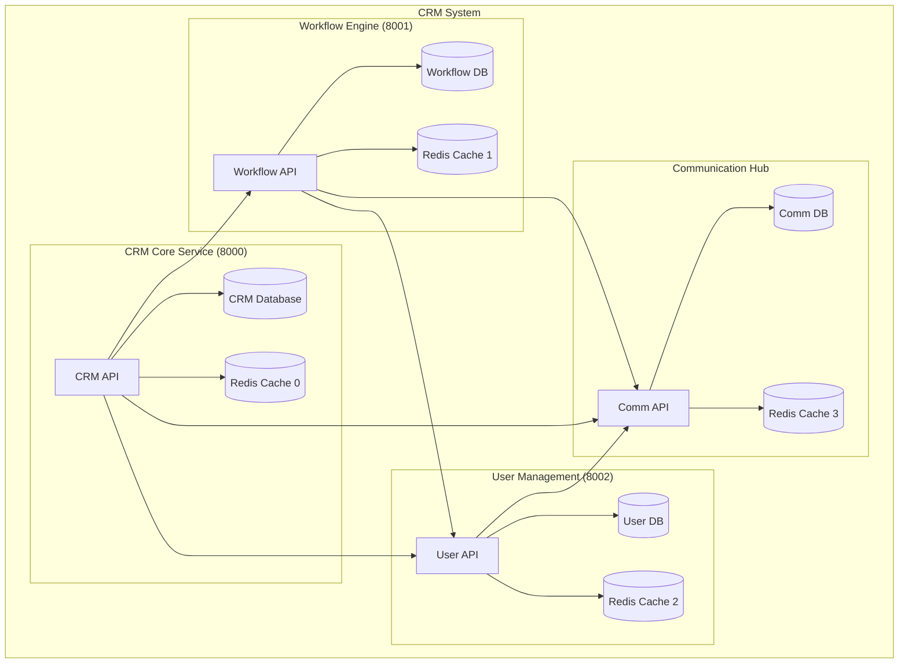

# System Topology

## High-Level Architecture

## Service Communication Overview

### 1. CRM Core Service (Port 8000)
- **Purpose**: Main entry point for CRM operations
- **Dependencies**:
  - PostgreSQL database (crm)
  - Redis instance (DB 0)
  - Workflow Engine
  - User Management
  - Communication Hub
- **Key Responsibilities**:
  - Customer data management
  - Integration orchestration
  - Business logic coordination

### 2. Workflow Engine (Port 8001)
- **Purpose**: Manages business process workflows
- **Dependencies**:
  - PostgreSQL database (workflows)
  - Redis instance (DB 1)
  - User Management
  - Communication Hub
- **Key Responsibilities**:
  - Workflow definition and execution
  - State management
  - Process automation

### 3. User Management (Port 8002)
- **Purpose**: Handles user authentication and authorization
- **Dependencies**:
  - PostgreSQL database (user_management)
  - Redis instance (DB 2)
  - Communication Hub
- **Key Responsibilities**:
  - User authentication
  - Role management
  - Access control

### 4. Communication Hub
- **Purpose**: Manages all external communications
- **Dependencies**:
  - PostgreSQL database
  - Redis instance (DB 3)
- **Key Responsibilities**:
  - Message routing
  - Channel management
  - Communication orchestration

## Data Flow

1. **Authentication Flow**:
   - All requests first go through User Management for authentication
   - JWT tokens are used for service-to-service communication

2. **Business Process Flow**:
   - CRM Core receives client requests
   - Delegates workflow execution to Workflow Engine
   - User Management validates permissions
   - Communication Hub handles external messaging

3. **Data Storage**:
   - Each service has its own PostgreSQL database
   - Redis is used for caching and session management
   - Databases are isolated for service independence

## Network Configuration

- All services are connected through `crm-network`
- Internal service discovery via Docker DNS
- Port mapping:
  - CRM Core: 8000
  - Workflow Engine: 8001
  - User Management: 8002
  - Postgres instances: 5432-5434
  - Redis instances: 6379-6381

## Security Considerations

1. **Service Isolation**:
   - Each service has its own database
   - Redis instances are separated by database index
   - Network segregation via Docker network

2. **Authentication**:
   - Centralized authentication through User Management
   - Service-to-service authentication using JWT
   - Rate limiting on API endpoints

3. **Data Protection**:
   - Database credentials managed via environment variables
   - Network access controlled through Docker network
   - Service-level access controls
